> 官方文档镜像 · [原文](https://open.workbuddy.cn/docs/buddy-app) · [文档目录](../wiki/index.md) · [开发路线](../wiki/development-map.md)

<a id="buddy应用"></a>


# Buddy应用


<a id="产品概述"></a>


## 产品概述

**Buddy 应用是垂直行业的 AI Harness** —— 伙伴无需从零构建一套 AI 产品，而是通过 Buddy 应用这层 Harness 封装，将自身的行业 know-how 整合进 WorkBuddy 的 AI 底座之中。最终用户打开即获得一个专属于该行业的完整 AI 工作台。


<a id="核心定位"></a>


## 核心定位

| 关键词 | 说明 |
| --- | --- |
| **行业 Harness** | 伙伴不造产品，造配置；WorkBuddy 提供产品框架与 AI 底座 |
| **开箱即用** | 用户无需学习，打开即进入行业专属工作台 |
| **场景优先** | 价值不在于堆叠能力清单，而在于将高频场景做深做顺 |


<a id="六大自定义维度"></a>


## 六大自定义维度

伙伴可通过以下六个维度，将垂直行业的完整能力装入 Buddy 应用。

Buddy 应用六大可自定义维度架构总览


<a id="工作模式"></a>


### 工作模式

定义垂直场景的 System Prompt 与内置 Skill，构成**模式级 Harness**，在当前模式下全程生效，让 AI 进入对话时即具备领域专业性。

- **System Prompt**：设定 AI 角色、行业术语规范、输出结构要求等
- **绑定 Skill**：预绑定该模式的 Skill，覆盖模式下所有对话，用户无需感知

> 示例：「投研模式」自带金融术语规范与研报结构要求；「法务模式」内嵌合规检查流程。


<a id="场景胶囊"></a>


### 场景胶囊

围绕具体任务组装**场景级 Harness**：用户不再面对空白输入框，而是看到「你可能需要做的事」；点击后叠加在当前工作模式之上。

- **推荐场景**：输入框上方的快捷提示词模板
- **绑定专家 / Skill / 案例**：预绑定该场景下的 Harness，覆盖场景下所有对话，用户无需感知

> 示例：金融用户看到「生成晨报」「分析个股」；教育用户看到「备课助手」「试卷生成」。


<a id="模型配置"></a>


### 模型配置

定义该应用可用的模型列表与展示排序，伙伴根据行业场景特点匹配最优模型能力。

- **模型列表**：从平台模型池中勾选适合本行业的模型（如 HY、GLM 等），默认跟随
- **排序**：拖动调整用户侧模型展示顺序，并指定默认模型

> 示例：金融场景优先推理能力强的模型；内容创作场景优先生成质量高的模型。


<a id="垂直行业市场"></a>


### 垂直行业市场

自定义应用内的能力市场，决定用户可发现和使用哪些生态资产。

- **Skill（技能）**：任务的可复用指令，对话中按需调用
- **专家**：领域专家或专家团
- **连接器**：第三方服务集成
- **灵感案例**：最佳实践与使用示范

> 能力可自建，也可直接引用 WorkBuddy 生态中已有的模块。


<a id="内嵌已有功能"></a>


### 内嵌已有功能

可以将伙伴现有系统无缝集成进 Buddy 应用，无需抛弃已有建设：

- **MCP Apps**：通过 MCP 协议将已有服务接入 AI 对话流

> 设计理念：不要求伙伴推倒重来，而是让 AI 长在已有系统之上。


<a id="workbuddy-基础能力"></a>


## WorkBuddy 基础能力

以下底层能力由 WorkBuddy 团队持续投入建设，伙伴无需重复造轮子，开箱即用：

- 多 Agent 协同运行
- 上下文压缩工程
- 记忆工程
- 工具调用编排
- 安全与权限管控


<a id="配置指引"></a>


## 配置指引

Buddy 应用通过 WorkBuddy 开放平台进行配置，采用左侧模块导航 + 右侧表单的单页布局，共包含 **5 个配置模块**。


<a id="配置规则"></a>


### 配置规则

| 规则 | 说明 |
| --- | --- |
| **允许跳步骤** | 模块之间可自由切换编辑，不强制按顺序完成 |
| **本地可预览** | 支持导出配置 JSON 文件在本地环境测试验证 |

---


<a id="模块-1创建应用"></a>


### 模块 1：创建应用

填写应用的身份信息，建立 Buddy 应用的基本形象。

| 配置项 | 说明 |
| --- | --- |
| 应用 ID | 系统自动生成，不可修改 |
| 应用头像 | 上传品牌图标（建议 256×256） |
| 应用名称 | 面向用户展示的应用名称 |
| 应用简介 | 简要描述应用定位与核心能力 |
| 授权列表 | 配置应用运行所需的 OAuth 授权项 |
| 授权回调 URL | OAuth 授权回调地址 |
| 可信 Origin | 允许访问的域名白名单 |

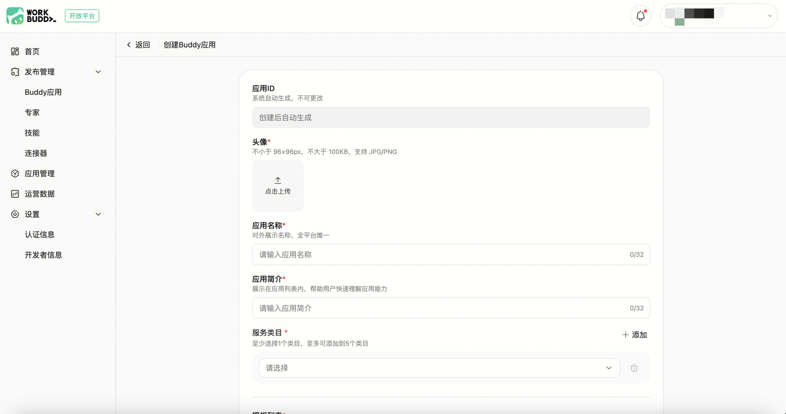

创建后将生成 Client ID 和 Client Secret，Client Secret仅此一次完整展示，关闭后将无法再次查看，请注意保存。

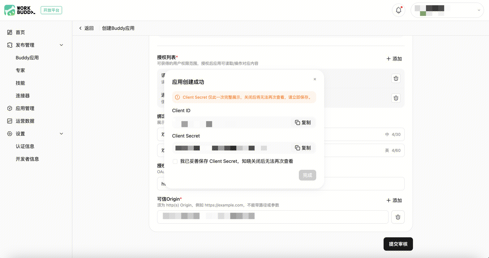

---


<a id="模块-2首页配置"></a>


### 模块 2：首页配置

配置用户进入应用后看到的首页内容，决定第一印象与使用动线。

| 配置项 | 说明 |
| --- | --- |
| 首页标题（Slogan） | 应用打开后的欢迎语标题 |
| 场景胶囊 | 场景级 Harness，点击后叠加在当前工作模式上。首页展示「你可能需要做的事」，并预绑定该任务的专家 / Skill / 案例 |
| 工作模式 | 模式级 Harness：System Prompt + 预绑定 Skill，进入该模式后全程生效。建议 2–4 个 |
| 内置连接器 | 进入应用后自动启用的连接器能力（可选） |

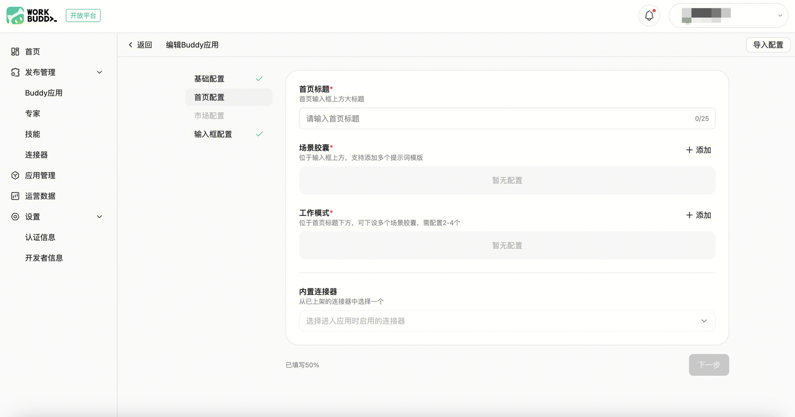

注意：内置连接器需要为支持 OAuth 方式认证的 MCP；用户首次进入 Buddy 应用时，在完成 Buddy 应用授权后，会有绑定应用弹窗，用户点击「绑定」即可跳转 MCP OAuth 认证

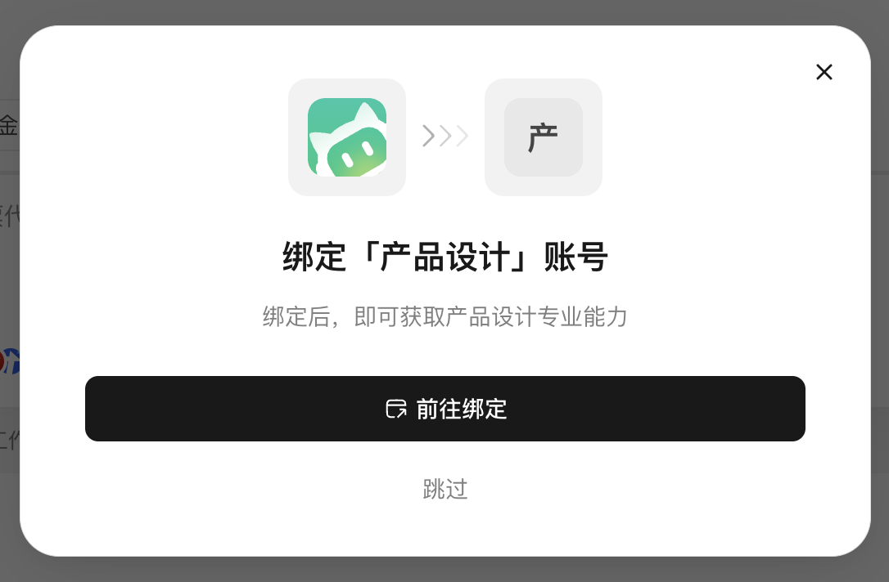

---


<a id="模块-3市场配置"></a>


### 模块 3：市场配置

决定应用内能力市场展示哪些生态资产。

| 板块 | 说明 |
| --- | --- |
| 专家 | 配置可用的专家 / 专家团，可设置分类标签；专家团为可选开启项 |
| 技能 | 配置可用的 Skill 列表 |
| 连接器 | 配置可用的连接器列表 |
| 精选场景 | 可选开启，在市场页做推荐位展示（关联专家或专家团） |

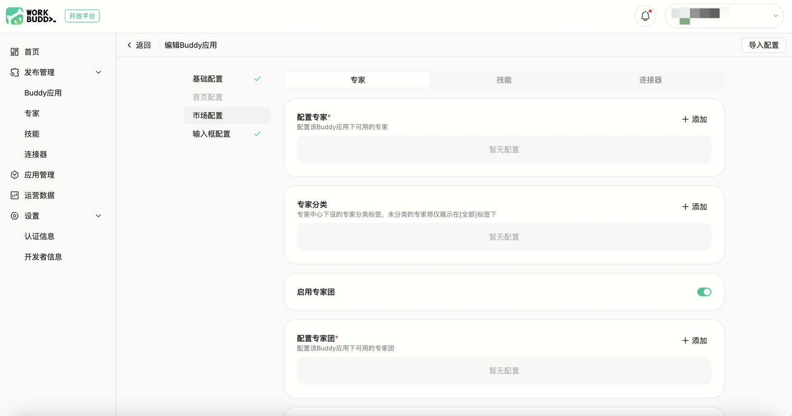

---


<a id="模块-4其他配置"></a>


### 模块 4：其他配置

1、跳过首次绑定应用授权

如果 Buddy 应用使用过程中不需要使用应用绑定的能力，如内置连接器使用非 OAuth 方式授权，可以配置跳过首次绑定应用

2、绑定应用授权文案

用户在绑定应用时，弹窗内可以配置关于应用绑定能够提供的能力：“绑定后，即可获取「绑定应用授权文案」专业能力”；如果不设置，则是应用名，即“绑定后，即可获取「应用名」专业能力”

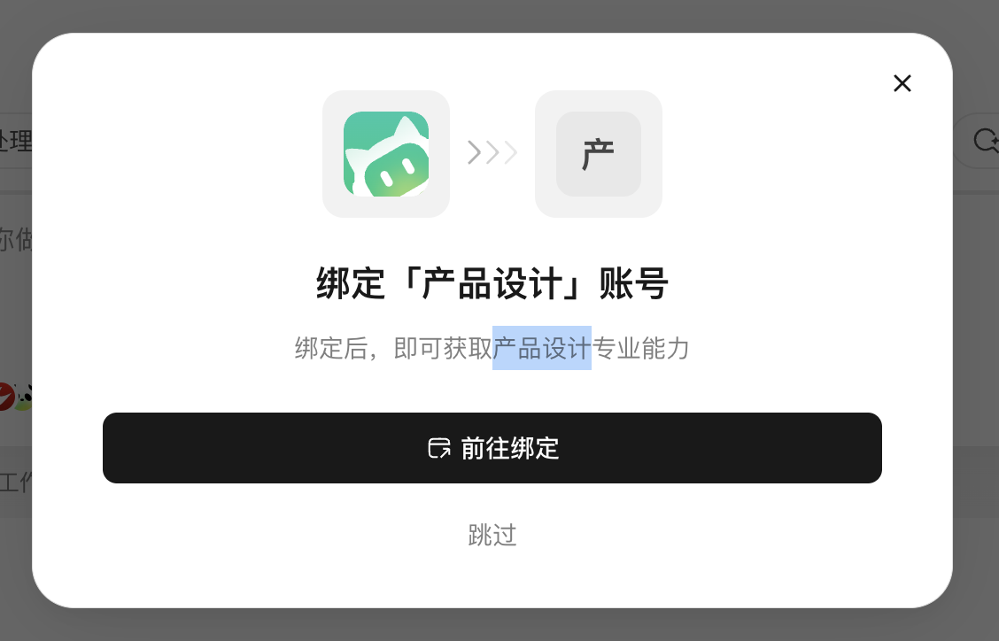

3、输入框占位符配置

当对话框内未输入时，占位符用作提示文案，引导用户输入的内容。需支持中英文两种文案。

4、从平台模型池中选择适合行业场景的模型组合。

| 操作 | 说明 |
| --- | --- |
| 模型勾选 | 从模型池中选择 |
| 排序调整 | 拖动调整用户侧模型展示顺序 |
| 默认模型 | 指定一个默认选中的模型 |

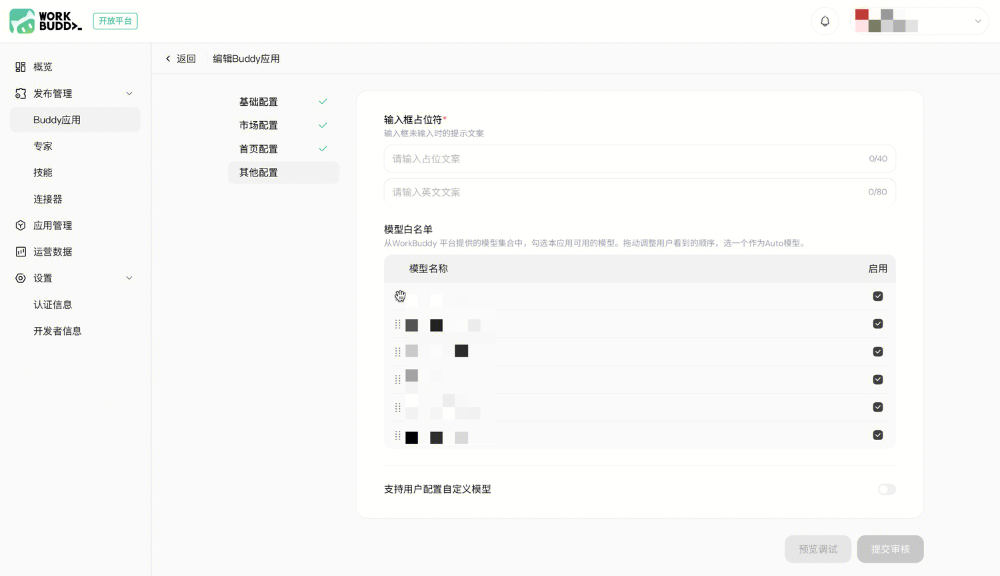

---


<a id="模块-5预览调试"></a>


### 模块 5：预览调试

配置完其他模块，提交审核之前，请通过预览链接，下载对应版本WorkBuddy端，通过链接打开预览态，查看是否符合配置需求。

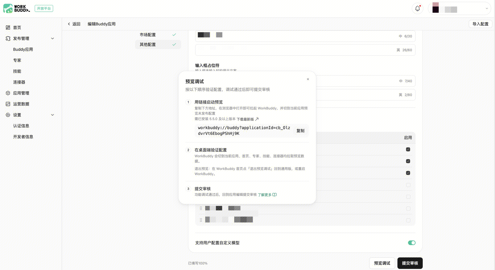


<a id="buddy应用设计规范"></a>


## Buddy应用设计规范


<a id="应用icon"></a>


### 应用icon

配置过程中，需要上传icon的位置，需要按设计规范来设计。

icon尺寸16px\*16px，线宽1.2px，有断口，圆角平滑100%，风格需要与示例icon保持一致。

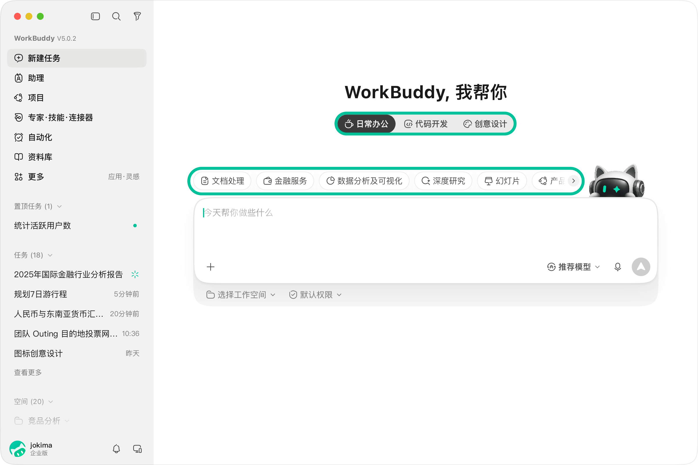
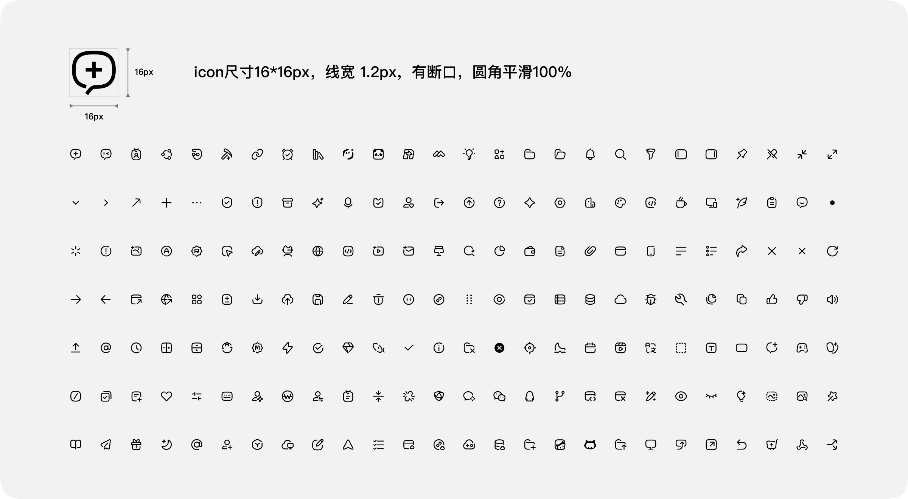


<a id="专家页精选场景背景图"></a>


### 专家页精选场景背景图

模块3市场配置中，专家页精选场景支持配置两套背景图，需要按设计规范来设计。

图片尺寸1000px\*910px，结构为底图+3层渐变蒙层，需要提供日夜间2套资源。建议底图内容采用极简插画风格。

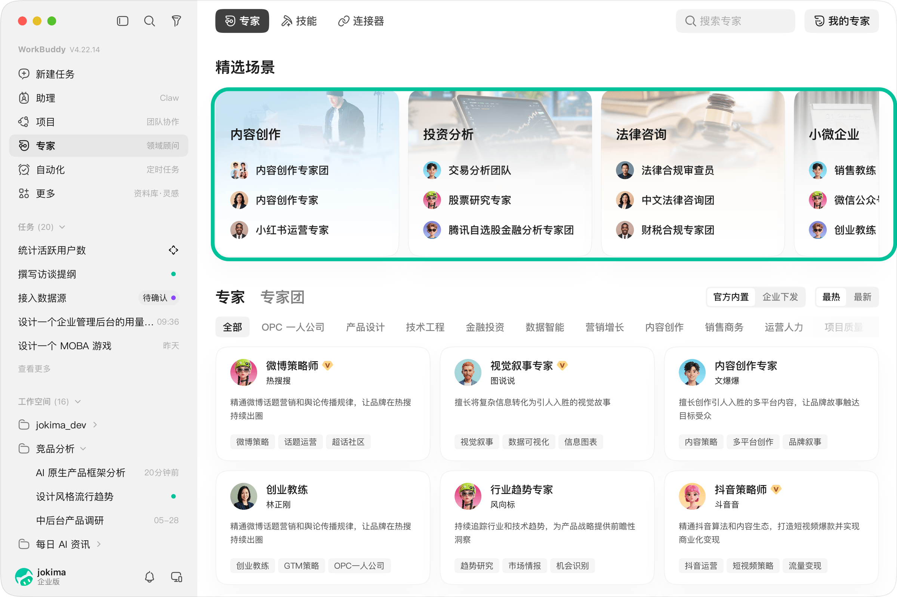
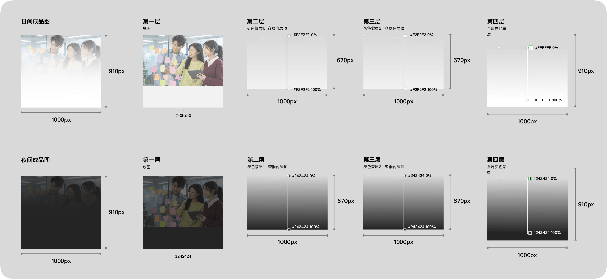

[设计规范配图-buddy应用.zip](../assets/498302f6ef90-buddy-app.zip)


<a id="发布流程"></a>


## 发布流程


```
创建应用 → 填写基础信息 → 创建审核通过 → 分模块配置 → 预览调试 → 提交审核 → 发布上线
```


**关键节点说明：**

1. **创建审核**：首次提交应用基础信息后需通过平台审核，审核通过后进入"草稿"状态
2. **草稿态编辑**：审核通过后可继续编辑各配置模块，不限顺序
3. **预览调试**：正式提交前请务必进行本地测试，确保功能完整
4. **配置审核**：配置完成后提交审核，审核通过即发布上线
5. **后续更新**：已发布应用如需变更，修改后需重新提交审核

---


<a id="最佳实践建议"></a>


## 最佳实践建议

1. **从场景出发**：先梳理目标用户的至少5个高频场景，再围绕场景组织能力配置
2. **精简工作模式**：建议 2–4 个工作模式，过多反而增加用户选择成本
3. **善用已有系统**：通过 MCP Apps 集成现有业务系统，降低迁移成本
4. **迭代优化**：先发布最小可用版本，根据用户反馈持续迭代
5. **导入/导出配置**：当前配置项较多，请每次退出配置前导出配置文件，下次进入配置时，导入配置文件即可还原上次配置

---
