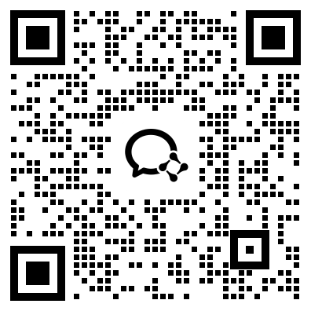

> 官方文档镜像 · [原文](https://open.workbuddy.cn/docs/contact) · [文档目录](../wiki/index.md) · [开发路线](../wiki/development-map.md)

# 联系渠道

## 咨询邮箱

[openworkbuddy@tencent.com](mailto:openworkbuddy@tencent.com)

## 官方社群

扫描下方二维码加入应用官方互助交流群，欢迎参与讨论。

