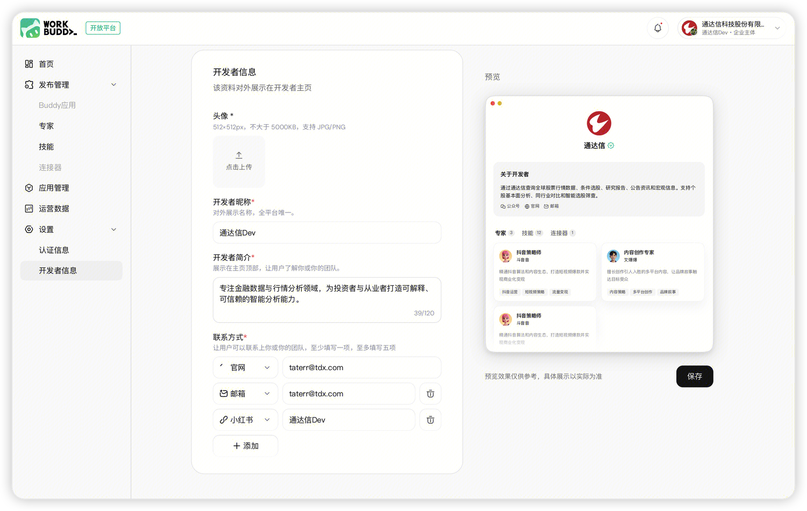

> 官方文档镜像 · [原文](https://open.workbuddy.cn/docs/developer-profile) · [文档目录](../wiki/index.md) · [开发路线](../wiki/development-map.md)

# 开发者profile

## 编辑开发者信息

开发者主页是开发者对外展示身份和开放资产的主要入口。用户可通过平台当前提供的入口访问对应主体的开发者主页。

实名认证只采集认证所需信息。对外展示的头像、昵称、简介和联系方式需在“设置—开发者信息”中填写。

## 开发者头像

开发者头像为必填项。主体创建后，系统根据开发者昵称生成默认头像，也可上传自定义头像替换。

上传要求：

- 尺寸：512×512 px；
- 大小：不超过 5000KB；
- 格式：JPG 或 PNG；
- 内容不得包含违法、违规、侵权或误导信息。

## 开发者昵称

开发者昵称为必填项，且在全平台唯一。修改后，主页名称和开放资产署名会同步更新。

昵称需要满足以下要求：

- 长度为 2—20 个字符；
- 不得使用纯数字、纯空格、表情或不支持的特殊符号；
- 不得包含敏感、违法或违禁内容；
- 不得冒充官方、平台、客服或管理员；
- 不得使用“官方、平台、客服、管理员、admin”等容易引起误解的表达；
- 非腾讯内部主体不得冒充或仿冒腾讯系品牌；
- 不得使用可能造成官方关联误解的腾讯系品牌名称；
- 不得使用“认证、VIP、第一、独家、保证”等误导性背书；
- 不得使用“测试、test、demo、试用”等测试性质名称。

昵称仅用于平台展示，不代表商标或品牌权利归属。昵称侵犯他人合法权益时，平台有权要求修改或收回。

## 开发者简介

开发者简介为必填项，长度为 20—120 个字符。简介应清楚说明个人、团队或企业的专业方向和主要资产，不得使用夸大、虚假或无法验证的宣传内容。

## 联系方式

联系方式会在开发者主页对外展示，支持官方网站、联系邮箱、微信公众号和自定义平台。

- 至少填写 1 项；
- 最多填写 5 项；
- 自定义平台可以填写平台名称和对应账号名称或账号 ID；
- 不得填写违法、欺诈、侵权或与开发者无关的信息。

完成填写后点击保存，资料会应用到当前主体的开发者主页。

## 开发者主页展示内容

开发者主页展示以下内容：

- **主页头部**：开发者头像、昵称、认证标识；企业主体还会展示企业全称；
- **关于开发者**：开发者简介和对外联系方式；
- **已发布资产**：按类型展示技能、专家、连接器和 Buddy 应用，用户可以进入详情页或按平台入口添加、使用资产。

开发者主页的公开展示条件和入口状态以平台当期页面规则为准。

## 内容合规与违规处置

开发者头像、昵称、简介、联系方式、企业展示名称以及资产介绍和素材均需符合平台规范。

平台发现违规内容后，可视情况采取以下措施：

- 将头像恢复为系统默认头像；
- 使用兜底文案替代违规简介；
- 隐藏违规联系方式；
- 限制开发者主页展示；
- 要求开发者修改后重新提交；
- 对严重违规主体或能力采取下架等措施。

收到整改提示后，应及时修改违规内容并重新提交。整改通过后，相关信息才能恢复展示。
