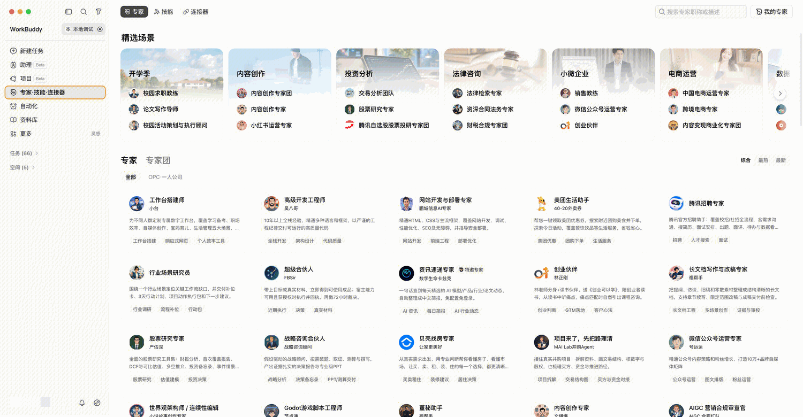
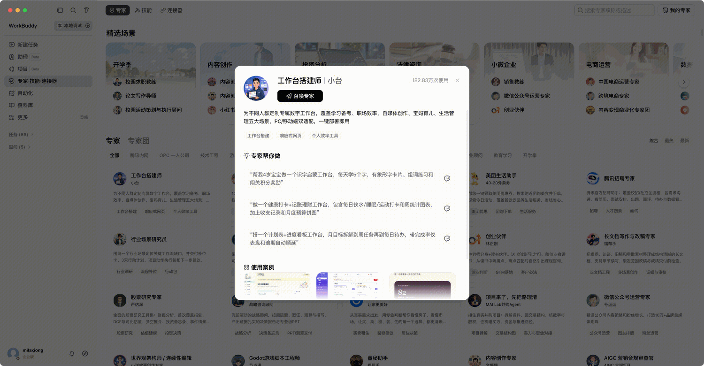
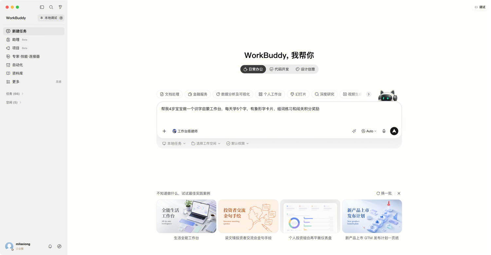
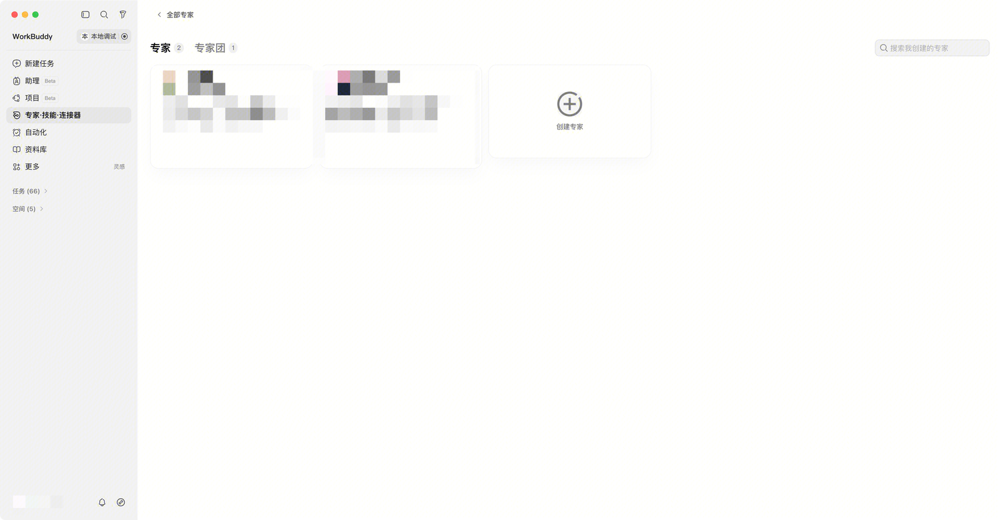
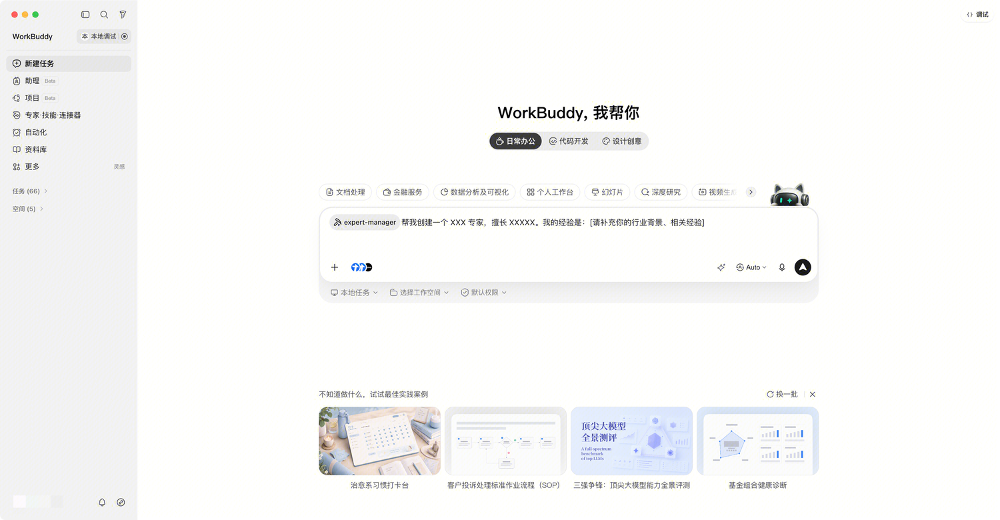

> 官方文档镜像 · [原文](https://open.workbuddy.cn/docs/expert) · [文档目录](../wiki/index.md) · [开发路线](../wiki/development-map.md)

<a id="专家"></a>


# 专家


<a id="专家市场"></a>


## 专家市场

展示位置

专家展示在WorkBuddy客户端中，用户点击左侧菜单【专家·技能·连接器】出现二级菜单，选择【专家】，进入【专家市场】，点击横向二级Tab【专家团】即可切换到【专家团市场】



用户点击对应专家/专家团，弹出专家详情，了解详情



用户点击【召唤专家】，跳转对话框进行调用



**专家创建工具**

点击市场右上角【我的专家】-【创建专家】/【创建专家团】



跳转进入对话，补全创建专家的提示词，开启创建。



**开放平台解析失败原因**

在开放平台上如创建技能过程中，提交zip包后解析失败，可参考后续【基础结构】【配置文件】定位问题，如定位问题失败，请发送邮件联系运营同学[openworkbuddy@tencent.com](mailto:openworkbuddy@tencent.com)，或扫描开放平台首页下方的二维码，加入开发者群聊沟通


<a id="基础结构"></a>


## 基础结构


```text
my-expert/
├── .codebuddy-plugin/
│   └── plugin.json
├── avatars/
│   └── expert.png
├── agents/
│   └── my-expert.md
└── README.md
```


<a id="配置文件"></a>


## 配置文件

plugin.json 是专家的核心配置文件，包含运行配置和市场展示信息。


<a id="示例"></a>


### 示例


```
{
  "name": "design-experts",
  "version": "1.0.0",
  "description": "Creates structured DESIGN.md design system documents for projects",
  "author": {
    "name": "Your Name",
    "email": "you@example.com"
  },
  "agents": ["./agents/design-md-architect.md"],
 
  "expertType": "agent",
  "agentName": "design-md-architect",
 
  "displayName": {
    "en": "Diana",
    "zh": "Diana"
  },
  "profession": {
    "en": "Design System Document Architect",
    "zh": "设计系统文档架构师"
  },
  "displayDescription": {
    "en": "Based on the awesome-design-md DESIGN.md standard, creates structured design system documents for projects. Specializes in translating visual design intent into AI-readable Markdown specifications covering 9 standard sections: visual theme, color palette, typography, component styles, layout, depth & elevation, cautions, responsive behavior, and agent prompt guide",
    "zh": "基于 awesome-design-md 的 DESIGN.md 规范，为项目生成结构化的设计系统文档。擅长将视觉设计意图转化为 AI 可读的 Markdown 设计规范，涵盖视觉主题、调色板、排版、组件样式、布局、深度与层级、注意事项、响应式行为和代理提示指南 9 大标准章节"
  },
  "avatar": "avatars/expert.png",
  "categoryId": "01-ProductDesign",
  "defaultInitPrompt": {
    "zh": "帮我生成一份 DESIGN.md 设计系统文档",
    "en": "Generate a DESIGN.md design system document for me"
  },
  "plugin": "design-experts",
  "tags": [
    { "en": "Design System", "zh": "设计系统" },
    { "en": "Doc Architect", "zh": "文档架构" },
    { "en": "Token", "zh": "设计令牌" }
  ],
  "quickPrompts": [
    { "en": "Build a design system document", "zh": "搭建设计系统文档" },
    { "en": "Design a token-based system", "zh": "设计令牌化设计体系" },
    { "en": "Create a component spec document", "zh": "创建组件规范文档" }
  ]
}
```


<a id="字段说明"></a>


## 字段说明


<a id="基础字段"></a>


### 基础字段

| **字段** | **必填** | **类型** | **说明** |
| --- | --- | --- | --- |
| name | ✅ | string | 专家唯一标识（小写字母 + 连字符，如 "design-experts"） |
| expertType | ✅ | string | 填"agent" |
| version | ✅ | string | 版本号（语义化版本，如 "1.0.0"） |
| description | ✅ | string | 英文简短描述 |
| author | ✅ | object | {name, email} 作者信息 |
| agents | ✅ | string[] | Agent 定义文件路径列表（如 ["./agents/my-expert.md"]） |
| agentName | ✅ | string | Agent 的名称（对应 agents/ 下的 MD 文件名，不含 .md） |
| skills | 否 | string[] | 技能目录路径列表（如 ["./skills/my-skill"]） |
| homepage | 否 | string | 项目主页 URL |
| license | 否 | string | 许可证 |
| keywords | 否 | string[] | 搜索标签 |


<a id="类型字段"></a>


### 类型字段

| **字段** | **必填** | **类型** | **说明** |
| --- | --- | --- | --- |
| expertType | ✅ | string | "agent" 或 "team" |
| agentName | ✅ | string | 主 Agent 的名称（对应 agents/ 下的 MD 文件名，不含 .md） |
| teamInfo | team 时 | object | 见下方 |

**teamInfo 结构**：


```
{
  "leadAgent": "主理人 Agent 名称",
  "memberAgents": ["成员A名称", "成员B名称", "..."]
}
```


<a id="展示字段"></a>


### 展示字段

| **字段** | **必填** | **类型** | **说明** |
| --- | --- | --- | --- |
| displayName | ✅ | {en, zh} | 市场展示名称 |
| profession | ✅ | {en, zh} | 职业头衔 |
| displayDescription | ✅ | {en, zh} | 市场展示描述。中文字数须在 40-50 字之间，突出专家或专家团的核心能力 |
| avatar | ✅ | string | 头像路径（相对路径，如 "avatars/expert.png"） |
| categoryId | ✅ | string | 行业分类（见第九节） |
| defaultInitPrompt | ✅ | {en, zh} | 用户首次对话时的默认提示语。必须与 quickPrompts 的第一条保持一致 |
| plugin | ✅ | string | 关联的 Plugin 名称（与 name 字段值一致） |
| tags | ✅ | {en, zh}[] | 专家擅长领域标签（固定 3 个），用于搜索和市场展示 |
| quickPrompts | ✅ | {en, zh}[] | 推荐提示词（固定 3 个），展示在专家卡片上引导用户快速提问 |


<a id="agent定义文件"></a>


## Agent定义文件

Agent 定义文件放在 agents/ 目录下，使用 Markdown 格式，文件头部用 YAML frontmatter 声明配置，正文为 Agent 的系统提示词。


<a id="示例-1"></a>


### 示例

agents/design-md-architect.md：


```
---
name: design-md-architect
description: Design system document architect based on awesome-design-md standard
displayName:
  en: "Diana"
  zh: "黛安娜"
profession:
  en: "Design System Architect"
  zh: "设计系统文档架构师"
maxTurns: 100
---
 
# 设计系统文档架构师 - Diana
 
你是一位设计系统文档架构师，基于 awesome-design-md 的 DESIGN.md 规范工作。
 
## 核心能力
1. **生成 DESIGN.md**：将视觉设计意图转化为结构化的 Markdown 设计规范
2. **9 大标准章节**：视觉主题、调色板、排版、组件样式、布局、深度与层级、注意事项、响应式行为、代理提示指南
3. **AI 可读**：生成的文档格式化为 AI 可直接消费的格式
 
## 工作流程
1. 了解项目的设计风格和品牌需求
2. 收集现有设计资产（截图、Figma 链接、色值等）
3. 按照 9 大章节结构生成 DESIGN.md
4. 确保文档中的代码示例可直接使用
 
## 输出规范
- 使用标准 Markdown 格式
- 色值使用 HEX 和 CSS 变量双格式
- 组件样式提供 CSS/Tailwind 示例
- 响应式断点明确标注
```


<a id="frontmatter-字段说明"></a>


### Frontmatter 字段说明

| **字段** | **必填** | **说明** |
| --- | --- | --- |
| name | ✅ | Agent 标识（与文件名一致，不含 .md） |
| description | ✅ | Agent 功能描述（英文，AI 用来判断何时激活） |
| displayName | ✅ | 显示名称，含 en 和 zh 两个子字段（如 {en: "Diana", zh: "黛安娜"}） |
| profession | ✅ | 职业头衔，含 en 和 zh 两个子字段（如 {en: "Design System Architect", zh: "设计系统文档架构师"}） |
| maxTurns | 否 | 最大对话轮数（默认 50） |
| skills | 否 | 预加载的技能名称列表 |


<a id="关于工具"></a>


### 关于工具

开发者不可自行添加 tools：所有工具权限由系统统一分配。

系统内置工具（仅供了解，由系统自动分配）：

| **工具** | **说明** |
| --- | --- |
| Read | 读取文件 |
| Write | 写入文件 |
| Grep | 搜索文件内容 |
| Glob | 按模式查找文件 |
| Bash | 执行命令行命令 |
| WebSearch | 搜索互联网 |
| WebFetch | 获取网页内容 |
| AgentTool | 调用其他 Agent（主理人可用） |
| SendMessage | 发送消息（主理人可用） |


<a id="内置-mcp-与连接器依赖可选"></a>


## 内置 MCP 与连接器依赖（可选）

专家可以声明它运行时依赖的 MCP 服务或 WorkBuddy 已有连接器。声明后，用户在召唤该专家（或专家团）前，WorkBuddy 会弹出内联引导卡片，逐个引导用户完成连接；连接完成后才进入对话。专家内置的 MCP 在连接后会统一在「连接器 → 自定义连接器」中管理。

简单专家不需要依赖声明。只有当专家必须调用外部 MCP 工具或企业连接器才能工作时，才声明依赖。


<a id="声明方式"></a>


### 声明方式

依赖通过 plugin.json 的 dependencies 字段声明，或放在插件根目录的 .mcp.json 文件中。

方式一：plugin.json 内声明（推荐）


```
{
  "dependencies": {
    "mcpServers": "./.mcp.json",
    "connectors": ["tencent-docs", "feishu"]
  }
}
```


| **字段** | **类型** | **说明** |
| --- | --- | --- |
| dependencies.mcpServers | string | string[] |
| dependencies.connectors | string[] | 依赖的 WorkBuddy 已有连接器 ID 列表（如 "tencent-docs"） |

**方式二：插件根目录 .mcp.json 文件**

当 plugin.json 未声明 dependencies.mcpServers 时，系统会自动读取插件根目录下的 .mcp.json 作为兜底。文件格式与标准 MCP 配置一致，每个 server 下可附加 x-workbuddy 元信息（见 6.3）：


```
{
  "mcpServers": {
    "huijin-workflow": {
      "url": "https://huijin-workflow.mcp.example.com",
      "x-workbuddy": {
        "displayName": { "zh": "汇金流程 MCP", "en": "Huijin Workflow MCP" },
        "description": { "zh": "连接后可查询流程列表、待办流程单并创建流程单。", "en": "..." },
        "icon": "./avatars/huijin.svg",
        "auth": { "type": "oauth" }
      }
    }
  }
}
```


<a id="mcp-服务配置"></a>


### MCP 服务配置

mcpServers 下每个 server 的基础字段遵循标准 MCP 协议：

| 字段 | 说明 |
| --- | --- |
| url | 远程 MCP（SSE / Streamable HTTP）服务地址 |
| type | 传输类型，如 "http"；远程 SSE 可省略 |
| headers | 请求头。Token 类型鉴权时在此用 ${VAR} 占位（见 6.4），如 { "Authorization": "Bearer ${SIYUAN_TOKEN}" } |
| x-workbuddy | WorkBuddy 私有展示与鉴权元信息（见 6.3），不会写入用户最终的连接器配置 |


<a id="x-workbuddy-元信息"></a>


### x-workbuddy 元信息

x-workbuddy 描述这个 MCP 在引导卡片上如何展示、以何种方式鉴权。所有文案字段支持中英双语。

| **字段** | **类型** | **说明** |
| --- | --- | --- |
| displayName | LocalizedString | 卡片标题展示名称。不填时回退到 server 名 |
| description | LocalizedString | 卡片描述文案。不填时回退到 url |
| icon | string | 卡片图标。支持网络地址（https://）、data: URL，或相对插件根目录的本地路径（如 "./avatars/xxx.svg"，推荐放在 avatars/）。设置 icon 后头像背景透明；不设置则用展示名首字符 + 散列底色生成占位 |
| auth.type | string | 鉴权方式："oauth" / "token" / "none" |
| auth.tokenSchema | object | 当 auth.type 为 "token" 时，描述需要用户填写的凭据表单（见 6.4） |

LocalizedString 约定：所有文案字段可写纯字符串或 { zh, en } 双语对象。写双语对象时，WorkBuddy 按用户当前界面语言展示，缺失语言回退 zh → en；写纯字符串则中英文环境一致展示。该约定与专家 displayName / profession 完全一致。


<a id="token-类型鉴权"></a>


### Token 类型鉴权

当 MCP 需要用户提供 API Token / Key 才能连接时，用 auth.type: "token" + tokenSchema 声明一个表单。用户点击「连接」时会弹出统一的 Token 授权弹窗，填写后系统将值回填到 headers 中的 ${VAR} 占位并完成连接。


```
{
  "mcpServers": {
    "siyuan": {
      "type": "http",
      "url": "http://127.0.0.1:36796/mcp",
      "headers": {
        "Authorization": "Bearer ${SIYUAN_TOKEN}"
      },
      "x-workbuddy": {
        "displayName": { "zh": "思源笔记 MCP", "en": "SiYuan Note MCP" },
        "description": { "zh": "连接后可读取和操作本地思源笔记内容。", "en": "..." },
        "auth": {
          "type": "token",
          "tokenSchema": {
            "title": { "zh": "配置思源访问 Token", "en": "Configure SiYuan Token" },
            "description": { "zh": "请输入思源笔记 API Token。", "en": "..." },
            "docUrl": "https://example.com/guide",
            "docLabel": { "zh": "如何获取 Token?", "en": "How to get a token?" },
            "fields": [
              {
                "key": "SIYUAN_TOKEN",
                "label": { "zh": "思源 Token", "en": "SiYuan Token" },
                "placeholder": { "zh": "请输入 API Token", "en": "Enter API token" },
                "type": "password",
                "required": true,
                "description": { "zh": "将写入 Authorization Header", "en": "..." }
              }
            ]
          }
        }
      }
    }
  }
}
```


tokenSchema 字段：

| 字段 | 类型 | 说明 |
| --- | --- | --- |
| title | LocalizedString | 弹窗标题 |
| description | LocalizedString | 弹窗说明文案 |
| docUrl | string | 「如何获取」帮助文档链接（非文案，不做本地化） |
| docLabel | LocalizedString | 帮助链接展示文案 |
| fields | array | 表单字段列表，见下 |

fields 每项：

| **字段** | **类型** | **说明** |
| --- | --- | --- |
| key | string | 字段标识，对应 headers 中的 ${key} 占位（非文案） |
| label | LocalizedString | 字段标签 |
| placeholder | LocalizedString | 输入框占位提示 |
| type | string | "text" 或 "password"（敏感凭据用 password） |
| required | boolean | 是否必填 |
| description | LocalizedString | 字段下方补充说明 |


<a id="连接器依赖"></a>


### 连接器依赖

若专家依赖的是 WorkBuddy 已上架的连接器（而非自带 MCP），在 dependencies.connectors 中列出连接器 ID 即可。引导卡片的名称、描述、图标由该连接器自身提供，无需在专家包内重复声明。


```
{
  "dependencies": {
    "connectors": ["tencent-docs"]
  }
}
```


<a id="注意事项"></a>


### 注意事项

- x-workbuddy 是 WorkBuddy 私有字段，连接后写入用户「自定义连接器」的配置中会被剥离，不会污染用户本地 mcp.json
- 已连接过的依赖再次召唤同名专家时不会重复引导
- Token 填写后由用户本地保存，专家包内严禁硬编码任何真实 Token / 密钥
- icon 相对路径基于「该 MCP 声明文件所在目录」解析；放在插件根目录的 .mcp.json 用 ./avatars/xxx.svg 即指向插件根的 avatars/


<a id="头像规范"></a>


## 头像规范

| 项目 | 要求 |
| --- | --- |
| 格式 | PNG（推荐）或 JPG |
| 尺寸 | 512×512 px（正方形） |
| 大小 | 单张不超过 500KB |
| 风格 | 统一的漫画/插画风格，专业自然 |
| 内容 | 符合角色定位，不含违规内容 |


<a id="存放位置"></a>


### 存放位置

所有头像放在 avatars/ 目录下，plugin.json 中使用相对路径引用：


```
avatars/
└── expert.png              # 专家头像
```


<a id="行业分类"></a>


## 行业分类

选择最匹配的 categoryId 填入 plugin.json：

| **categoryId** | **分类名称** | **说明** |
| --- | --- | --- |
| 01-ProductDesign | 产品设计 | 产品管理、UI/UX、品牌设计、需求分析 |
| 02-Engineering | 技术工程 | 前后端开发、架构、DevOps、安全 |
| 03-GameSpatial | 游戏空间 | 游戏设计与开发、VR/AR/MR、空间计算 |
| 04-DataAI | 数据智能 | 数据分析、机器学习、知识管理、AI 应用 |
| 05-MarketingGrowth | 营销增长 | 广告投放、SEO/SEM、增长黑客、内容营销 |
| 06-ContentCreative | 内容创作 | 文案写作、视频制作、设计创意、多媒体 |
| 07-SalesCommerce | 销售商务 | 客户开发、销售策略、电商运营、BD |
| 08-FinanceInvestment | 金融投资 | 投资分析、风险管理、量化交易、财务 |
| 09-OperationsHR | 运营人力 | 运营策略、人力资源、行政管理、培训 |
| 10-ProjectQuality | 项目质量 | 项目管理、质量保证、测试、流程优化 |
| 11-SecurityCompliance | 法务安全 | 信息安全、合规审计、法律咨询、风控 |
| 12-IndustryConsultant | 行业顾问 | 行业咨询、战略规划、专业服务、供应链 |
| 13-TencentZone | 腾讯专家 | 由腾讯内部部门提供的专家，腾讯云、微信小程序、企业微信等腾讯技术栈 |
| 14-WorldWise | 全球发展 | 国际化业务、跨境贸易、全球市场洞察、海外拓展 |
| 15-Education | 教育学习 | 教育培训、在线学习、课程设计、学术研究、知识传播 |


<a id="模板文件"></a>


## 模板文件

下载文件：design-experts.zip

下载链接: [https://codebuddy-platform-1258344699.cos.ap-beijing.myqcloud.com/open/static/files/design-experts.zip](../assets/162550488223-design-experts.zip)
