> 官方文档镜像 · [原文](https://open.workbuddy.cn/docs/legal-basis-and-examples) · [文档目录](../wiki/index.md) · [开发路线](../wiki/development-map.md)

# 法规依据及示例

## 物流服务

### 收件/派件

#### 政策法规依据

《快递暂行条例》第十七条

经营快递业务，应当依法取得快递业务经营许可。邮政管理部门应当根据《中华人民共和国邮政法》第五十二条、第五十三条规定的条件和程序核定经营许可的业务范围和地域范围，向社会公布取得快递业务经营许可的企业名单，并及时更新。

第十八条

经营快递业务的企业及其分支机构可以根据业务需要开办快递末端网点，并应当自开办之日起20日内向所在地邮政管理部门备案。快递末端网点无需办理营业执照。

#### 资质示例

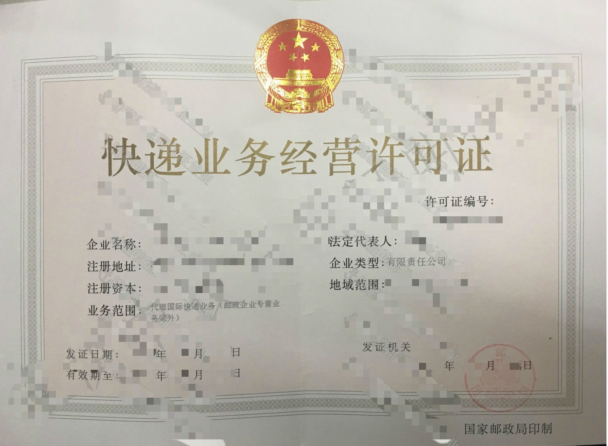
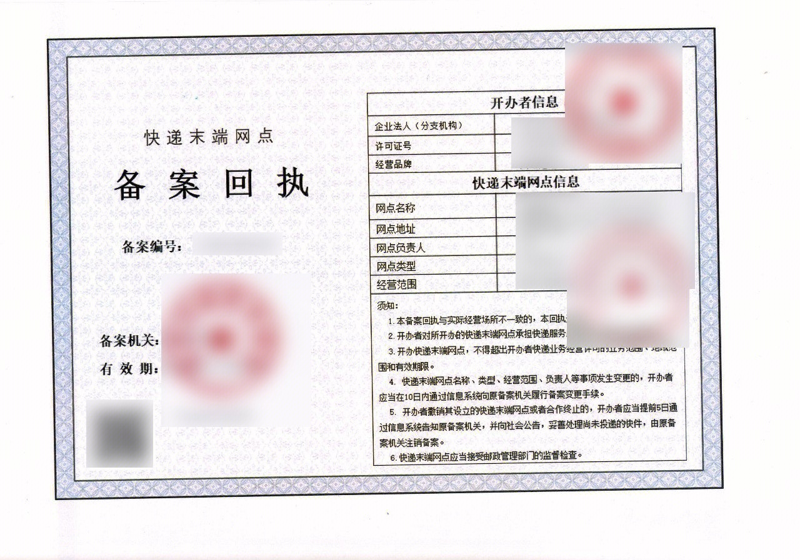

### 邮政

#### 政策法规依据

《经营邮政通信业务审批工作细则（试行）》

第四条 除法律另有规定外，经营邮政通信业务应当经过邮政管理部门许可，并接受邮政管理部门及其他有关部门的监督管理。

第十二条 邮政管理部门应当自受理之日起二十个工作日内对申请材料审查核实，做出批准或者不予批准的决定。予以批准的，出具证明文件；不予批准的，书面通知申请人并说明理由。二十个工作日内不能做出决定的，经邮政管理部门负责人批准，可以延长十个工作日，并将延长期限的理由告知申请人。第十三条 经营邮政通信业务审批证明文件应当明确许可的地域范围和有效期限，并标明具体的服务环节。

#### 资质示例

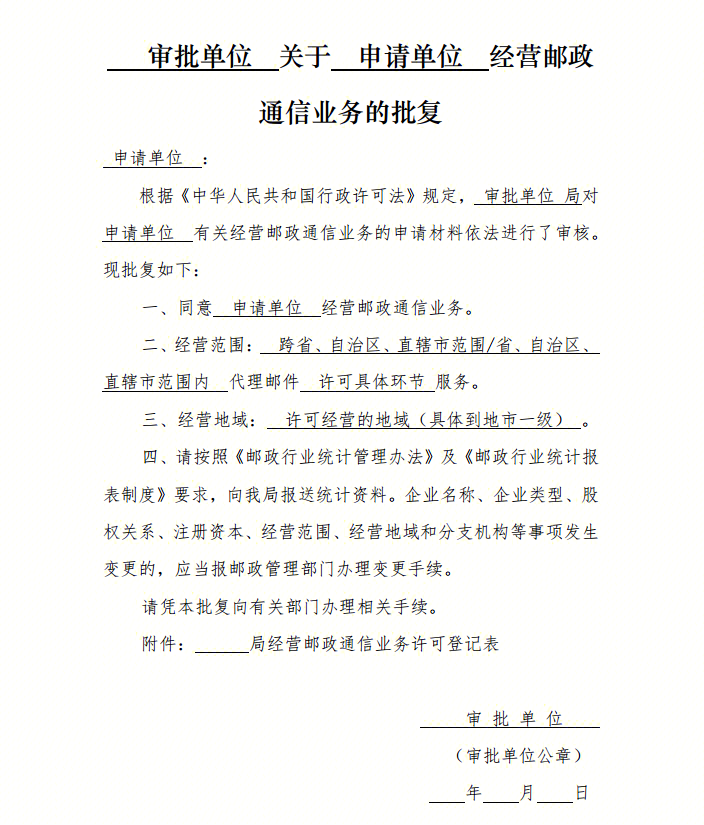
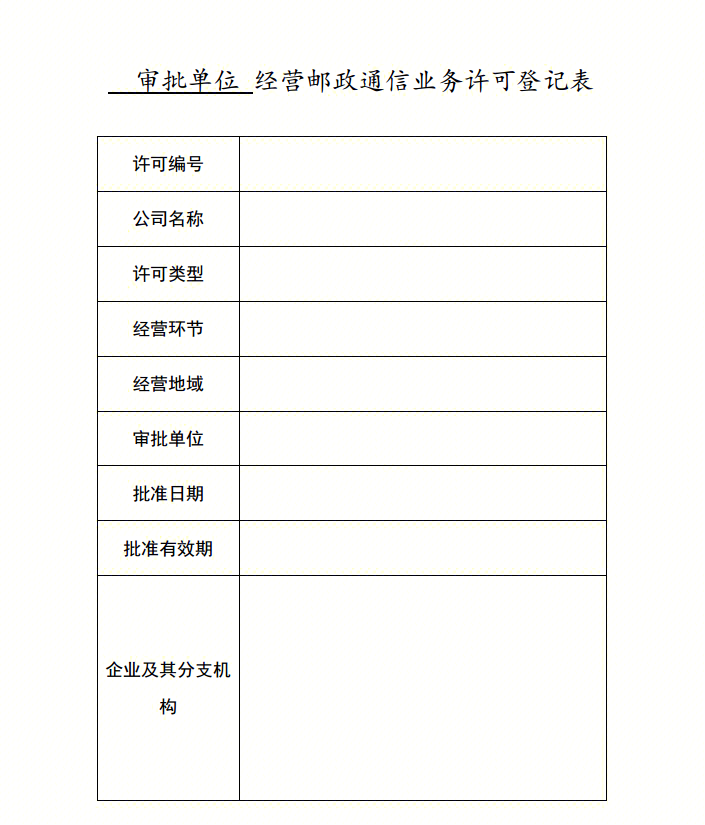

### 货物运输

#### 政策法规依据

一、《中华人民共和国道路运输条例》第二十五条

申请从事货运经营的，应当按照下列规定提出申请并分别提交符合本条例第二十二条、第二十四条规定条件的相关材料：

(一)从事危险货物运输经营以外的货运经营的，向县级道路运输管理机构提出申请；

(二)从事危险货物运输经营的，向设区的市级道路运输管理机构提出申请。

依照前款规定收到申请的道路运输管理机构，应当自受理申请之日起20日内审查完毕，作出许可或者不予许可的决定。予以许可的，向申请人颁发道路运输经营许可证，并向申请人投入运输的车辆配发车辆营运证；不予许可的，应当书面通知申请人并说明理由。

货运经营者应当持道路运输经营许可证依法向工商行政管理机关办理有关登记手续。

二、《铁路运输企业准入许可办法》第二条

在中华人民共和国境内依法登记注册的企业法人，从事铁路旅客、货物公共运输营业的，应当向国家铁路局提出申请，经审查合格取得铁路运输许可证。

涉及地方铁路运营事项的，国家铁路局应当邀请申请企业所在地省、自治区、直辖市人民政府有关部门参与审查。

三、《交通运输部关于公布十项交通运输行政许可事项取消下放后事中事后监管措施的公告》

一、取消“国际集装箱船、普通货船运输业务审批”后的事中事后监管措施

取消审批后，改为备案，相关备案工作由省级交通运输主管部门实施。各省级交通运输主管部门可使用部级水路运输建设综合管理信息系统的统一流程办理备案等相关业务，如使用各自系统办理，必须与部级系统实现数据对接。交通运输部已签发的，经营范围是国际船舶普通货物运输、国际船舶集装箱运输的《中华人民共和国国际船舶运输经营许可证》废止。

二、取消“从事内地与港澳间集装箱船、普通货船运输业务许可”后的事中事后监管措施

取消审批后，改为备案，相关备案工作由省级交通运输主管部门实施。各省级交通运输主管部门可使用部级水路运输建设综合管理信息系统的统一流程办理备案等相关业务，如使用各自系统办理，必须与部级系统实现数据对接。

注：交通运输部的水路运输建设综合管理信息系统备案查询网址参考： <http://wtis.mot.gov.cn/syportalapply/login>

四、《公共航空运输企业经营许可规定》

第二十一条　民航局对准予经营许可的，应当自作出决定之日起10个工作日内，向申请人颁发公共航空运输企业经营许可证。

对不予其经营许可的，应当自作出决定之日起10个工作日内书面通知申请人、说明理由，并告知申请人享有依法申请行政复议或者提起行政诉讼的权利。

资质示例

陆运：《道路运输经营许可证》

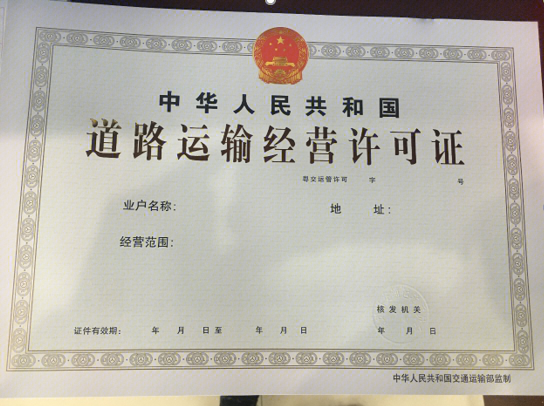
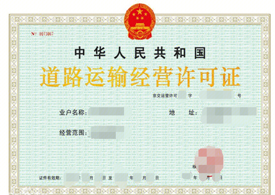

铁路：《铁路运输许可证》

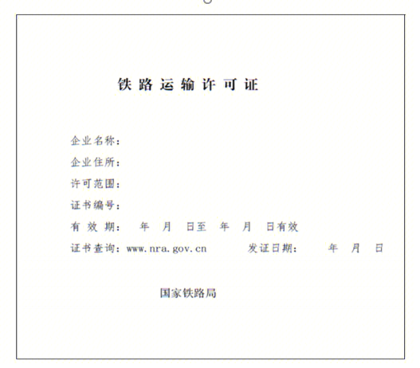

空运：《公共航空运输企业经营许可证》

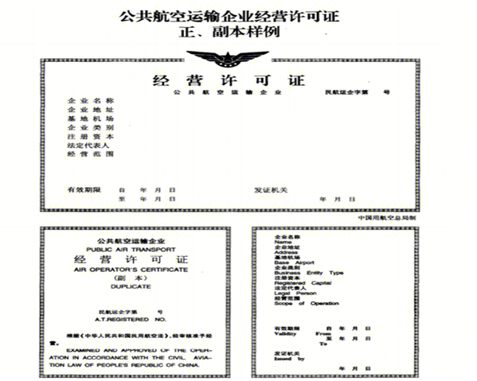

《省级航运部门的备案证明》:

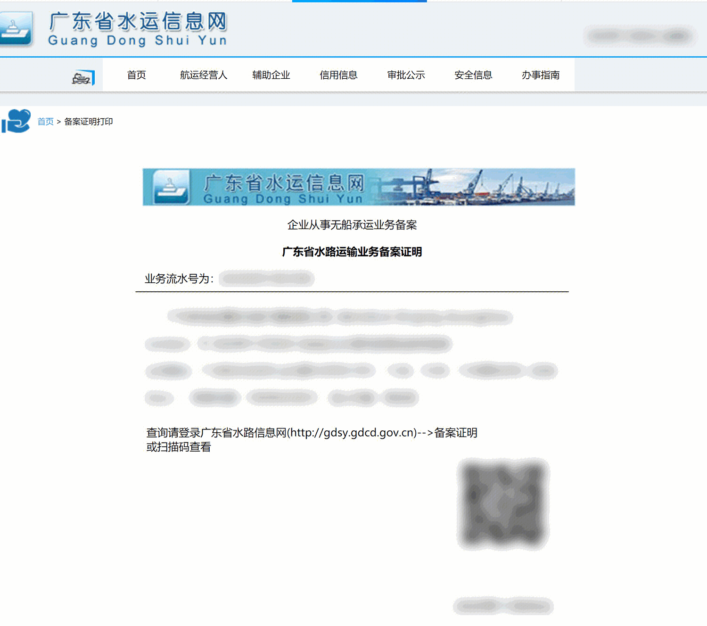

## 教育服务

### 学历教育（培训机构）

#### 政策法规依据

《国务院办公厅关于规范校外培训机构发展的意见》：校外培训机构必须经审批取得办学许可证后，登记取得营业执照（或事业单位法人证书、民办非企业单位登记证书），才能开展培训。

#### 资质示例

### 学历教育（学校）

#### 政策法规依据

《中华人民共和国民办教育促进法》第十二条

举办实施学历教育、学前教育、自学考试助学及其他文化教育的民办学校，由县级以上人民政府教育行政部门按照国家规定的权限审批。

举办实施以职业技能为主的职业资格培训、职业技能培训的民办学校，由县级以上人民政府人力资源社会保障行政部门按照国家规定的权限审批，并抄送同级教育行政部门备案。

#### 资质示例

《事业单位法人证书》：

《民办学校办学许可证》：

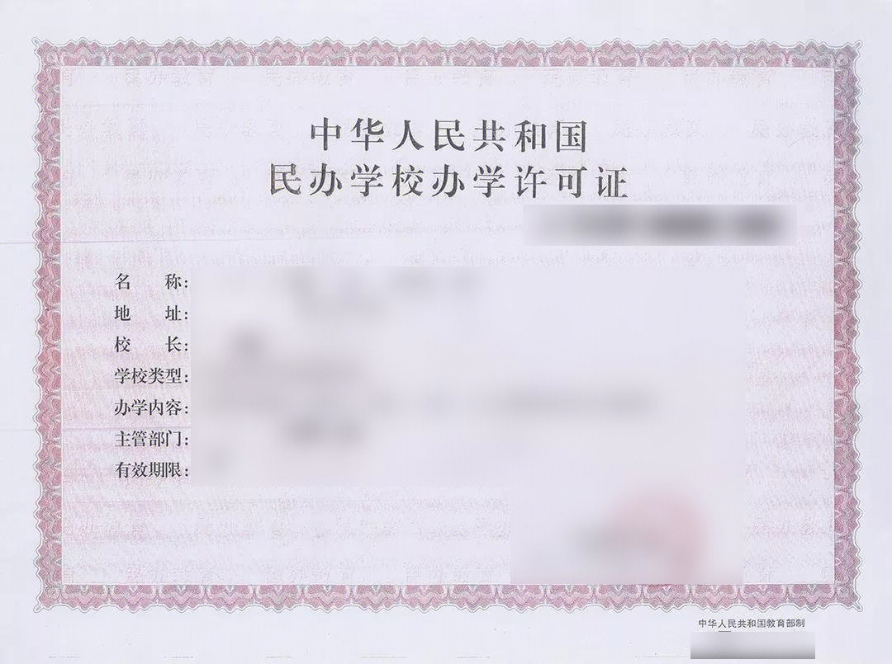

### 驾校培训

#### 政策法规依据

《中华人民共和国道路交通安全法（2021修正）》

第二十条　机动车的驾驶培训实行社会化，由交通运输主管部门对驾驶培训学校、驾驶培训班实行备案管理，并对驾驶培训活动加强监督，其中专门的拖拉机驾驶培训学校、驾驶培训班由农业（农业机械）主管部门实行监督管理。

驾驶培训学校、驾驶培训班应当严格按照国家有关规定，对学员进行道路交通安全法律、法规、驾驶技能的培训，确保培训质量。

任何国家机关以及驾驶培训和考试主管部门不得举办或者参与举办驾驶培训学校、驾驶培训班。

#### 资质示例

《机动车驾驶员培训备案》：

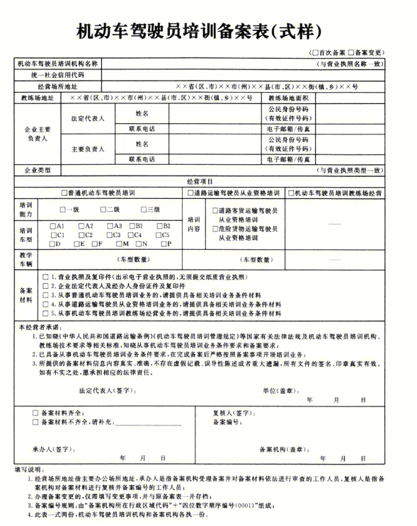

### 驾校培训

#### 政策法规依据

《中华人民共和国道路交通安全法（2021修正）》

第二十条　机动车的驾驶培训实行社会化，由交通运输主管部门对驾驶培训学校、驾驶培训班实行备案管理，并对驾驶培训活动加强监督，其中专门的拖拉机驾驶培训学校、驾驶培训班由农业（农业机械）主管部门实行监督管理。

驾驶培训学校、驾驶培训班应当严格按照国家有关规定，对学员进行道路交通安全法律、法规、驾驶技能的培训，确保培训质量。

任何国家机关以及驾驶培训和考试主管部门不得举办或者参与举办驾驶培训学校、驾驶培训班。

《互联网信息服务管理办法》第四条

国家对经营性互联网信息服务实行许可制度；对非经营性互联网信息服务实行备案制度，未取得许可或未履行备案手续的，不得从事互联网信息服务。

《非经营性互联网信息服务备案管理办法》（原信息产业部令第33号）第三条

拟从事非经营性互联网信息服务的，应当向其住所所在地省通信管理局履行备案手续。

#### 资质示例

《非经营性互联网信息服务备案核准》：

《机动车驾驶员培训备案》：

### 教育平台

#### 政策法规依据

《互联网信息服务管理办法》第四条

国家对经营性互联网信息服务实行许可制度；对非经营性互联网信息服务实行备案制度，未取得许可或未履行备案手续的，不得从事互联网信息服务。

《非经营性互联网信息服务备案管理办法》（原信息产业部令第33号）第三条

拟从事非经营性互联网信息服务的，应当向其住所所在地省通信管理局履行备案手续。

《中华人民共和国民办教育促进法》第十二条

举办实施学历教育、学前教育、自学考试助学及其他文化教育的民办学校，由县级以上人民政府教育行政部门按照国家规定的权限审批；

举办实施以职业技能为主的职业资格培训、职业技能培训的民办学校，由县级以上人民政府人力资源社会保障行政部门按照国家规定的权限审批，并抄送同级教育行政部门备案。

#### 资质示例

《非经营性互联网信息服务备案核准》：

《民办学校办学许可证》：

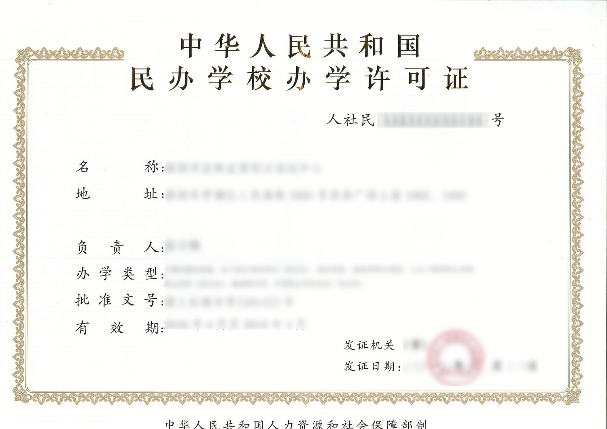

### 在线视频课程(适用于公立学校或培训机构)

#### 政策法规依据

- 《国务院办公厅关于规范校外培训机构发展的意见》：校外培训机构必须经审批取得办学许可证后，登记取得营业执照（或事业单位法人证书、民办非企业单位登记证书），才能开展培训。
- 资质4．全国校外线上培训管理服务平台备案：

《教育部等六部门关于规范校外线上培训的实施意见》

二、实施备案审查制度

（四）备案审查重点。按照《国务院办公厅关于规范校外培训机构发展的意见》要求，结合线上培训扁平化、覆盖广、规模大、变化快等特点，认真开展备案工作。省级教育行政部门要结合本地实际，根据“减证便民”的原则，明确备案内容和要求，重点是对培训机构、培训内容和培训人员等进行备案。校外线上培训机构备案材料主要包括：培训机构的ICP（互联网信息服务）备案、电信业务经营许可（涉及经营电信业务的）等相关证照信息、建立党组织情况的信息、资金管理、保障条件和服务承诺等信息，互联网平台信息数据交互及处理能力和个人信息保护制度、网络安全管理制度、安全保护技术措施、服务器设置在中国内地的说明材料。学科类培训内容备案材料主要包括：课程介绍、教学安排、招生简章等，引进国外课程的要根据有关规定提供相关证明。学科类培训人员备案材料主要包括：基本信息、教师资格证明（其中，外籍人员提供学习和工作经历、教学资质或教学能力说明）。

（五）备案审查流程。校外线上培训机构在取得ICP备案（涉及经营电信业务的，还应当申请电信业务经营许可）、网络安全等级保护定级备案的证明、等级测评报告后，向机构住所地的省级教育行政部门提交相关材料，申请备案。已开展校外线上培训的机构应当于2019年10月31日前提交相关材料，新成立的校外线上培训机构按照备案要求提交相关材料。省级教育行政部门会同有关部门对提交材料进行审查核实，对符合条件和规定的校外线上培训机构予以备案并公示公布。具体备案细则由各省（区、市）制订。

（六）备案变更流程。校外线上培训机构、培训内容和培训人员等备案内容产生变更时，及时提交变更内容说明和变更材料。省级教育行政部门依据备案要求对提交的变更材料进行审查。

《关于应用“全国校外线上培训管理服务平台”开展学科类校外线上培训机构备案工作的公告》

根据《教育部等六部门关于规范校外线上培训的实施意见》（教基函〔2019〕8号）要求，学科类校外线上培训机构（以下简称线上机构）将通过全国校外线上培训管理服务平台（以下简称平台，网址为[https://xwpx.eduyun.cn）备案。请已开展培训的线上机构尽快在平台上注册，并于2019年10月31日前填报完备案材料。各省级教育行政部门将在此平台上完成备案审核工作。新成立的线上机构按照备案要求在平台上提交相关材料。线上机构对平台操作如有疑问，可在平台帮助中心查看常见问题解答（Q&A），也可拨打400-8980-910进行咨询。](https://xwpx.eduyun.cn%EF%BC%89%E5%A4%87%E6%A1%88%E3%80%82%E8%AF%B7%E5%B7%B2%E5%BC%80%E5%B1%95%E5%9F%B9%E8%AE%AD%E7%9A%84%E7%BA%BF%E4%B8%8A%E6%9C%BA%E6%9E%84%E5%B0%BD%E5%BF%AB%E5%9C%A8%E5%B9%B3%E5%8F%B0%E4%B8%8A%E6%B3%A8%E5%86%8C%EF%BC%8C%E5%B9%B6%E4%BA%8E2019%E5%B9%B410%E6%9C%8831%E6%97%A5%E5%89%8D%E5%A1%AB%E6%8A%A5%E5%AE%8C%E5%A4%87%E6%A1%88%E6%9D%90%E6%96%99%E3%80%82%E5%90%84%E7%9C%81%E7%BA%A7%E6%95%99%E8%82%B2%E8%A1%8C%E6%94%BF%E9%83%A8%E9%97%A8%E5%B0%86%E5%9C%A8%E6%AD%A4%E5%B9%B3%E5%8F%B0%E4%B8%8A%E5%AE%8C%E6%88%90%E5%A4%87%E6%A1%88%E5%AE%A1%E6%A0%B8%E5%B7%A5%E4%BD%9C%E3%80%82%E6%96%B0%E6%88%90%E7%AB%8B%E7%9A%84%E7%BA%BF%E4%B8%8A%E6%9C%BA%E6%9E%84%E6%8C%89%E7%85%A7%E5%A4%87%E6%A1%88%E8%A6%81%E6%B1%82%E5%9C%A8%E5%B9%B3%E5%8F%B0%E4%B8%8A%E6%8F%90%E4%BA%A4%E7%9B%B8%E5%85%B3%E6%9D%90%E6%96%99%E3%80%82%E7%BA%BF%E4%B8%8A%E6%9C%BA%E6%9E%84%E5%AF%B9%E5%B9%B3%E5%8F%B0%E6%93%8D%E4%BD%9C%E5%A6%82%E6%9C%89%E7%96%91%E9%97%AE%EF%BC%8C%E5%8F%AF%E5%9C%A8%E5%B9%B3%E5%8F%B0%E5%B8%AE%E5%8A%A9%E4%B8%AD%E5%BF%83%E6%9F%A5%E7%9C%8B%E5%B8%B8%E8%A7%81%E9%97%AE%E9%A2%98%E8%A7%A3%E7%AD%94%EF%BC%88Q&A%EF%BC%89%EF%BC%8C%E4%B9%9F%E5%8F%AF%E6%8B%A8%E6%89%93400-8980-910%E8%BF%9B%E8%A1%8C%E5%92%A8%E8%AF%A2%E3%80%82)

备案、查询网址：<https://xwpx.eduyun.cn>

#### 资质示例

《事业单位法人证书》（适用公立学校）：

《民办学校办学许可证》（适用培训机构）：

全国校外教育培训监管与服务综合平台备案：

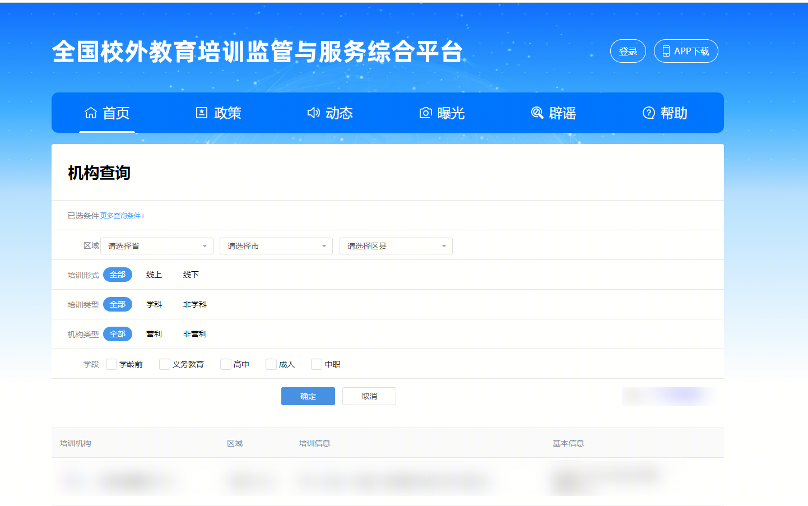

《信息网络传播视听节目许可证》：

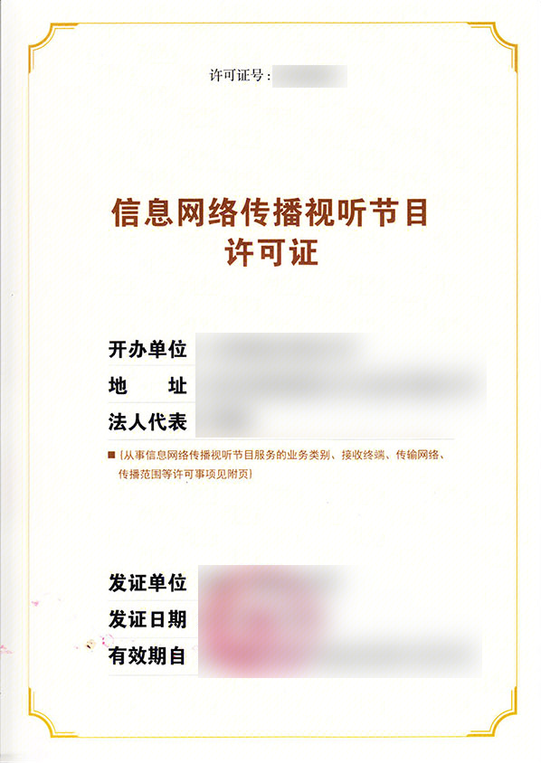

## 医疗服务

### 公立医疗机构

#### 政策法规依据

《医疗机构管理条例》 第十五条 医疗机构执业，必须进行登记，领取《医疗机构执业许可证》。

#### 资质示例

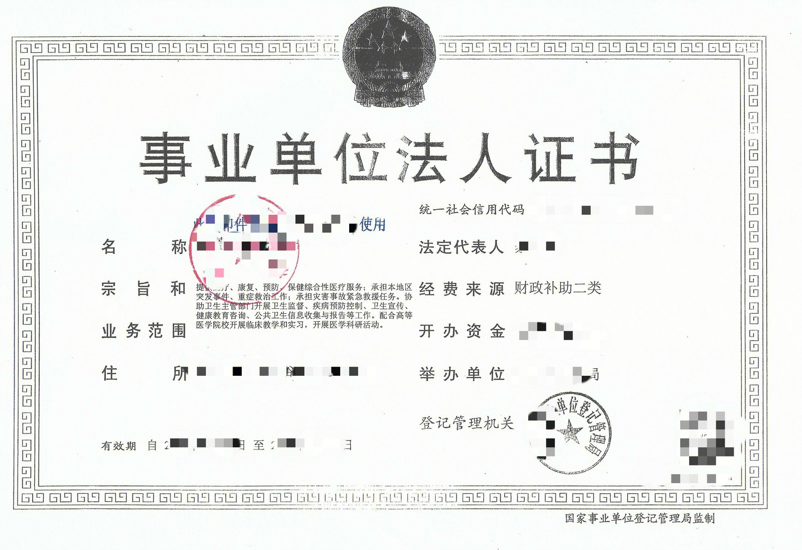

### 其他私立医疗机构

#### 政策法规依据

1、《医疗机构管理条例》 第十五条 医疗机构执业，必须进行登记，领取《医疗机构执业许可证》。

2、《中医诊所备案管理暂行办法》第二章 备案

第四条 举办中医诊所的，报拟举办诊所所在地县级中医药主管部门备案后即可开展执业活动。

3、《诊所备案管理暂行办法》第二章 备案

第四条 单位或者个人设置诊所应当报拟设置诊所所在地县级人民政府卫生健康行政部门或中医药主管部门备案，取得诊所备案凭证后即可开展执业活动。

#### 资质示例

1、《医疗机构执业许可证》

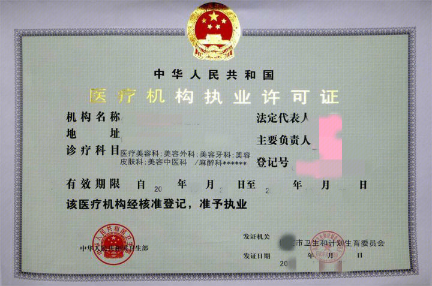

2、《中医诊所备案证》

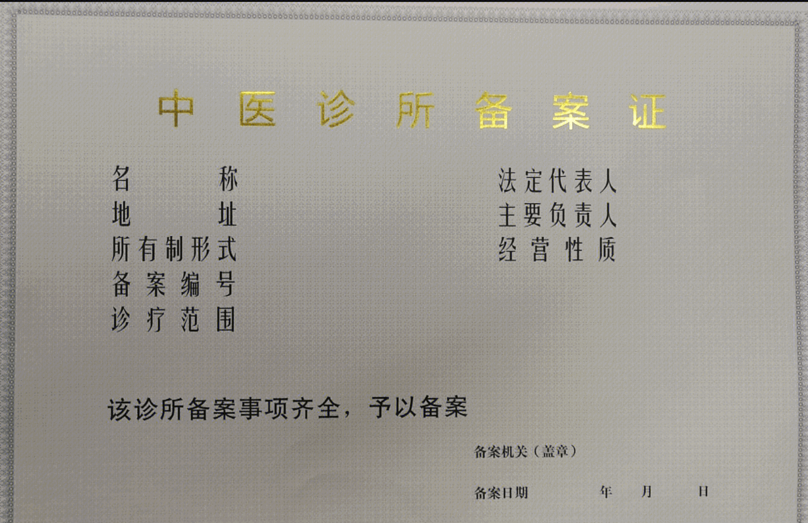

3、《诊所备案证》

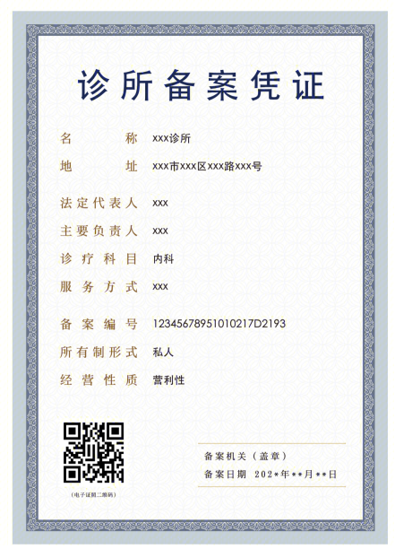

### 就医服务

#### 政策法规依据

《医疗机构管理条例》 第十五条 医疗机构执业，必须进行登记，领取《医疗机构执业许可证》。

第二十四条 任何单位或者个人，未取得《医疗机构执业许可证》，不得开展诊疗活动。

#### 资质示例

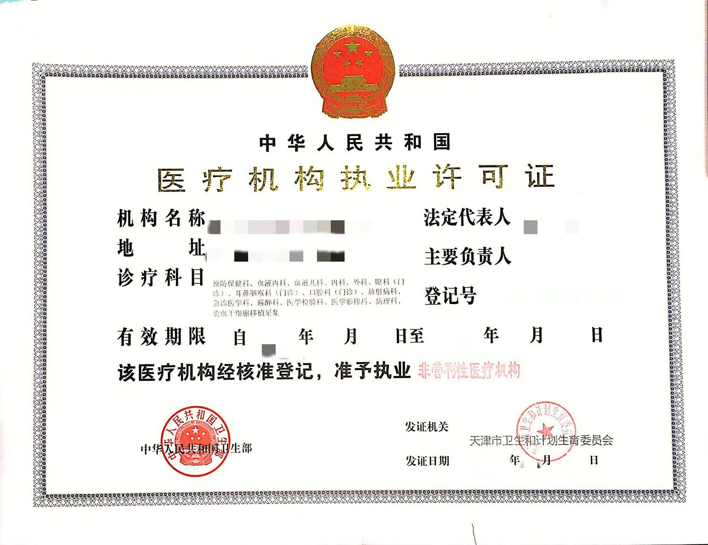

### 其他医学健康服务

#### 政策法规依据

《医疗机构管理条例》第二十四条

任何单位或者个人，未取得《医疗机构执业许可证》，不得开展诊疗活动。

《医疗器械生产监督管理办法》第八条

开办第二类、第三类医疗器械生产企业的，应当向所在地省、自治区、直辖市食品药品监督管理部门申请生产许可。

第十条 符合规定条件的，依法作出准予许可的书面决定，并于10个工作日内发给《医疗器械生产许可证》；不符合规定条件的，作出不予许可的书面决定，并说明理由。

#### 资质示例

《医疗机构执业许可证》：

《医疗器械生产许可证》：

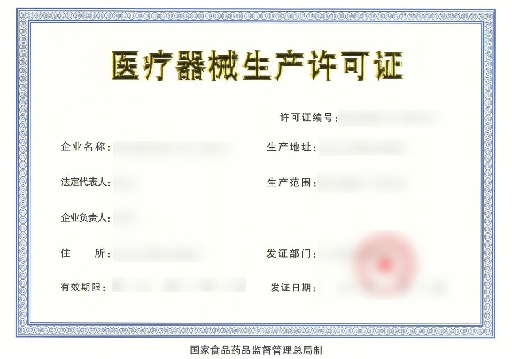

供应商医疗器械备案凭证：

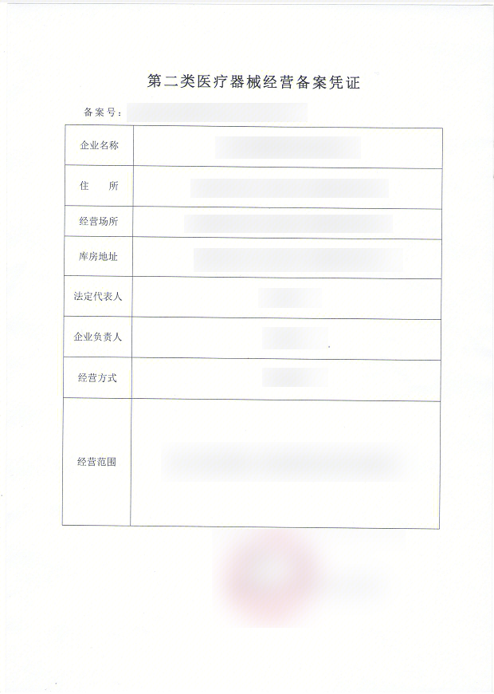

### 药品（非处方药）销售（适用药品生产企业）

#### 政策法规依据

1、《药品生产监督管理办法》第六条

药品生产企业将部分生产车间分立，形成独立药品生产企业的，按照本办法第四条、第五条的规定办理《药品生产许可证》。

2、《互联网药品信息服务管理办法》第五条

拟提供互联网药品信息服务的网站，应当在向国务院信息产业主管部门或者省级电信管理机构申请办理经营许可证或者办理备案手续之前，按照属地监督管理的原则，向该网站主办单位所在地省、自治区、直辖市食品药品监督管理部门提出申请，经审核同意后取得提供互联网药品信息服务的资格。

第六条

各省、自治区、直辖市食品药品监督管理部门对本辖区内申请提供互联网药品信息服务的互联网站进行审核，符合条件的核发《互联网药品信息服务资格证书》。

#### 资质示例

### 药品（非处方药）销售（适用药品批发企业）

#### 政策法规依据

1、《药品经营许可证管理办法》第八条 开办药品批发企业按照以下程序办理《药品经营许可证》。

2、《互联网药品信息服务管理办法》第五条 拟提供互联网药品信息服务的网站，应当在向国务院信息产业主管部门或者省级电信管理机构申请办理经营许可证或者办理备案手续之前，按照属地监督管理的原则，向该网站主办单位所在地省、自治区、直辖市食品药品监督管理部门提出申请，经审核同意后取得提供互联网药品信息服务的资格。

第六条 各省、自治区、直辖市食品药品监督管理部门对本辖区内申请提供互联网药品信息服务的互联网站进行审核，符合条件的核发《互联网药品信息服务资格证书》。

#### 资质示例

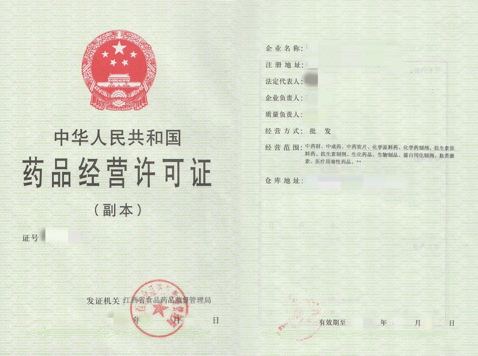

### 药品（非处方药）销售（适用药品零售企业）

#### 政策法规依据

1、《药品经营许可证管理办法》第九条 开办药品零售企业按照以下程序办理《药品经营许可证》。

2、《互联网药品信息服务管理办法》第五条 拟提供互联网药品信息服务的网站，应当在向国务院信息产业主管部门或者省级电信管理机构申请办理经营许可证或者办理备案手续之前，按照属地监督管理的原则，向该网站主办单位所在地省、自治区、直辖市食品药品监督管理部门提出申请，经审核同意后取得提供互联网药品信息服务的资格。

第六条 各省、自治区、直辖市食品药品监督管理部门对本辖区内申请提供互联网药品信息服务的互联网站进行审核，符合条件的核发《互联网药品信息服务资格证书》。

#### 资质示例

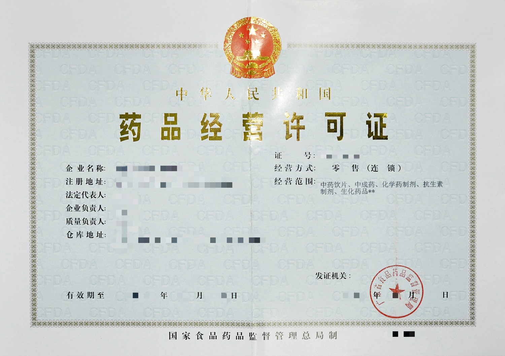

### 非处方药销售平台

#### 政策法规依据

《互联网药品信息服务管理办法》第五条

拟提供互联网药品信息服务的网站，应当在向国务院信息产业主管部门或者省级电信管理机构申请办理经营许可证或者办理备案手续之前，

按照属地监督管理的原则，向该网站主办单位所在地省、自治区、直辖市食品药品监督管理部门提出申请，经审核同意后取得提供互联网药品信息服务的资格。

#### 资质示例

《互联网药品信息服务资格证书》：

《药品网络交易服务第三方平台备案凭证》：

### 处方药服务

《互联网药品信息服务资格证书》：

《药品网络交易服务第三方平台备案凭证》：

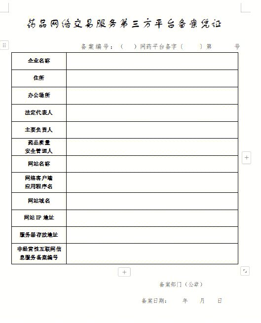

《药品经营许可证》：

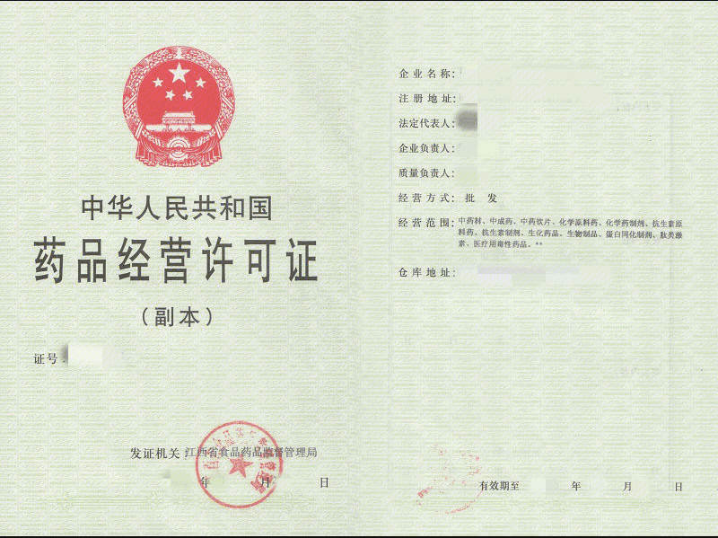

### 医疗器械信息展示

#### 政策法规依据

1、《医疗器械网络销售监督管理办法》第四十九条 医疗器械网络信息服务按照《互联网药品信息服务管理办法》执行。

2、《互联网药品信息服务管理办法》 第五条 拟提供互联网药品信息服务的网站，应当在向国务院信息产业主管部门或者省级电信管理机构申请办理经营许可证或者办理备案手续之前，按照属地监督管理的原则，向该网站主办单位所在地省、自治区、直辖市食品药品监督管理部门提出申请，经审核同意后取得提供互联网药品信息服务的资格。

第六条 各省、自治区、直辖市食品药品监督管理部门对本辖区内申请提供互联网药品信息服务的互联网站进行审核，符合条件的核发《互联网药品信息服务资格证书》。

#### 资质示例

### 药品信息展示

#### 政策法规依据

《互联网药品信息服务管理办法》 第五条 拟提供互联网药品信息服务的网站，应当在向国务院信息产业主管部门或者省级电信管理机构申请办理经营许可证或者办理备案手续之前，按照属地监督管理的原则，向该网站主办单位所在地省、自治区、直辖市食品药品监督管理部门提出申请，经审核同意后取得提供互联网药品信息服务的资格。

第六条 各省、自治区、直辖市食品药品监督管理部门对本辖区内申请提供互联网药品信息服务的互联网站进行审核，符合条件的核发《互联网药品信息服务资格证书》。

#### 资质示例

### 医疗器械生产企业

#### 政策法规依据

《医疗器械生产监督管理办法》第八条

开办第二类、第三类医疗器械生产企业的，应当向所在地省、自治区、直辖市食品药品监督管理部门申请生产许可。

第十条 符合规定条件的，依法作出准予许可的书面决定，并于10个工作日内发给《医疗器械生产许可证》；不符合规定条件的，作出不予许可的书面决定，并说明理由。

#### 资质示例

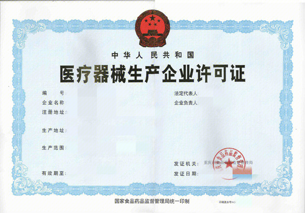

### 医疗器械自营

#### 政策法规依据

《医疗器械网络销售监督管理办法》第九条

从事医疗器械网络销售的企业，应当通过自建网站或者医疗器械网络交易服务第三方平台开展医疗器械网络销售活动。通过自建网站开展医疗器械网络销售的企业，应当依法取得《互联网药品信息服务资格证书》，并具备与其规模相适应的办公场所以及数据备份、故障恢复等技术条件。

1、《医疗器械生产监督管理办法》第八条

开办第二类、第三类医疗器械生产企业的，应当向所在地省、自治区、直辖市食品药品监督管理部门申请生产许可。

第十条 符合规定条件的，依法作出准予许可的书面决定，并于10个工作日内发给《医疗器械生产许可证》；不符合规定条件的，作出不予许可的书面决定，并说明理由。

2、《医疗器械监督管理条例》第三十一条

从事第三类医疗器械经营的，经营企业应当向所在地设区的市级人民政府食品药品监督管理部门申请经营许可。

#### 资质示例

《互联网药品信息服务资格证书》：

《医疗器械生产许可证》：

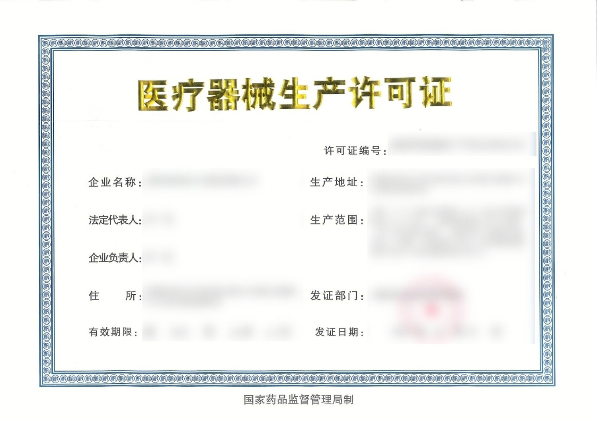

《医疗器械经营许可证》：

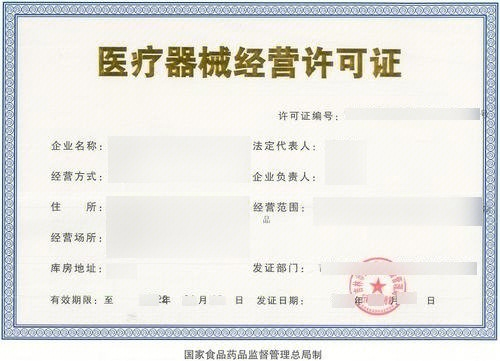

### 医疗器械经营销售平台

#### 政策法规依据

《医疗器械网络销售监督管理办法》第十五条

医疗器械网络交易服务第三方平台提供者应当依法取得《互联网药品信息服务资格证书》，具备与其规模相适应的办公场所以及数据备份、故障恢复等技术条件，设置专门的医疗器械网络质量安全管理机构或者配备医疗器械质量安全管理人员。

《医疗器械网络销售监督管理办法》第十六条

医疗器械网络交易服务第三方平台提供者应当向所在地省级食品药品监督管理部门备案，填写医疗器械网络交易服务第三方平台备案表

#### 资质示例

《互联网药品信息服务资格证书》：

医疗器械网络交易服务第三方平台备案凭证（食药监局颁发）：

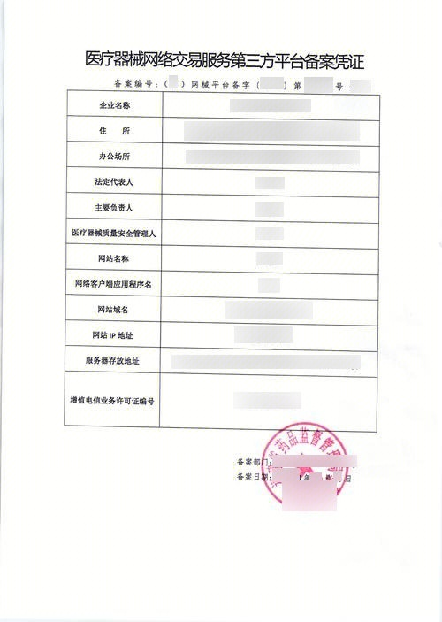

### 互联网医院

#### 政策法规依据

《互联网医院管理办法（试行）》第九条

卫生健康行政部门受理设置申请后，依据《医疗机构管理条例》、《医疗机构管理条例实施细则》的有关规定进行审核，在规定时间内作出同意或者不同意的书面答复。批准设置并同意其将互联网医院作为第二名称的，在《设置医疗机构批准书》中注明；批准第三方机构申请设置互联网医院的，发给《设置医疗机构批准书》。医疗机构按照有关法律法规和规章申请执业登记。

《医疗机构管理条例》 第二十四条

任何单位或者个人，未取得《医疗机构执业许可证》，不得开展诊疗活动。

#### 资质示例

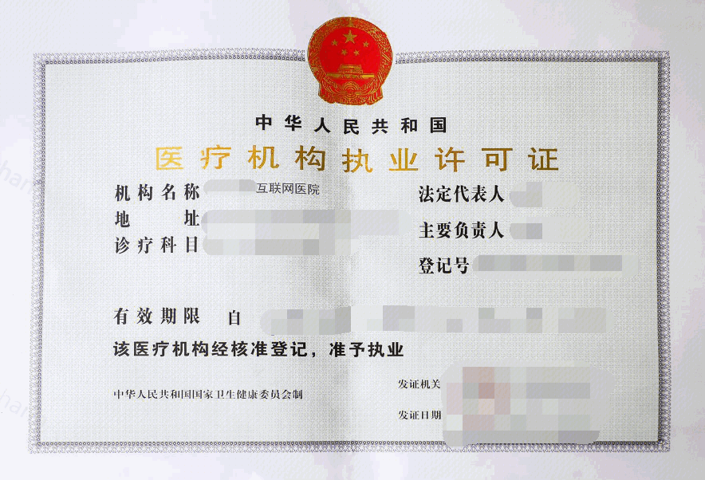

### 血液、干细胞服务

#### 政策法规依据

《血站管理办法》第十三条

血站开展采供血活动，应当向所在省、自治区、直辖市人民政府卫生行政部门申请办理执业登记，取得《血站执业许可证》。没有取得《血站执业许可证》的，不得开展采供血活动。

《单采血浆站管理办法》第六条

血液制品生产单位设置单采血浆站应当符合当地单采血浆站设置规划，并经省、自治区、直辖市人民政府卫生计生行政部门批准。

第十四条

经审查符合条件的，由省级人民政府卫生计生行政部门核发《单采血浆许可证》，并在设置审批后10日内报国家卫生计生委备案；经审查不符合条件的，应当将不予批准的理由书面通知申请人。

#### 资质示例

《单采血浆许可证》：

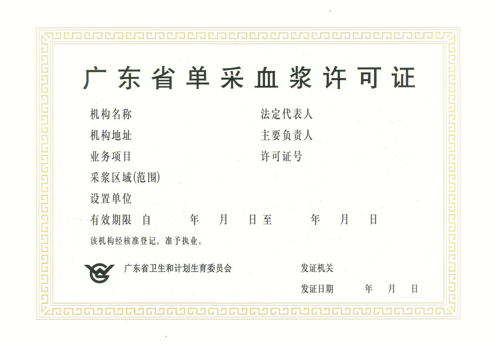

《血站执业许可证》：

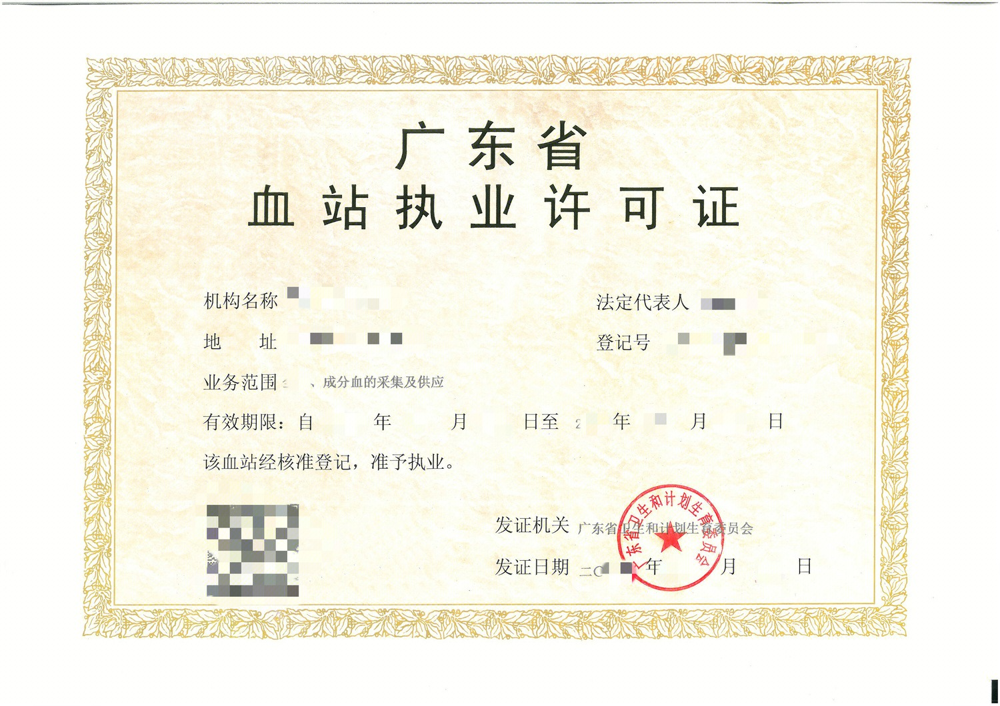

### 临床试验

#### 政策法规依据

《医疗机构管理条例》第十五条

医疗机构执业，必须进行登记，领取《医疗机构执业许可证》。

《国家药品监督管理局 国家卫生健康委员会关于发布药物临床试验机构管理规定的公告》（2019年第101号）第三条

从事药品研制活动，在中华人民共和国境内开展经国家药品监督管理局批准的药物临床试验（包括备案后开展的生物等效性试验），应当在药物临床试验机构中进行。药物临床试验机构应当符合本规定条件，实行备案管理。

仅开展与药物临床试验相关的生物样本等分析的机构，无需备案。

#### 资质示例

《事业单位法人证书》：

《药物临床试验机构资格认定证书》：

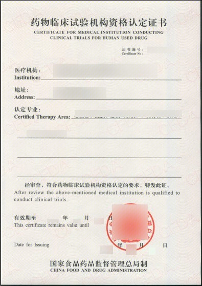

《医疗机构执业许可证》：

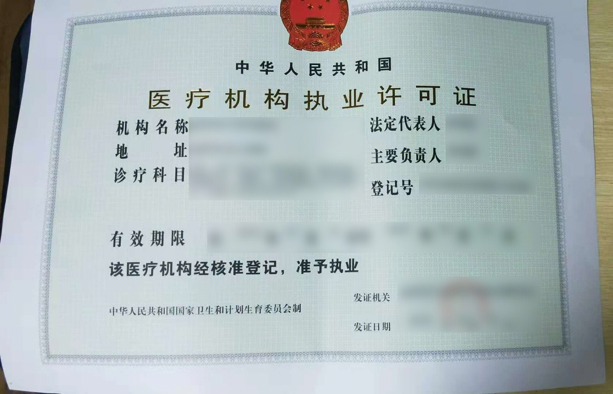

《药物临床试验机构备案》：

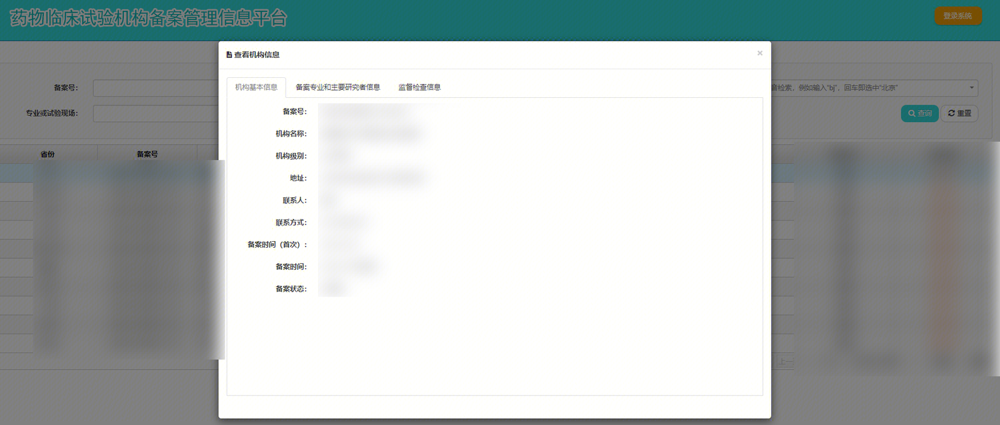

## 金融业

### 银行

#### 政策法规依据

《中华人民共和国商业银行法》第十六条

经批准设立的商业银行，由国务院银行业监督管理机构颁发经营许可证，并凭该许可证向工商行政管理部门办理登记，领取营业执照。

《金融许可证管理办法》第三条

金融许可证适用于银监会监管的、经批准经营金融业务的金融机构。金融机构包括政策性银行、商业银行、农村合作银行、城市信用社、农村信用社、村镇银行、贷款公司、农村资金互助社、金融资产管理公司、信托公司、企业集团财务公司、金融租赁公司、汽车金融公司、货币经纪公司等。

#### 资质示例

### 信托

#### 政策法规依据

《金融许可证管理办法》第二条

本办法所称金融许可证是指中国银行业监督管理委员会（以下简称银监会）依法颁发的特许金融机构经营金融业务的法律文件。

第三条

金融许可证适用于银监会监管的、经批准经营金融业务的金融机构。金融机构包括政策性银行、商业银行、农村合作银行、城市信用社、农村信用社、村镇银行、贷款公司、农村资金互助社、金融资产管理公司、信托公司、企业集团财务公司、金融租赁公司、汽车金融公司、货币经纪公司等。

#### 资质示例

### 公募基金

#### 政策法规依据

《证券投资基金销售管理办法》 第八条

基金管理人可以办理其募集的基金产品的销售业务。商业银行（含在华外资法人银行，下同）、证券公司、期货公司、保险机构、证券投资咨询机构、独立基金销售机构以及中国证监会认定的其他机构从事基金销售业务的，应向工商注册登记所在地的中国证监会派出机构进行注册并取得相应资格。

《证券投资基金托管业务管理办法》第十三条

中国证监会应当自受理申请材料之日起20个工作日内作出行政许可决定。中国证监会作出予以核准决定的，应当会签中国银监会；作出不予核准决定的，应当说明理由并告知申请人，行政许可程序终止。

中国银监会应当自收到会签件之日起20个工作日内，作出行政许可决定。中国银监会作出予以核准决定的，中国证监会和中国银监会共同签发批准文件，并由中国证监会颁发基金托管业务许可证；中国银监会作出不予核准决定的，应当说明理由并告知申请人，行政许可程序终止。

《证监会公告(2016)4号—关于对现有证券、基金、期货业务许可证进行整合的公告》

自2016年5月1日起，中国证监会及其派出机构向证券期货经营机构颁发的《经营证券业务许可证》、《证券投资咨询业务资格证书》、《经营外资股业务资格证书》、《合格境外机构投资者证券投资业务许可证》、《证券投资业务许可证》、《基金管理资格证书》、《特定客户资产管理业务资格证书》、《基金销售业务资格证书》、《经营期货业务许可证》、《期货公司营业部经营许可证》等10项许可证统一为《经营证券期货业务许可证》。

《证券投资基金托管业务管理办法》第十三条

《证券投资基金评价业务管理暂行办法》第六条 基金评价机构应当加入中国证券投资基金业协会。

#### 资质示例

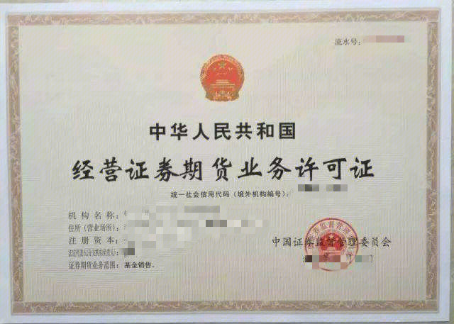
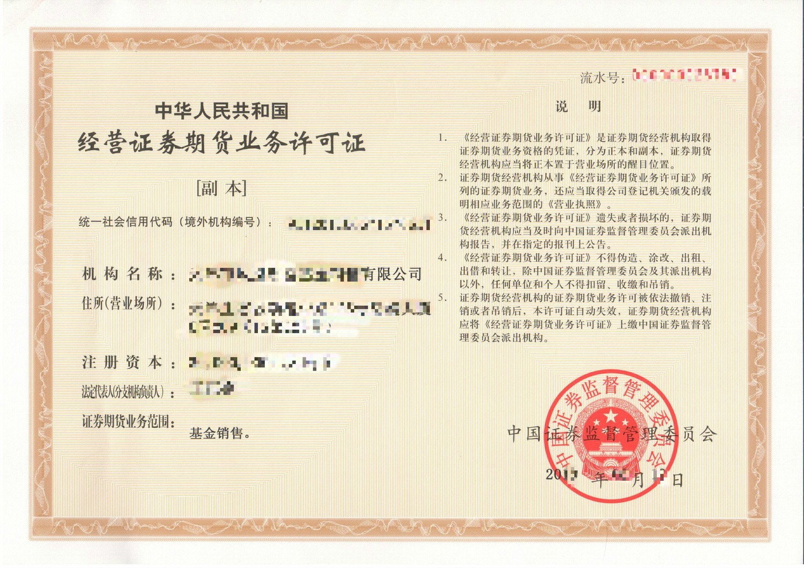

### 私募基金

#### 政策法规依据

私募投资基金服务业务管理办法（试行）

私募基金管理人应当委托在中国证券投资基金业协会（以下简称协会）完成登记并已成为协会会员的服务机构提供私募基金服务业务。

私募基金管理人委托服务机构从事私募基金募集、投资顾问等业务的相关规定，由协会另行规定。

《私募投资基金监督管理暂行办法》第七条

各类私募基金管理人应当根据基金业协会的规定，向基金业协会申请登记，报送以下基本信息：

（一）工商登记和营业执照正副本复印件；

（二）公司章程或者合伙协议；

（三）主要股东或者合伙人名单；

（四）高级管理人员的基本信息；

（五）基金业协会规定的其他信息。

基金业协会应当在私募基金管理人登记材料齐备后的20 个工作日内，通过网站公告私募基金管理人名单及其基本情况的方式，为私募基金管理人办结登记手续。

《私募投资基金监督管理暂行办法》第八条

各类私募基金募集完毕，私募基金管理人应当根据基金业协会的规定，办理基金备案手续，报送以下基本信息：

（一）主要投资方向及根据主要投资方向注明的基金类别；

（二）基金合同、公司章程或者合伙协议。资金募集过程中向投资者提供基金招募说明书的，应当报送基金招募说明书。以公司、合伙等企业形式设立的私募基金，还应当报送工商登记和营业执照正副本复印件；

（三）采取委托管理方式的，应当报送委托管理协议。委托托管机构托管基金财产的，还应当报送托管协议；

（四）基金业协会规定的其他信息。

基金业协会应当在私募基金备案材料齐备后的20 个工作日内，通过网站公告私募基金名单及其基本情况的方式，为私募基金办结备案手续。

#### 资质示例

《中国证券投资基金业协会私募基金管理人分类查询公示网址查询截图》：

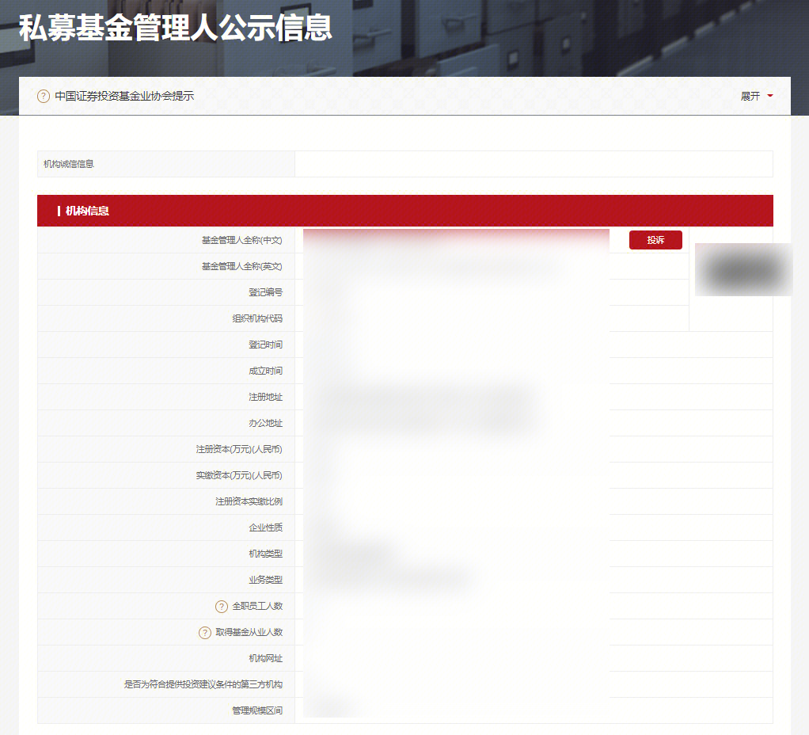

《私募基金备案证明》：

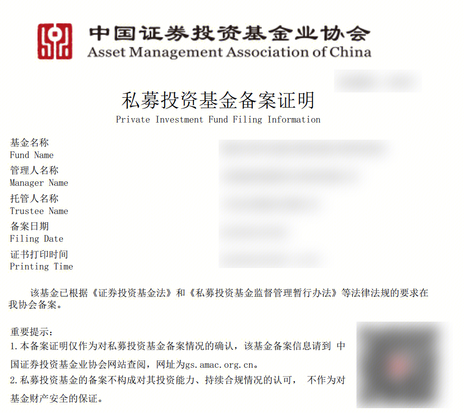

### 证券/期货

#### 政策法规依据

《证券公司监督管理条例》第十七条

公司登记机关应当依照法律、行政法规的规定，凭国务院证券监督管理机构的批准文件，办理证券公司及其境内分支机构的设立、变更、注销登记。证券公司在取得公司登记机关颁发或者换发的证券公司或者境内分支机构的营业执照后，应当向国务院证券监督管理机构申请颁发或者换发经营证券业务许可证。经营证券业务许可证应当载明证券公司或者境内分支机构的证券业务范围。未取得经营证券业务许可证，证券公司及其境内分支机构不得经营证券业务。

#### 资质示例

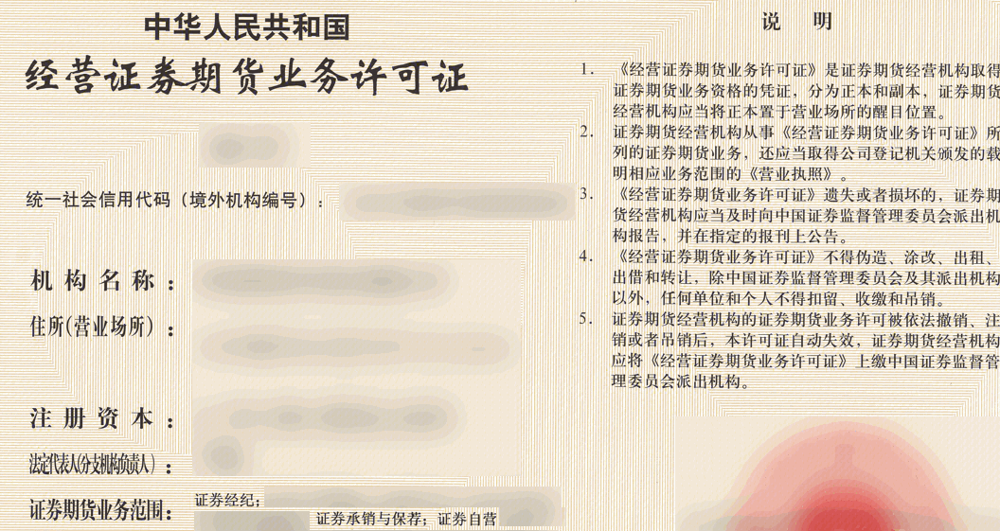

### 证券/期货投资咨询

#### 政策法规依据

《证券、期货投资咨询管理暂行办法》第三条

从事证券、期货投资咨询业务，必须依照本办法的规定，取得中国证监会的业务许可。未经中国证监会许可，任何机构和个人均不得从事本办法第二条所列各种形式证券、期货投资咨询业务。

《证监会公告(2016)4号—关于对现有证券、基金、期货业务许可证进行整合的公告》

自2016年5月1日起，中国证监会及其派出机构向证券期货经营机构颁发的《经营证券业务许可证》、《证券投资咨询业务资格证书》、《经营外资股业务资格证书》、《合格境外机构投资者证券投资业务许可证》、《证券投资业务许可证》、《基金管理资格证书》、《特定客户资产管理业务资格证书》、《基金销售业务资格证书》、《经营期货业务许可证》、《期货公司营业部经营许可证》等10项许可证统一为《经营证券期货业务许可证》。

#### 资质示例

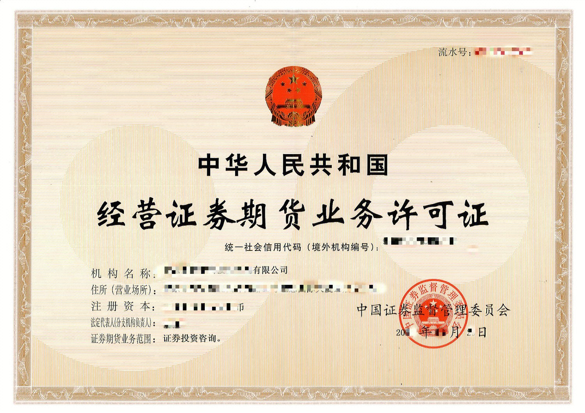
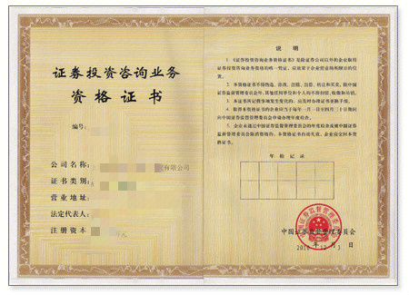

### 非金融机构自营小额贷款

#### 政策法规依据

《小额贷款公司监督管理暂行办法》

第八条 设立小额贷款公司从事小额贷款业务，应当经省级地方金融管理机构同意。

#### 资质示例

### 保险

#### 政策法规依据

《中华人民共和国保险法》第七十三条

筹建工作完成后，申请人具备本法第六十八条规定的设立条件的，可以向国务院保险监督管理机构提出开业申请。国务院保险监督管理机构应当自受理开业申请之日起六十日内，作出批准或者不批准开业的决定。决定批准的，颁发经营保险业务许可证；决定不批准的，应当书面通知申请人并说明理由。《保险许可证管理办法》第五条本办法所称保险许可证包括下列几种类型：

（一）保险公司法人许可证和经营保险业务许可证；

（二）保险营销服务许可证；（三）经营保险代理业务许可证；（四）经营保险经纪业务许可证；（五）经营保险公估业务许可证；（六）保险兼业代理业务许可证；（七）保险资产管理公司法人许可证和经营保险资产管理业务许可证。

#### 资质示例

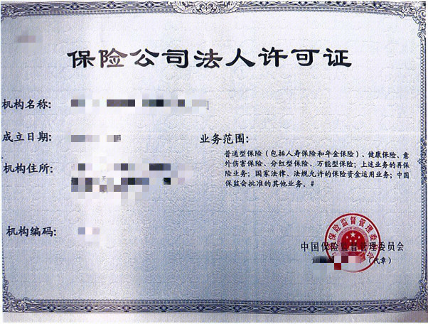

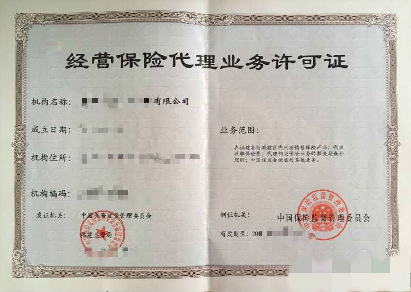

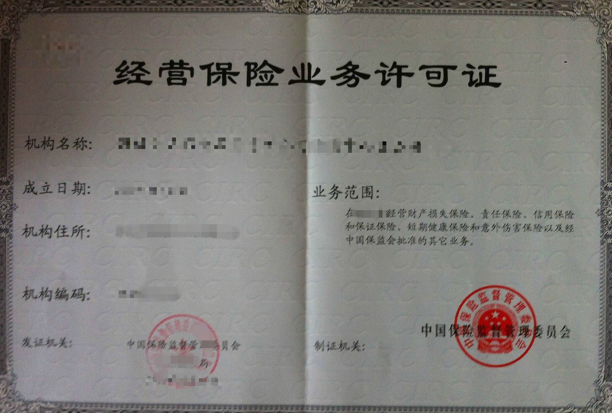

### 征信业务

#### 政策法规依据

《征信业管理条例》第七条经批准设立的经营个人征信业务的征信机构，凭个人征信业务经营许可证向公司登记机关办理登记。

《征信业管理条例》 第十条设立经营企业征信业务的征信机构，应当符合《中华人民共和国公司法》规定的设立条件，并自公司登记机关准予登记之日起30日内向所在地的国务院征信业监督管理部门派出机构办理备案，并提供下列材料：

#### 资质示例

《企业征信业务经营备案证》：

《个人征信业务经营许可证》、《营业执照》：

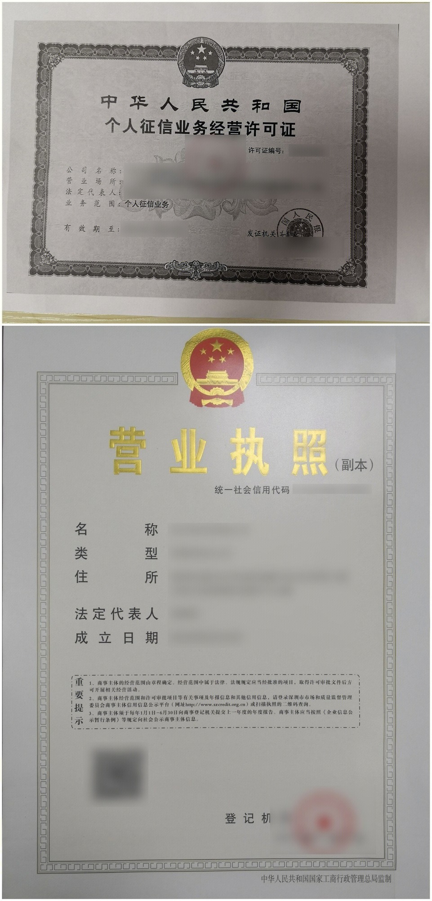

### 新三板信息服务平台

#### 政策法规依据

《全国中小企业股份转让系统业务规则（试行）》3.2.2

全国股份转让系统公司负责全国股份转让系统信息的统一管理和发布。未经全国股份转让系统公司许可，任何机构和个人不得发布、使用和传播转让信息。经全国股份转让系统公司许可使用转让信息的机构和个人，未经同意不得将转让信息提供给其他机构和个人使用或予以传播。

1、《互联网信息服务管理办法》第三条

互联网信息服务分为经营性和非经营性两类。非经营性互联网信息服务，是指通过互联网向上网用户无偿提供具有公开性、共享性信息的服务活动。

2、《非经营性互联网信息服务备案管理办法》第七条

拟从事非经营性互联网信息服务的，应当通过信息产业部备案管理系统如实填报《非经营性互联网信息服务备案登记表》（以下简称“《备案登记表》”，格式见本办法附录），履行备案手续。

### 股票信息服务平台（港股/美股）

#### 政策法规依据

1、《互联网信息服务管理办法》第三条 互联网信息服务分为经营性和非经营性两类。非经营性互联网信息服务，是指通过互联网向上网用户无偿提供具有公开性、共享性信息的服务活动。

2、《非经营性互联网信息服务备案管理办法》第七条 拟从事非经营性互联网信息服务的，应当通过信息产业部备案管理系统如实填报《非经营性互联网信息服务备案登记表》（以下简称“《备案登记表》”，格式见本办法附录），履行备案手续。

#### 资质示例

《非经营性互联网信息服务备案核准》：

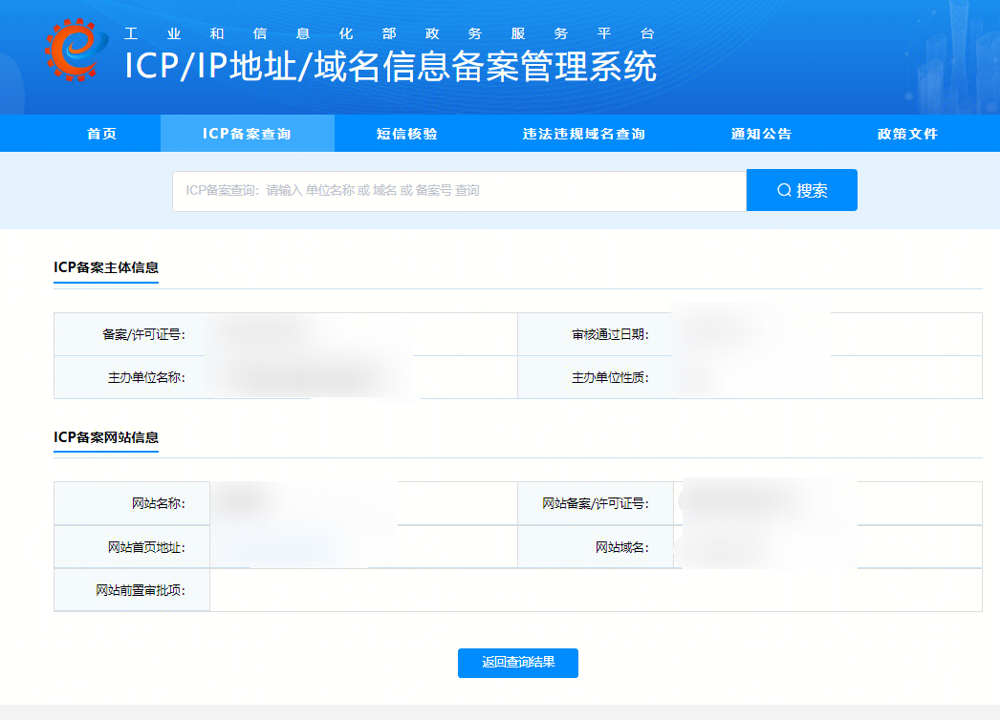

### 股票信息服务平台

#### 政策法规依据

深市行情信息授权申请流程：<http://www.cninfo.com.cn/fwsq/hq/sq.htm>

深交所公布授权信息商名单：<http://www.cninfo.com.cn/fwsq/hq/sqmd.htm>

上证所的信息服务商业务办理平台：[https://ic.sseinfo.com/page/business/ywsq_level1.jsp#根据信息的类型签订不同的合同及发放不同的证件](https://ic.sseinfo.com/page/business/ywsq_level1.jsp#%E6%A0%B9%E6%8D%AE%E4%BF%A1%E6%81%AF%E7%9A%84%E7%B1%BB%E5%9E%8B%E7%AD%BE%E8%AE%A2%E4%B8%8D%E5%90%8C%E7%9A%84%E5%90%88%E5%90%8C%E5%8F%8A%E5%8F%91%E6%94%BE%E4%B8%8D%E5%90%8C%E7%9A%84%E8%AF%81%E4%BB%B6)

#### 资质示例

《深圳交易所专有信息经营许可证》：

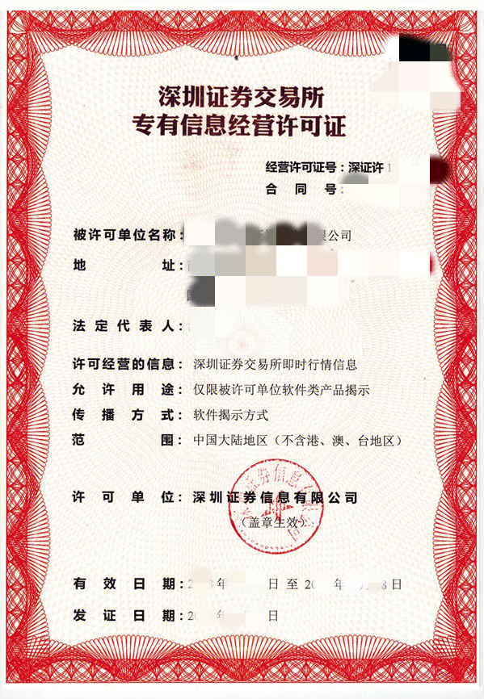

《增值电信业务经营许可证》：

《上证所证券信息经营许可》：

### 外币兑换

#### 政策法规依据

《个人本外币兑换特许业务试点管理办法》第五条

境内非金融机构拟经营特许业务，应向外汇局申请在单一外汇局分局、外汇管理部（以下简称外汇分局）所辖地区内或在全国范围内经营的资格，并取得《个人本外币兑换特许业务经营许可证》（以下简称兑换特许证）。

#### 资质示例

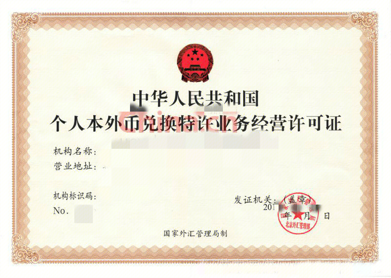

### 实物黄金买卖

#### 政策法规依据

《中国人民银行办公厅关于黄金资产管理业务有关事项的通知》第四条

按照有关金融监管规定发起设立的黄金资产管理产品，除了要符合金融监管部门的管理规定外，发起设立的金融机构还应当向中国人民银行备案：

（一）发起设立的金融机构为银行业金融机构的，按照《中国人民银行办公厅关于加强银行业金融机构黄金市场业务管理有关事项的通知》（银办发〔2012〕238号）要求备案；

（二）发起设立的金融机构为非银行业金融机构的，向公司法人注册所在地的中国人民银行分支机构备案，备案程序及金融机构应提供的材料比照《中国人民银行办公厅关于加强银行业金融机构黄金市场业务管理有关事项的通知》要求执行

### 消费金融

#### 政策法规依据

1、《消费金融公司试点管理办法》第二条

本办法所称消费金融公司，是指经银监会批准，在中华人民共和国境内设立的，不吸收公众存款，以小额、分散为原则，为中国境内居民个人提供以消费为目的的贷款的非银行金融机构。

2、《中国银监会非银行金融机构行政许可事项实施办法》第六十八条

消费金融公司开业，应由主要出资人作为申请人向拟设地银监局提交申请，由银监局受理、审查并决定。银监局自受理之日起2个月内作出核准或不予核准的书面决定，并抄报银监会。

第六十九条 申请人应在收到开业核准文件并领取金融许可证后，办理工商登记，领取营业执照。

#### 资质示例

《金融许可证》：

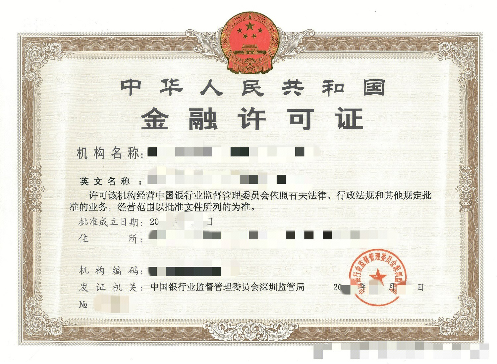

《营业执照》：

### 信用卡

#### 政策法规依据

《金融许可证管理办法》第三条

金融许可证适用于银监会监管的、经批准经营金融业务的金融机构。

金融机构包括政策性银行、商业银行、农村合作银行、城市信用社、农村信用社、村镇银行、贷款公司、农村资金互助社、金融资产管理公司、信托公司、企业集团财务公司、金融租赁公司、汽车金融公司、货币经纪公司等。

《非金融机构支付服务管理办法》第三条

非金融机构提供支付服务，应当依据本办法规定取得《支付业务许可证》，成为支付机构。支付机构依法接受中国人民银行的监督管理。

未经中国人民银行批准，任何非金融机构和个人不得从事或变相从事支付业务。

#### 资质示例

《金融许可证》 ：

《支付业务许可证》：

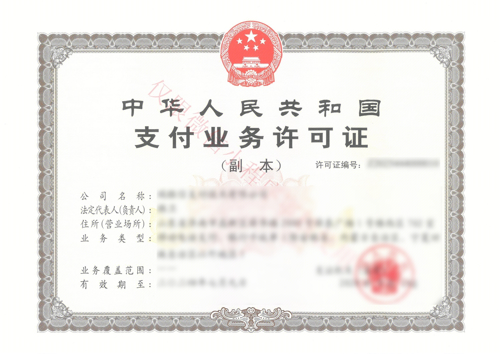

### 区域性股权交易市场

#### 政策法规依据

国务院办公厅关于规范发展区域性股权市场的通知（国办发〔2017〕11号）

区域性股权市场运营机构（以下简称运营机构）负责组织区域性股权市场的活动，对市场参与者进行自律管理，保障市场规范稳定运行。

运营机构名单由省级人民政府实施管理并予以公告，同时向证监会备案。

本通知印发前，省、自治区、直辖市、计划单列市行政区域内已设立运营机构的，不再设立；尚未设立运营机构的，可设立一家；已设立两家及以上运营机构的，省级人民政府要积极稳妥推动整合为一家，证监会要予以指导督促。

#### 资质示例

《批准成立股权交易市场相关文件》：

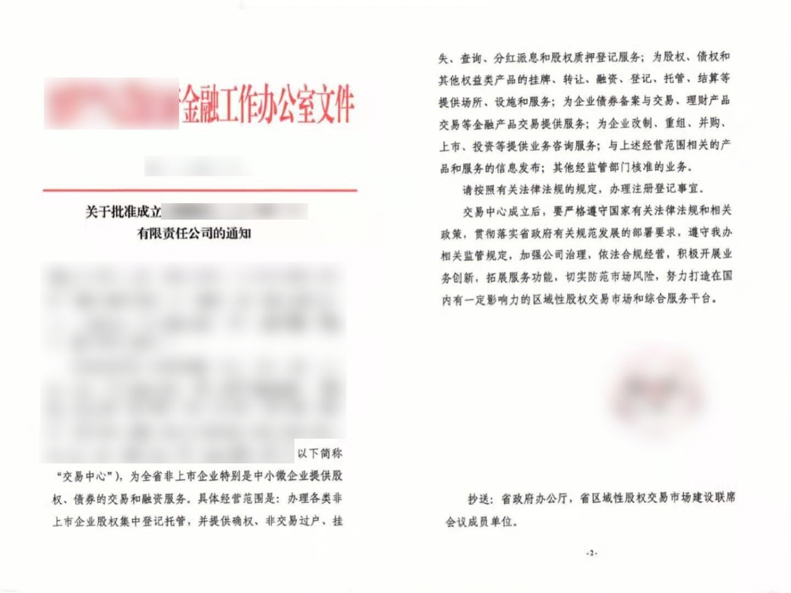

《营业执照》：

### 电子汇票

#### 政策法规依据

《电子商业汇票系统管理办法》第十五条

上海票据交易所在中国人民银行指导下开展系统参与者的准入、变更和退出申请的受理和审核工作。

《电子商业汇票系统管理办法》第十七条

金融机构加入电子商业汇票系统，应由其法人机构按照申请、审核、实施和加入的程序办理。

申请是指金融机构按规定以书面形式向上海票据交易所提交加入电子商业汇票系统请求的行为。

审核是指上海票据交易所审查、核准金融机构加入电子商业汇票系统的行为。

实施是指金融机构按规定完成内部系统接入电子商业汇票系统前各项准备工作的行为。加入是指金融机构正式接入电子商业汇票系统的行为。

《电子商业汇票系统管理办法》第十八条

金融机构及其分支机构需加入电子商业汇票系统的，应以法人为单位提出书面申请，并遵循上海票据交易所关于系统参与者加入的相关规定。

申请集中接入直连的金融机构，应同时提交集中接入技术服务机构同意其使用接入服务的书面意见。

## 交通服务

### 网约车

#### 政策法规依据

《网络预约出租汽车经营服务管理暂行办法》第八条

出租汽车行政主管部门对于网约车经营申请作出行政许可决定的，应当明确经营范围、经营区域、经营期限等，并发放《网络预约出租汽车经营许可证》。

#### 资质示例

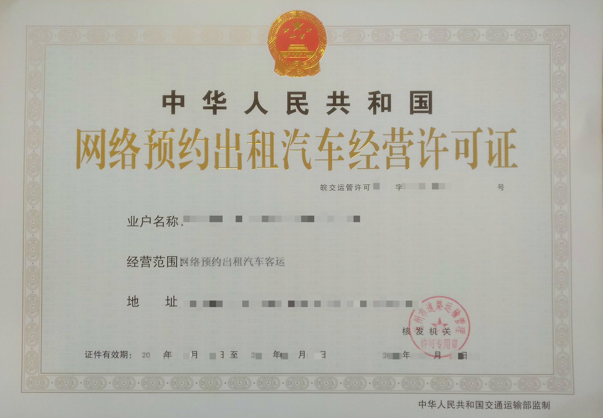

### 顺风车/拼车

#### 政策法规依据

《网络预约出租汽车经营服务管理暂行办法》第三十八条 私人小客车合乘，也称为拼车、顺风车，按城市人民政府有关规定执行。

#### 资质示例

《道路运输经营许可证》（经营范围含客运）：

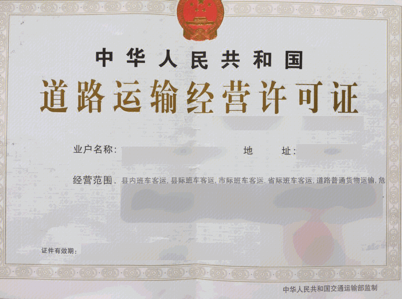

### 出租车

#### 政策法规依据

《中华人民共和国道路运输条例》第十条

申请从事客运经营的，应当依法向工商行政管理机关办理有关登记手续后，按照下列规定提出申请并提交符合本条例第八条规定条件的相关材料：

（一）从事县级行政区域内客运经营的，向县级道路运输管理机构提出申请；

（二）从事省、自治区、直辖市行政区域内跨2个县级以上行政区域客运经营的，向其共同的上一级道路运输管理机构提出申请；

（三）从事跨省、自治区、直辖市行政区域客运经营的，向所在地的省、自治区、直辖市道路运输管理机构提出申请。依照前款规定收到申请的道路运输管理机构，应当自受理申请之日起20日内审查完毕，作出许可或者不予许可的决定。予以许可的，向申请人颁发道路运输经营许可证，并向申请人投入运输的车辆配发车辆营运证；不予许可的，应当书面通知申请人并说明理由。对从事跨省、自治区、直辖市行政区域客运经营的申请，有关省、自治区、直辖市道路运输管理机构依照本条第二款规定颁发道路运输经营许可证前，应当与运输线路目的地的省、自治区、直辖市道路运输管理机构协商；协商不成的，应当报国务院交通主管部门决定。

#### 资质示例

《道路运输经营许可证》：

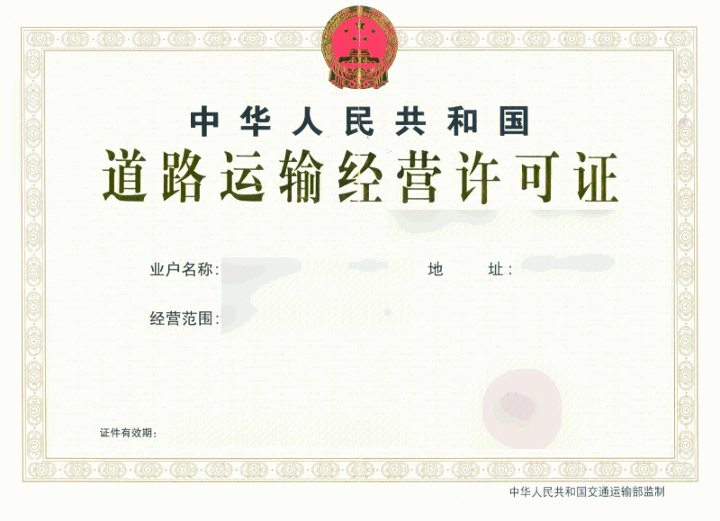

### 跨境客运

#### 政策法规依据

《广东省直通港澳道路运输管理办法》

第十四条 取得车辆指标的企业，应当按照《道路旅客运输及客运站管理规定》《道路货物运输及站场管理规定》《道路危险货物运输管理规定》相关要求向省交通运输主管

部门申请跨境运输经营许可，并提供有关材料。省交通运输主管部门对符合法定条件的跨境运输经营申请作出准予行政许可决定，出具相应的《行政许可决定书》，明确经营

主体、经营范围（跨境客运、跨境普通货运、跨境危险货运）等许可事项，并按规定向被许可人发放《道路运输经营许可证》。

### 航空业务

#### 政策法规依据

《中华人民共和国民用航空法》第一百四十七条

从事非经营性通用航空的，应当向国务院民用航空主管部门办理登记。

从事经营性通用航空的，应当向国务院民用航空主管部门申请领取通用航空经营许可证，并依法办理工商登记；未取得经营许可证的，工商行政管理部门不得办理工商登记。

#### 资质示例

《通用航空经营许可证》：

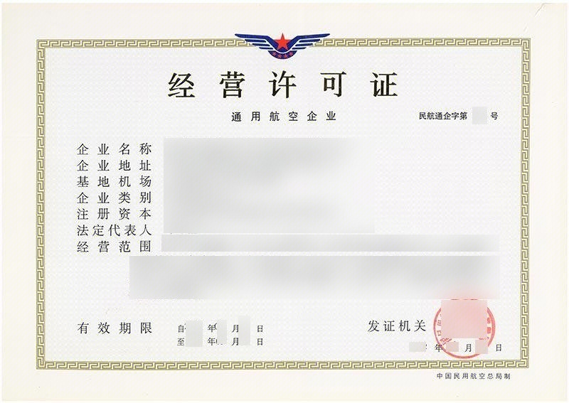

## 房地产服务

### 房地产营销

#### 政策法规依据

《中华人民共和国城市房地产管理法》第四十五条

商品房预售，应当符合下列条件：

（一）已交付全部土地使用权出让金，取得土地使用权证书；

（二）持有建设工程规划许可证；

（三）按提供预售的商品房计算，投入开发建设的资金达到工程建设总投资的百分之二十五以上，并已经确定施工进度和竣工交付日期；

（四）向县级以上人民政府房产管理部门办理预售登记，取得商品房预售许可证明。商品房预售人应当按照国家有关规定将预售合同报县级以上人民政府房产管理部门和土地管理部门登记备案。

商品房预售所得款项，必须用于有关的工程建设。

《城市商品房预售管理办法》第六条

商品房预售实行许可制度。开发企业进行商品房预售，应当向房地产管理部门申请预售许可，取得《商品房预售许可证》。未取得《商品房预售许可证》的，不得进行商品房预售。

《商品房销售管理办法》第八条

房地产开发企业应当在商品房现售前将房地产开发项目手册及符合商品房现售条件的有关证明文件报送房地产开发主管部门备案。

#### 资质示例

《商品房现售备案证明》：

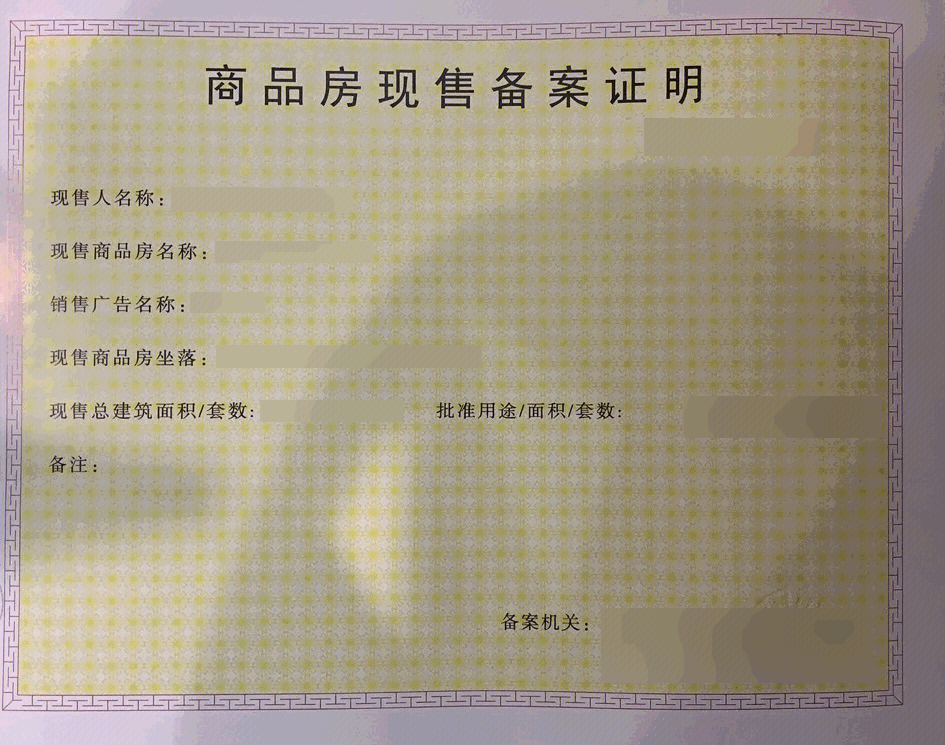

《商品房预售许可证》：

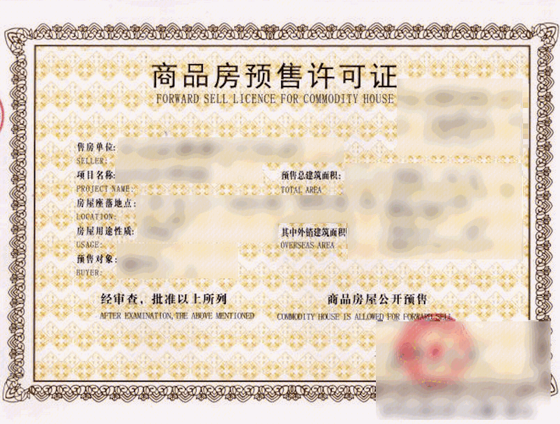

## 生活服务

### 宠物医院/兽医

#### 政策法规依据

《中华人民共和国动物防疫法》第五十一条

设立从事动物诊疗活动的机构，应当向县级以上地方人民政府兽医主管部门申请动物诊疗许可证。受理申请的兽医主管部门应当依照本法和《中华人民共和国行政许可法》的规定进行审查。经审查合格的，发给动物诊疗许可证；不合格的，应当通知申请人并说明理由。

#### 资质示例

### 其他宠物健康服务

#### 政策法规依据

《中华人民共和国动物防疫法》第五十一条

设立从事动物诊疗活动的机构，应当向县级以上地方人民政府兽医主管部门申请动物诊疗许可证。受理申请的兽医主管部门应当依照本法和《中华人民共和国行政许可法》的规定进行审查。

经审查合格的，发给动物诊疗许可证；不合格的，应当通知申请人并说明理由。

《中华人民共和国动物防疫法》第五十二条

实验室疫病检测报告应当由动物疫病预防控制机构、取得相关资质认定、国家认可机构认可或者符合省级农业农村主管部门规定条件的实验室出具。

#### 资质示例

《动物诊疗许可证》：

《检验检测机构资质认定证书》：

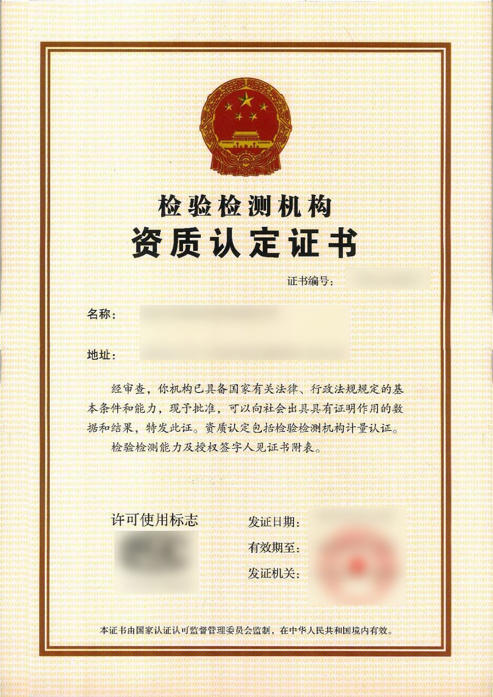

### 兽药

#### 政策法规依据

《兽药管理条例》第十一条

从事兽药生产的企业，应当符合国家兽药行业发展规划和产业政策，并具备下列条件：

(一)与所生产的兽药相适应的兽医学、药学或者相关专业的技术人员；

(二)与所生产的兽药相适应的厂房、设施；

(三)与所生产的兽药相适应的兽药质量管理和质量检验的机构、人员、仪器设备；

(四)符合安全、卫生要求的生产环境；

(五)兽药生产质量管理规范规定的其他生产条件。符合前款规定条件的，申请人方可向省、自治区、直辖市人民政府兽医行政管理部门提出申请，并附具符合前款规定条件的证明材料；省、自治区、直辖市人民政府兽医行政管理部门应当自收到申请之日起40个工作日内完成审查。经审查合格的，发给兽药生产许可证；不合格的，应当书面通知申请人。

《兽药管理条例》第二十二条

经营兽药的企业，应当具备下列条件：

(一)与所经营的兽药相适应的兽药技术人员；

(二)与所经营的兽药相适应的营业场所、设备、仓库设施；

(三)与所经营的兽药相适应的质量管理机构或者人员；

(四)兽药经营质量管理规范规定的其他经营条件。符合前款规定条件的，申请人方可向市、县人民政府兽医行政管理部门提出申请，并附具符合前款规定条件的证明材料；经营兽用生物制品的，应当向省、自治区、直辖市人民政府兽医行政管理部门提出申请，并附具符合前款规定条件的证明材料。县级以上地方人民政府兽医行政管理部门，应当自收到申请之日起30个工作日内完成审查。审查合格的，发给兽药经营许可证；不合格的，应当书面通知申请人。

#### 资质示例

《兽药生产许可证》：

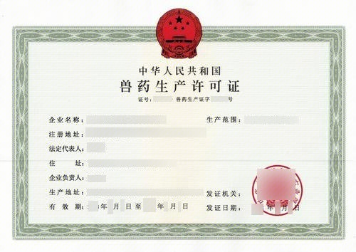
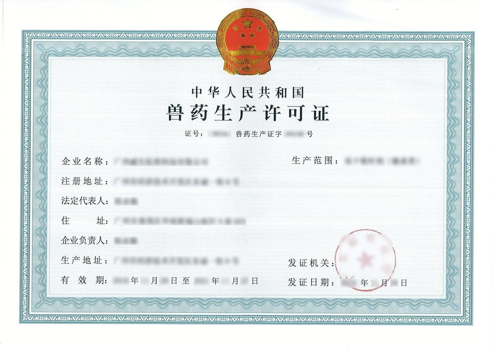

《兽药经营许可证》：

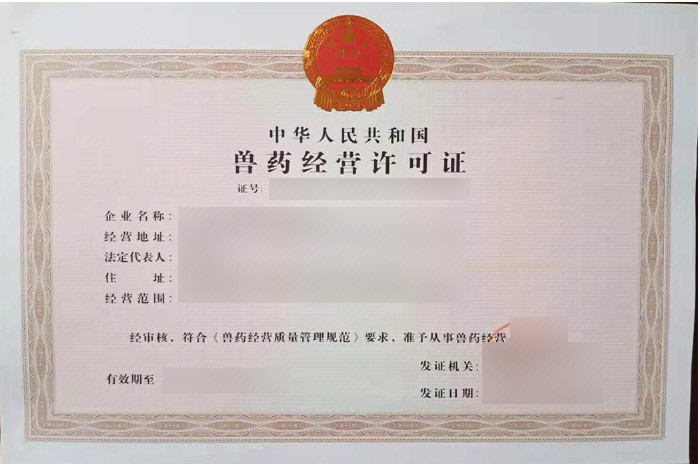

### 兽药平台

#### 政策法规依据

《兽药管理条例》第十一条

从事兽药生产的企业，应当符合国家兽药行业发展规划和产业政策，并具备下列条件：

(一)与所生产的兽药相适应的兽医学、药学或者相关专业的技术人员；

(二)与所生产的兽药相适应的厂房、设施；

(三)与所生产的兽药相适应的兽药质量管理和质量检验的机构、人员、仪器设备；

(四)符合安全、卫生要求的生产环境；

(五)兽药生产质量管理规范规定的其他生产条件。符合前款规定条件的，申请人方可向省、自治区、直辖市人民政府兽医行政管理部门提出申请，并附具符合前款规定条件的证明材料；省、自治区、直辖市人民政府兽医行政管理部门应当自收到申请之日起40个工作日内完成审查。经审查合格的，发给兽药生产许可证；不合格的，应当书面通知申请人。

《兽药管理条例》第二十二条

经营兽药的企业，应当具备下列条件：

(一)与所经营的兽药相适应的兽药技术人员；

(二)与所经营的兽药相适应的营业场所、设备、仓库设施；

(三)与所经营的兽药相适应的质量管理机构或者人员；

(四)兽药经营质量管理规范规定的其他经营条件。符合前款规定条件的，申请人方可向市、县人民政府兽医行政管理部门提出申请，并附具符合前款规定条件的证明材料；经营兽用生物制品的，应当向省、自治区、直辖市人民政府兽医行政管理部门提出申请，并附具符合前款规定条件的证明材料。县级以上地方人民政府兽医行政管理部门，应当自收到申请之日起30个工作日内完成审查。审查合格的，发给兽药经营许可证；不合格的，应当书面通知申请人。

#### 资质示例

《兽药生产许可证》：

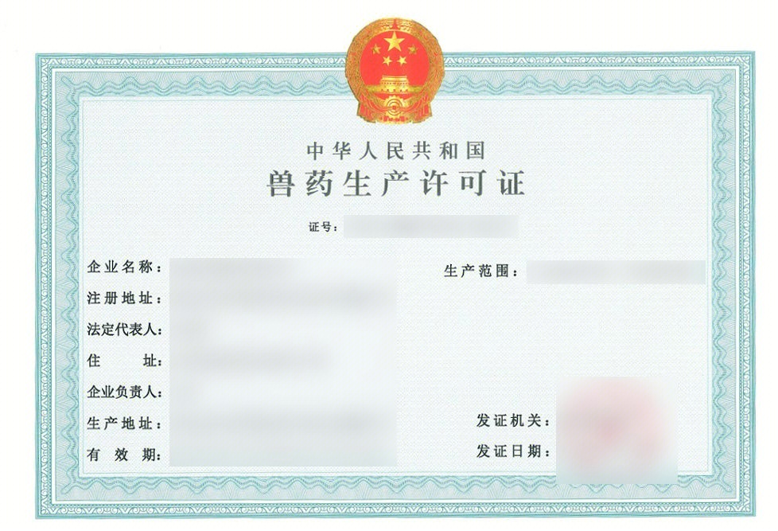

《兽药经营许可证》：

《增值电信业务经营许可证》：

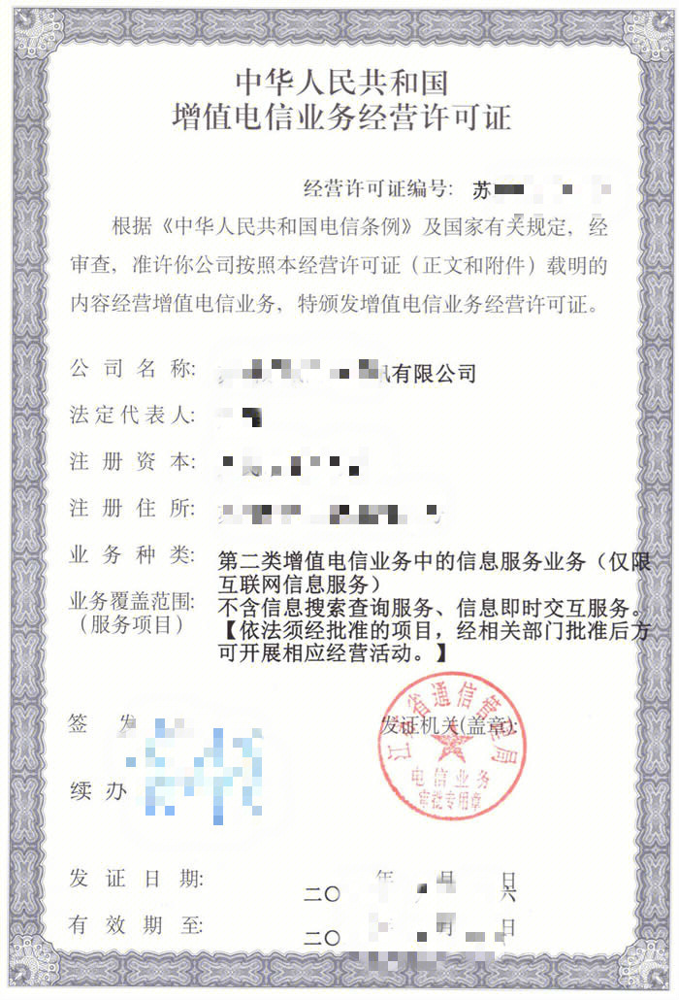

### 求职/招聘

#### 政策法规依据

《人力资源市场暂行条例》第十八条

经营性人力资源服务机构从事职业中介活动的，应当依法向人力资源社会保障行政部门申请行政许可，取得人力资源服务许可证。

《网络招聘服务管理规定》

第九条 经营性人力资源服务机构从事网络招聘服务，应当依法取得人力资源服务许可证。涉及经营电信业务的，还应当依法取得电信业务经营许可证。

#### 资质示例

### 求职/招聘（涉外）

#### 政策法规依据

《对外劳务合作管理条例》

第二条　本条例所称对外劳务合作，是指组织劳务人员赴其他国家或者地区为国外的企业或者机构（以下统称国外雇主）工作的经营性活动。

国外的企业、机构或者个人不得在中国境内招收劳务人员赴国外工作。

第五条　从事对外劳务合作，应当按照省、自治区、直辖市人民政府的规定，经省级或者设区的市级人民政府商务主管部门批准，取得对外劳务合作经营资格。

《网络招聘服务管理规定》

第九条 经营性人力资源服务机构从事网络招聘服务，应当依法取得人力资源服务许可证。涉及经营电信业务的，还应当依法取得电信业务经营许可证。

第十条 对从事网络招聘服务的经营性人力资源服务机构，人力资源社会保障行政部门应当在其服务范围中注明“开展网络招聘服务”。

#### 资质示例

《人力资源服务许可证》：

### 开锁服务

#### 政策法规依据

《公安部、人力资源和社会保障部、国家工商行政管理总局关于加强开锁行业管理严厉打击利用开锁技术违法犯罪的通知》

工商行政管理部门要严把登记注册关，对不符合工商登记条件的开锁经营单位，一律不予办理营业执照。公安机关对依法领取营业执照的开锁业经营单位及其从业人员要建立登记备案制度，建档立簿，登记详细信息，并实行信息化管理。

#### 资质示例

《公安局备案证明》：

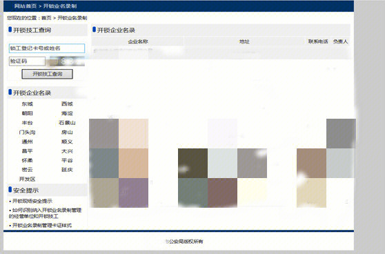

《营业执照》:

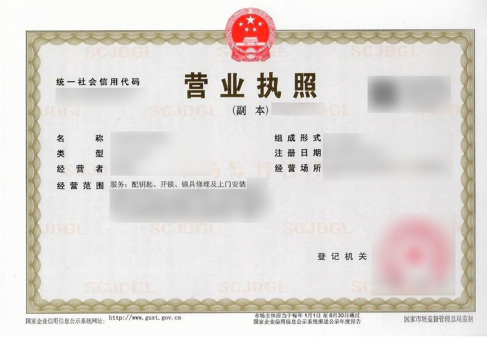

### 洗浴保健

#### 政策法规依据

《公共场所卫生管理条例》第四条

国家对公共场所以及新建、改建、扩建的公共场所的选址和设计实行“卫生许可证”制度。

《公共场所卫生管理条例》第七条

公共场所直接为顾客服务的人员，持有“健康合格证”方能从事本职工作。

《中华人民共和国消防法》第十五条

公众聚集场所在投入使用、营业前，建设单位或者使用单位应当向场所所在地的县级以上地方人民政府公安机关消防机构申请消防安全检查。公安机关消防机构应当自受理申请之日起十个工作日内，根据消防技术标准和管理规定，对该场所进行消防安全检查。未经消防安全检查或者经检查不符合消防安全要求的，不得投入使用、营业

《国务院对确需保留的行政审批项目设定行政许可的决定》36 旅馆业特种行业许可证核发

#### 资质示例

《公共场所卫生许可证》：

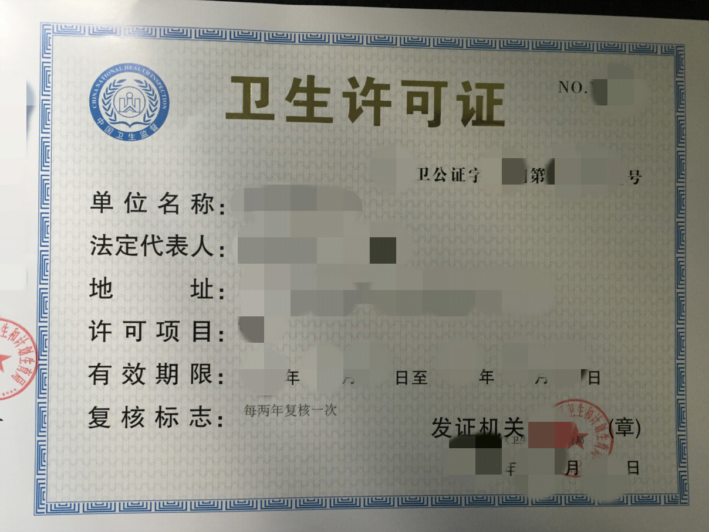

《公众聚集场所投入使用、营业前消防安全检查合格证》：

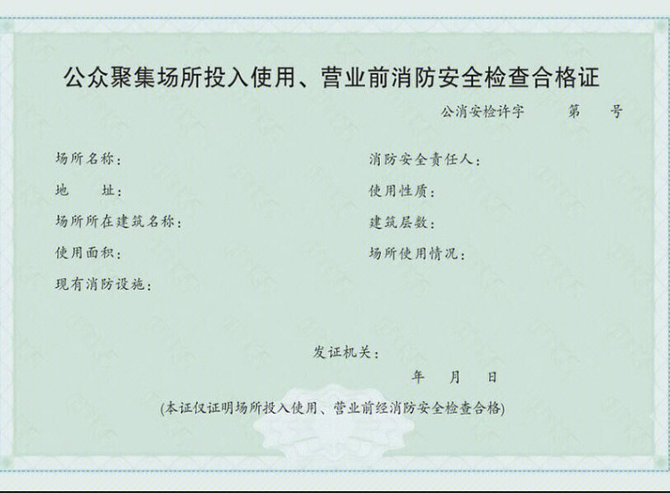

《健康合格证》：

《建设工程消防验收意见书》：

### 营业性演出票务

#### 政策法规依据

《文化部关于规范营业性演出票务市场经营秩序的通知》（一）

从事营业性演出票务经营活动的单位，应当依照《营业性演出管理条例》及其实施细则关于演出经纪机构的有关规定，按照《文化部关于加强演出市场有关 问题管理的通知》（文市发〔2011〕56号）有关要求，向文化行政部门申请取得营业性演出许可证。利用信息网络从事营业性演出票务经营活动的互联网平台企业属于演出票务经营单位，应当按上述规定办理营业性演出许可证。文化行政部门向演出票务经营单位颁发营业性演出许可证时，应当在经营范围中载明“演出票务”。

#### 资质示例

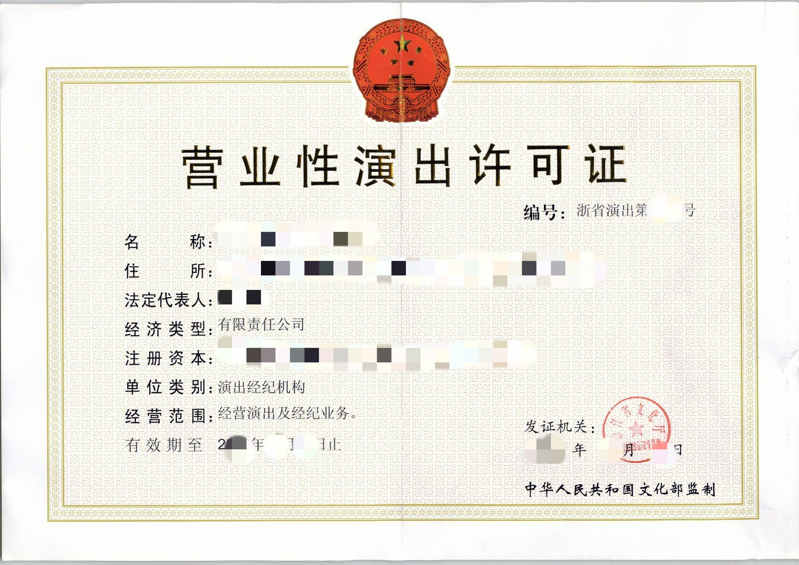

## IT科技

### 音视频设备

#### 政策法规依据

《强制性产品认证管理规定》第二条

为保护国家安全、防止欺诈行为、保护人体健康或者安全、保护动植物生命或者健康、保护环境，国家规定的相关产品必须经过认证（以下简称强制性产品认证），并标注认证标志后，方可出厂、销售、进口或者在其他经营活动中使用。

市场监管总局关于优化强制性产品认证目录的公告

为便利各相关方准确界定强制性产品认证目录范围，市场监管总局（认监委）重新修订《强制性产品认证目录描述与界定表》（见附件），一并予以公布。

#### 资质示例

《中国国家强制性产品认证证书》：

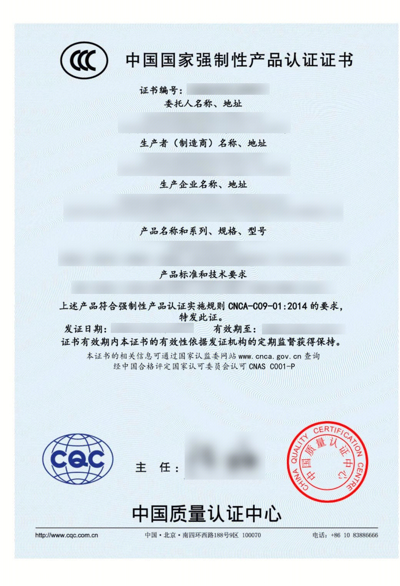

### 基础电信运营商

#### 政策法规依据

《中华人民共和国电信条例》第八条

电信业务分为基础电信业务和增值电信业务。基础电信业务，是指提供公共网络基础设施、公共数据传送和基本话音通信服务的业务。增值电信业务，是指利用公共网络基础设施提供的电信与信息服务的业务。第九条经营基础电信业务，须经国务院信息产业主管部门审查批准，取得《基础电信业务经营许可证》

#### 资质示例

《基础电信业务经营许可证》：

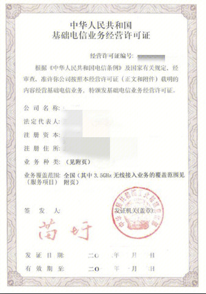

《营业执照》（含相关业务范围）

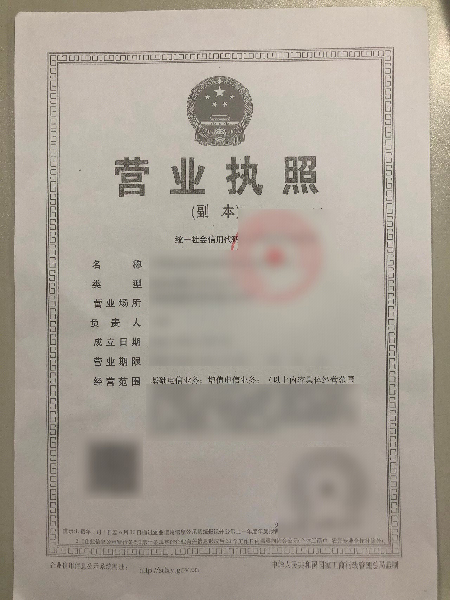

### 转售移动通信

#### 资质示例

《增值电信业务经营许可证》（业务种类需含通过转售方式提供移动通信业务）：

### 多方通信

#### 资质示例

《增值电信业务经营许可证》（业务范围需含“国内多方通信服务业务”）：

## 餐饮

### 餐饮服务场所/餐饮服务管理企业

#### 政策法规依据

1、《食品经营许可管理办法》第四条

食品经营许可实行一地一证原则，即食品经营者在一个经营场所从事食品经营活动，应当取得一个食品经营许可证。

2、《中华人民共和国食品安全法》第三十五条

国家对食品生产经营实行许可制度。从事食品生产、食品销售、餐饮服务，应当依法取得许可。

#### 资质示例

《食品经营许可证》：

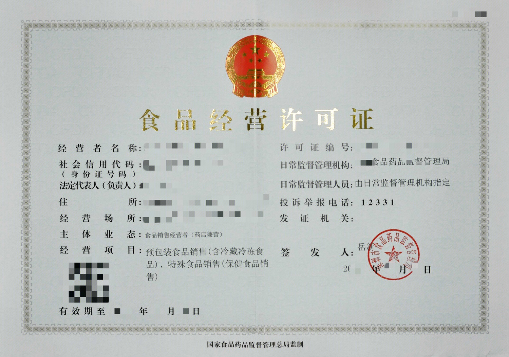

《国境口岸卫生许可证》：

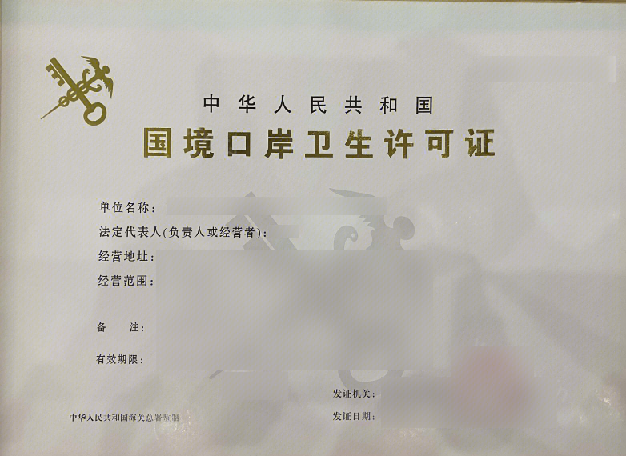

### 点餐平台

#### 资质示例

### 外卖平台

#### 政策法规依据

网络餐饮服务食品安全监督管理办法：

第二条： 在中华人民共和国境内，网络餐饮服务第三方平台提供者、通过第三方平台和自建网站提供餐饮服务的餐饮服务提供者（以下简称入网餐饮服务提供者），利用互联网提供餐饮服务及其监督管理，适用本办法。

第五条： 网络餐饮服务第三方平台提供者应当在通信主管部门批准后30个工作日内，向所在地省级食品药品监督管理部门备案。自建网站餐饮服务提供者应当在通信主管部门备案后30个工作日内，向所在地县级食品药品监督管理部门备案。备案内容包括域名、IP地址、电信业务经营许可证或者备案号、企业名称、地址、法定代表人或者负责人姓名等。

网络餐饮服务第三方平台提供者设立从事网络餐饮服务分支机构的，应当在设立后30个工作日内，向所在地县级食品药品监督管理部门备案。备案内容包括分支机构名称、地址、法定代表人或者负责人姓名等。

食品药品监督管理部门应当及时向社会公开相关备案信息。

#### 资质示例

## 时政信息

### 时政信息

#### 政策法规依据

《互联网新闻信息服务许可管理实施细则》 第三条

通过互联网站、应用程序、论坛、博客、微博客、公众账号、即时通信工具、网络直播等形式向社会公众提供互联网新闻信息服务，应当取得互联网新闻信息服务许可，禁止未经许可或超越许可范围开展互联网新闻信息服务活动。

《互联网信息服务管理办法》第三条

互联网信息服务分为经营性和非经营性两类。非经营性互联网信息服务，是指通过互联网向上网用户无偿提供具有公开性、共享性信息的服务活动。

第八条

从事非经营性互联网信息服务，应当向省、自治区、直辖市电信管理机构或者国务院信息产业主管部门办理备案手续。

#### 资质示例

《互联网新闻信息服务许可证》：

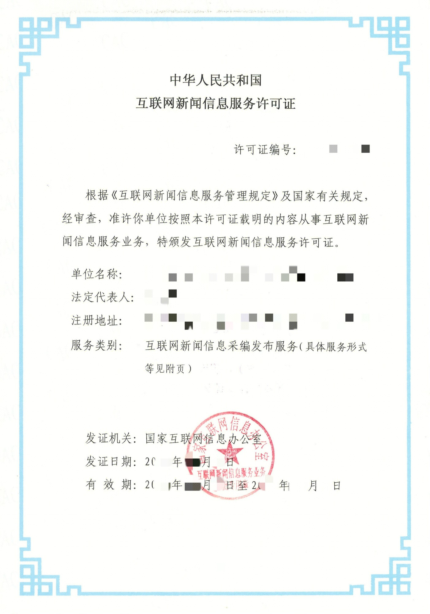

《组织机构代码证》（机构类型需为机关）

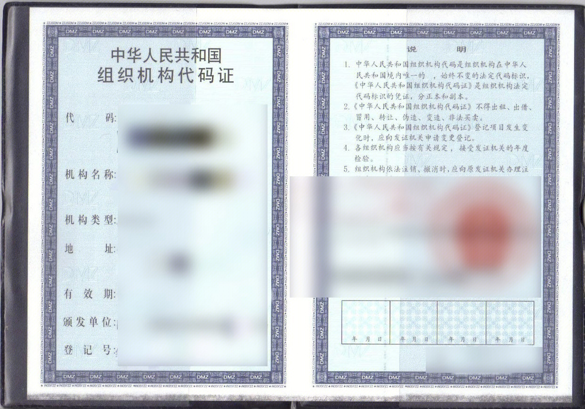

《非经营性互联网信息服务备案核准》：

## 文娱

### 网络小说

#### 政策法规依据

《网络出版服务管理规定》第一章第二条

第二条 在中华人民共和国境内从事网络出版服务，适用本规定。

本规定所称网络出版服务，是指通过信息网络向公众提供网络出版物。

本规定所称网络出版物，是指通过信息网络向公众提供的，具有编辑、制作、加工等出版特征的数字化作品，范围主要包括：

(一)文学、艺术、科学等领域内具有知识性、思想性的文字、图片、地图、游戏、动漫、音视频读物等原创数字化作品；

(二)与已出版的图书、报纸、期刊、音像制品、电子出版物等内容相一致的数字化作品；

(三)将上述作品通过选择、编排、汇集等方式形成的网络文献数据库等数字化作品；

(四)国家新闻出版广电总局认定的其他类型的数字化作品。

网络出版服务的具体业务分类另行制定。

《网络出版服务管理规定》第二章第七条

第七条 从事网络出版服务，必须依法经过出版行政主管部门批准，取得《网络出版服务许可证》。

#### 资质示例

《互联网出版许可证》：

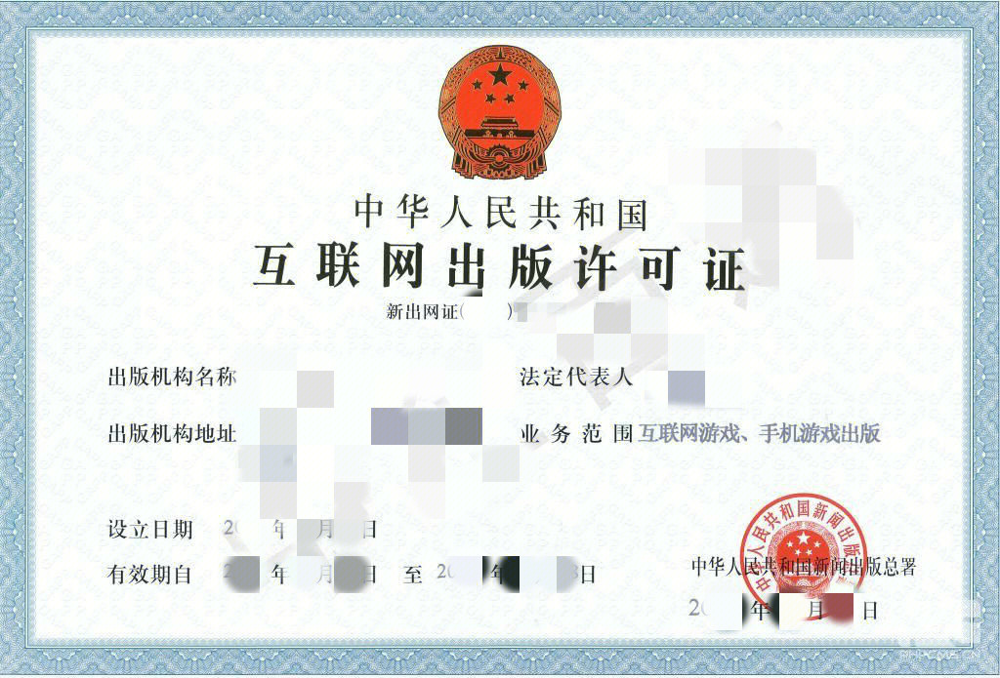
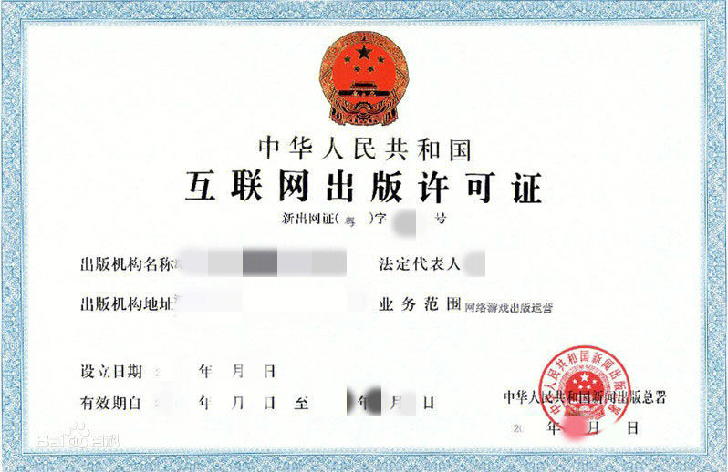

《网络出版服务许可证》：

### 学术期刊

#### 政策法规依据

《期刊出版管理规定》第二条

在中华人民共和国境内从事期刊出版活动，适用本规定。期刊由依法设立的期刊出版单位出版。

期刊出版单位出版期刊，必须经新闻出版总署批准，持有国内统一连续出版物号，领取《期刊出版许可证》。

本规定所称期刊又称杂志，是指有固定名称，用卷、期或者年、季、月顺序编号，按照一定周期出版的成册连续出版物。

本规定所称期刊出版单位，是指依照国家有关规定设立，经新闻出版总署批准并履行登记注册手续的期刊社。

法人出版期刊不设立期刊社的，其设立的期刊编辑部视为期刊出版单位。

#### 资质示例

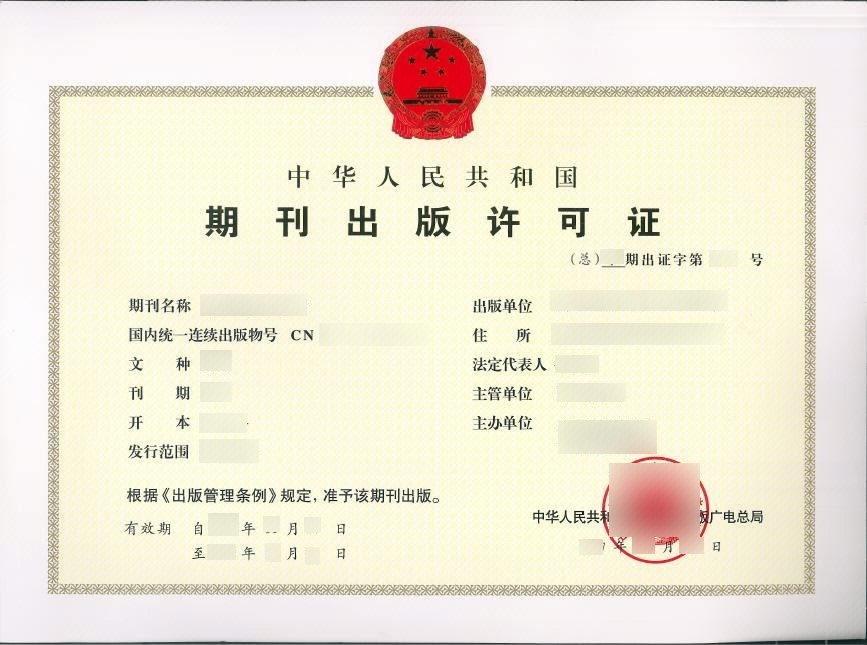

### 其他视频

#### 政策法规依据

《互联网视听节目服务管理规定》第二条

在中华人民共和国境内向公众提供互联网（含移动互联网，以下简称互联网）视听节目服务活动，适用本规定。本规定所称互联网视听节目服务，是指制作、编辑、集成并通过互联网向公众提供视音频节目，以及为他人提供上载传播视听节目服务的活动。

第七条 从事互联网视听节目服务，应当依照本规定取得广播电影电视主管部门颁发的《信息网络传播视听节目许可证》（以下简称《许可证》）或履行备案手续。

《广播电视管理条例》第三十一条 广播电视节目由广播电台、电视台和省级以上人民政府广播电视行政部门批准设立的广播电视节目制作经营单位制作。广播电台、电视台不得播放未取得广播电视节目制作经营许可的单位制作的广播电视节目。

《广播电台电视台审批管理办法》第十八条 广电总局对经批准设立的广播电台、电视台颁发《广播电视播出机构许可证》，并同时对批准开办的每套广播电视节目颁发《广播电视频道许可证》。

#### 资质示例

《信息网络传播视听节目许可证》：

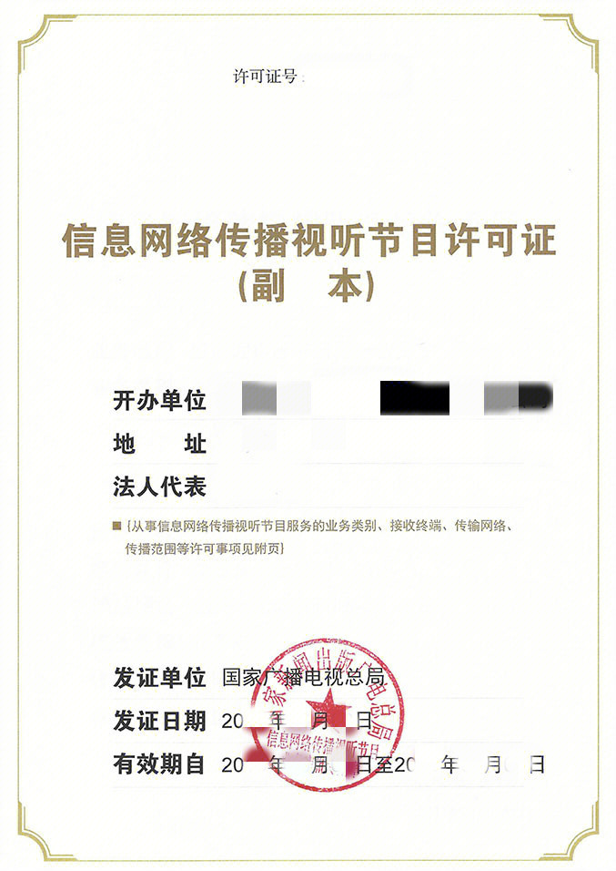

《广播电视节目制作经营许可证》：

《广播电视播出机构许可证》：

《广播电视频道许可证》：

《统一社会信用代码》（机构类型为机关）

《事业单位法人证书》

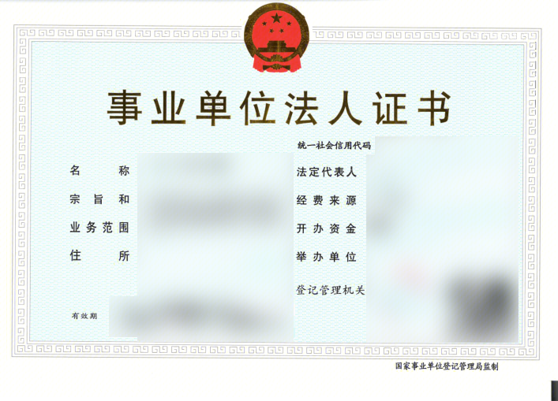

### 视频广场

#### 政策法规依据

《互联网视听节目服务管理规定》第七条

从事互联网视听节目服务，应当依照本规定取得广播电影电视主管部门颁发的《信息网络传播视听节目许可证》（以下简称《许可证》）或履行备案手续。

未按照本规定取得广播电影电视主管部门颁发的《许可证》或履行备案手续，任何单位和个人不得从事互联网视听节目服务。

互联网视听节目服务业务指导目录由国务院广播电影电视主管部门商国务院信息产业主管部门制定。

《互联网视听节目服务管理规定》第九条

从事广播电台、电视台形态服务和时政类视听新闻服务的，除符合本规定第八条规定外，还应当持有广播电视播出机构许可证或互联网新闻信息服务许可证。

其中，以自办频道方式播放视听节目的，由地（市）级以上广播电台、电视台、中央新闻单位提出申请。

从事主持、访谈、报道类视听服务的，除符合本规定第八条规定外，还应当持有广播电视节目制作经营许可证和互联网新闻信息服务许可证；从事自办网络剧（片）类服务的，还应当持有广播电视节目制作经营许可证。未经批准，任何组织和个人不得在互联网上使用广播电视专有名称开展业务。

《广播电视节目制作经营管理规定》第四条

国家对设立广播电视节目制作经营机构或从事广播电视节目制作经营活动实行许可制度。

设立广播电视节目制作经营机构或从事广播电视节目制作经营活动应当取得《广播电视节目制作经营许可证》。

《广播电台电视台审批管理办法》第十八条

广电总局对经批准设立的广播电台、电视台颁发《广播电视播出机构许可证》，并同时对批准开办的每套广播电视节目颁发《广播电视频道许可证》。

许可证有效期为三年，自颁发之日起计算。期满后如需继续开办，须于有效期届满180日前按本办法第六条、第七条、第八条规定提出申请，经逐级审核同意后换发许可证。

《互联网视听节目服务管理规定》第十条

申请《许可证》，应当通过省、自治区、直辖市人民政府广播电影电视主管部门向国务院广播电影电视主管部门提出申请，中央直属单位可以直接向国务院广播电影电视主管部门提出申请。

省、自治区、直辖市人民政府广播电影电视主管部门应当提供便捷的服务，自收到申请之日起20日内提出初审意见，报国务院广播电影电视主管部门审批；国务院广播电影电视主管部门应当自收到申请或者初审意见之日起40日内作出许可或者不予许可的决定，其中专家评审时间为20日。

予以许可的，向申请人颁发《许可证》，并向社会公告；不予许可的，应当书面通知申请人并说明理由。

《许可证》应当载明互联网视听节目服务的播出标识、名称、服务类别等事项。

《许可证》有效期为3年。有效期届满，需继续从事互联网视听节目服务的，应于有效期届满前30日内，持符合本办法第八条规定条件的相关材料，向原发证机关申请办理续办手续。

地（市）级以上广播电台、电视台从事互联网视听节目转播类服务的，到省级以上广播电影电视主管部门履行备案手续。

中央新闻单位从事互联网视听节目转播类服务的，到国务院广播电影电视主管部门履行备案手续。

备案单位应在节目开播30日前，提交网址、网站名、拟转播的广播电视频道、栏目名称等有关备案材料，广播电影电视主管部门应将备案情况向社会公告。

#### 资质示例

《信息网络传播视听节目许可证》：

《事业单位法人证书》：

《统一社会信用代码》（机构类型为机关）

《广播电视频道许可证》：

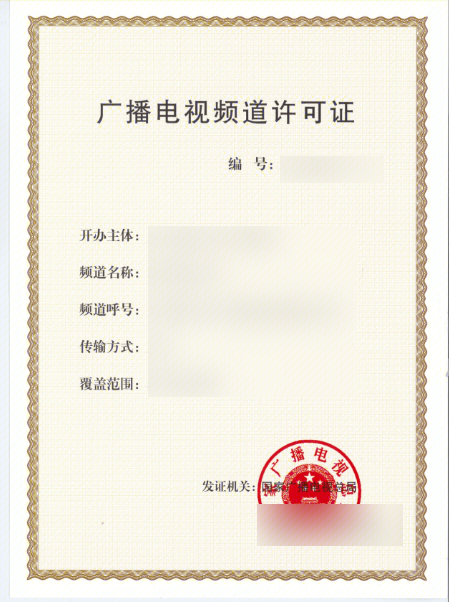

《广播电视节目制作经营许可证》：

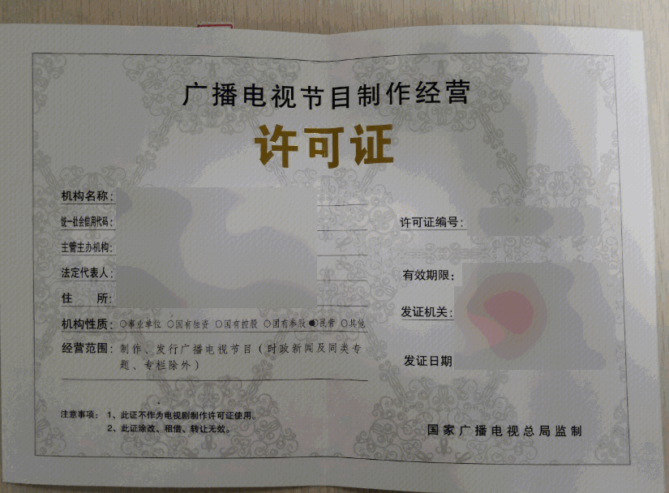

《广播电视节目播出机构许可证》：

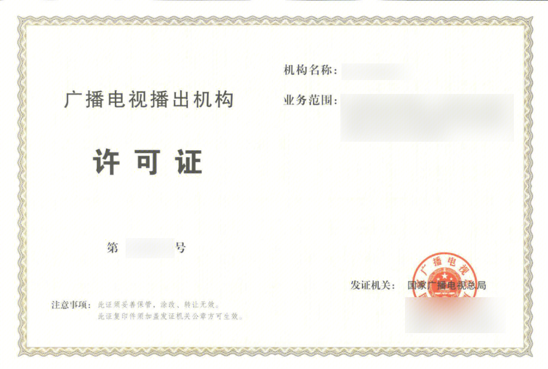

《全国网络视听平台信息登记管理系统》备案：

### 电台

#### 政策法规依据

《互联网视听节目服务管理规定》第二条 在中华人民共和国境内向公众提供互联网（含移动互联网，以下简称互联网）视听节目服务活动，适用本规定。本规定所称互联网视听节目服务，是指制作、编辑、集成并通过互联网向公众提供视音频节目，以及为他人提供上载传播视听节目服务的活动。

第七条 从事互联网视听节目服务，应当依照本规定取得广播电影电视主管部门颁发的《信息网络传播视听节目许可证》（以下简称《许可证》）或履行备案手续。

《广播电视管理条例》第三十一条 广播电视节目由广播电台、电视台和省级以上人民政府广播电视行政部门批准设立的广播电视节目制作经营单位制作。广播电台、电视台不得播放未取得广播电视节目制作经营许可的单位制作的广播电视节目。

#### 资质示例

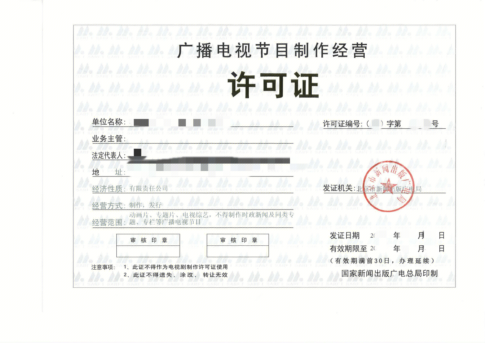
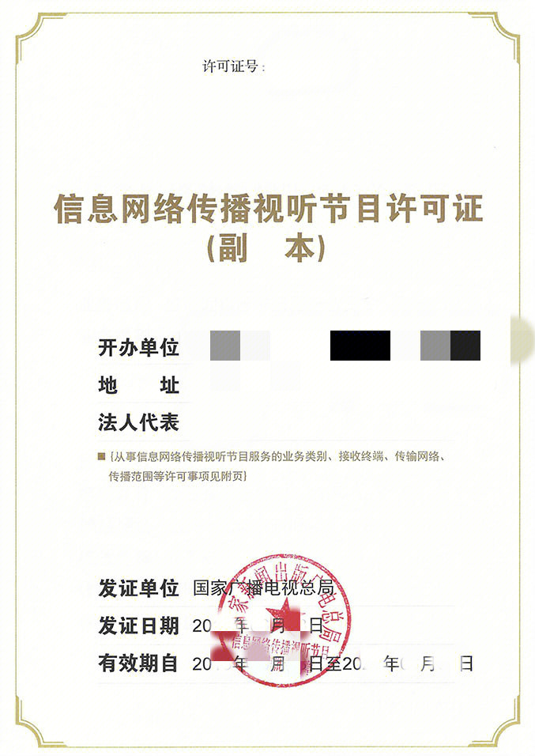

### 音乐

#### 政策法规依据

《互联网文化管理暂行规定》第二条 本规定所称互联网文化产品是指通过互联网生产、传播和流通的文化产品，主要包括：

（一）专门为互联网而生产的网络音乐娱乐、网络游戏、网络演出剧（节）目、网络表演、网络艺术品、网络动漫等互联网文化产品；

（二）将音乐娱乐、游戏、演出剧（节）目、表演、艺术品、动漫等文化产品以一定的技术手段制作、复制到互联网上传播的互联网文化产品。

第八条 申请从事经营性互联网文化活动，应当向所在地省、自治区、直辖市人民政府文化行政部门提出申请，由省、自治区、直辖市人民政府文化行政部门审核批准。 对申请从事经营性互联网文化活动的，省、自治区、直辖市人民政府文化行政部门应当自受理申请之日起20日内做出批准或者不批准的决定。批准的，核发《网络文化经营许可证》，并向社会公告；不批准的，应当书面通知申请人并说明理由。

《互联网视听节目服务管理规定》第二条 在中华人民共和国境内向公众提供互联网（含移动互联网，以下简称互联网）视听节目服务活动，适用本规定。本规定所称互联网视听节目服务，是指制作、编辑、集成并通过互联网向公众提供视音频节目，以及为他人提供上载传播视听节目服务的活动。

第七条 从事互联网视听节目服务，应当依照本规定取得广播电影电视主管部门颁发的《信息网络传播视听节目许可证》（以下简称《许可证》）或履行备案手续。

#### 资质示例

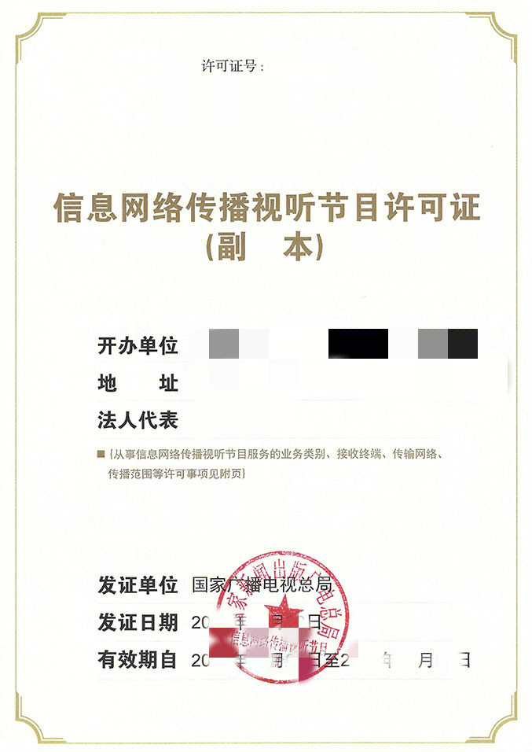

### 有声读物

#### 政策法规依据

《网络出版服务管理规定》第七条

从事网络出版服务，必须依法经过出版行政主管部门批准，取得《网络出版服务许可证》。

#### 资质示例

《互联网出版许可证》：

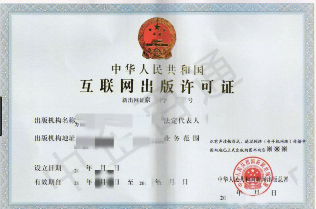
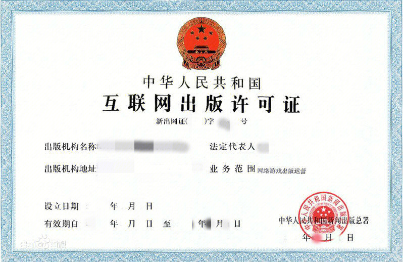

《网络出版服务许可证》：

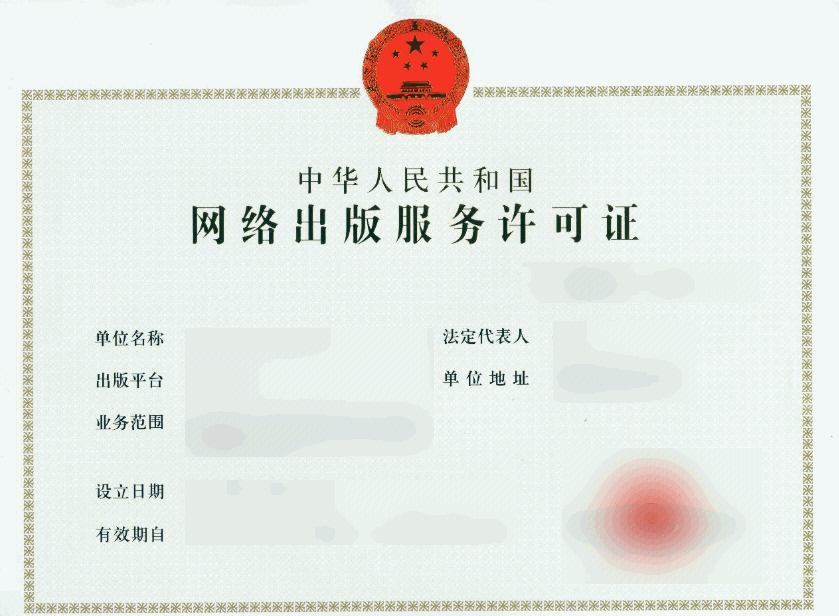

### 动漫

#### 政策法规依据

《互联网文化管理暂行规定》

第二条 本规定所称互联网文化产品是指通过互联网生产、传播和流通的文化产品，主要包括：

（一）专门为互联网而生产的网络音乐娱乐、网络游戏、网络演出剧（节）目、网络表演、网络艺术品、网络动漫等互联网文化产品；

第九条 对申请从事经营性互联网文化活动的，省、自治区、直辖市人民政府文化行政部门应当自受理申请之日起20日内做出批准或者不批准的决定。批准的，核发《网络文化经营许可证》，并向社会公告；不批准的，应当书面通知申请人并说明理由。

#### 资质示例

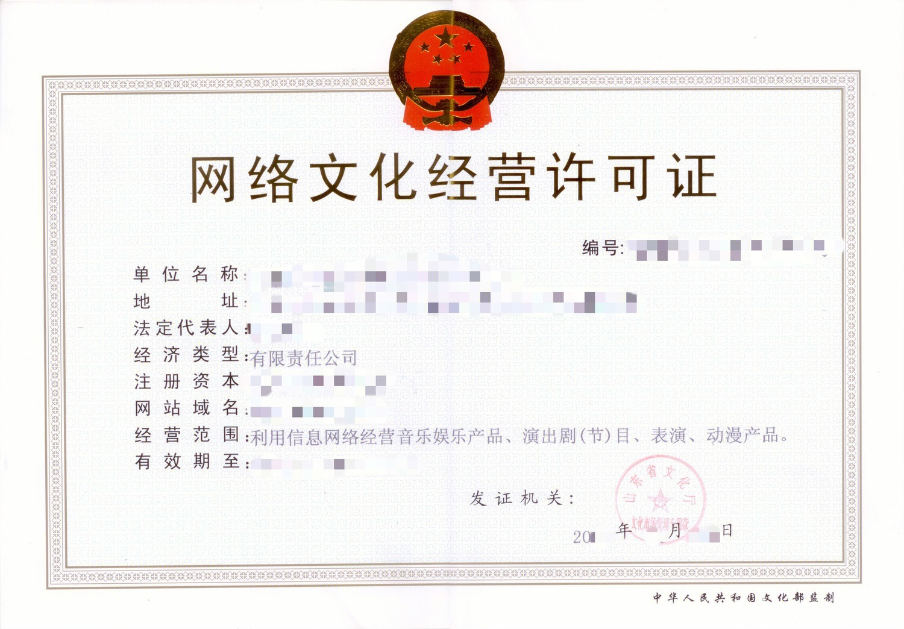

### 宗教信息

#### 政策法规依据

《互联网宗教信息服务管理办法》第二章第六条

通过互联网站、应用程序、论坛、博客、微博客、公众账号、即时通信工具、网络直播等形式，以文字、图片、音视频等方式向社会公众提供宗教教义教规、宗教知识、宗教文化、宗教活动等信息的服务，应当取得互联网宗教信息服务许可。

## 电商平台

### 电商平台

#### 资质示例

## 商家自营

### 食品饮料

#### 政策法规依据

1、《食品经营许可管理办法》第四条

食品经营许可实行一地一证原则，即食品经营者在一个经营场所从事食品经营活动，应当取得一个食品经营许可证。

2、《中华人民共和国食品安全法》第三十五条

国家对食品生产经营实行许可制度。从事食品生产、食品销售、餐饮服务，应当依法取得许可。但是，销售食用农产品和仅销售预包装食品的，不需要取得许可。仅销售预包装食品的，应当报所在地县级以上地方人民政府食品安全监督管理部门备案。

3、《国境口岸食品卫生监督管理规定》第七条

食品生产经营单位从事口岸食品生产经营活动前，应当向其所在地海关申请办理《中华人民共和国国境口岸卫生许可证》。

#### 资质示例

《食品经营许可证》：

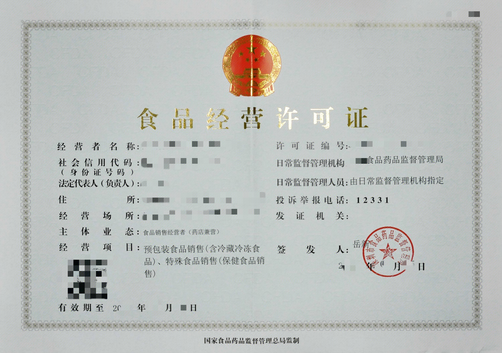

《食品生产许可证》

《国境口岸卫生许可证》

《预包装食品销售备案凭证》：

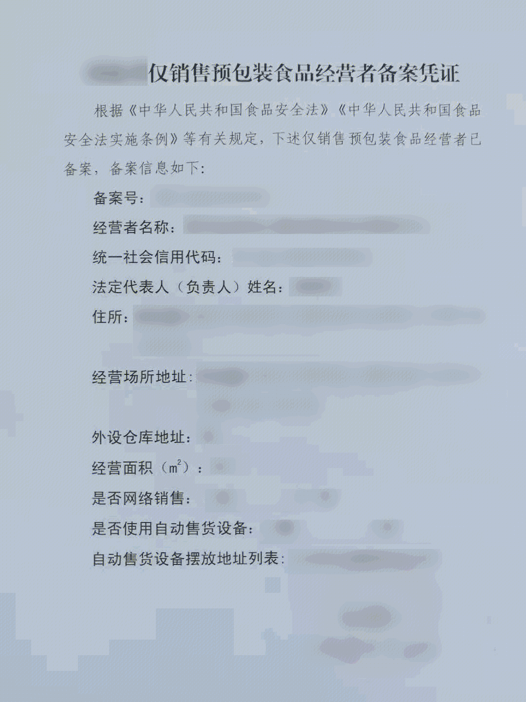

### 生鲜/初级食用农产品

#### 资质示例

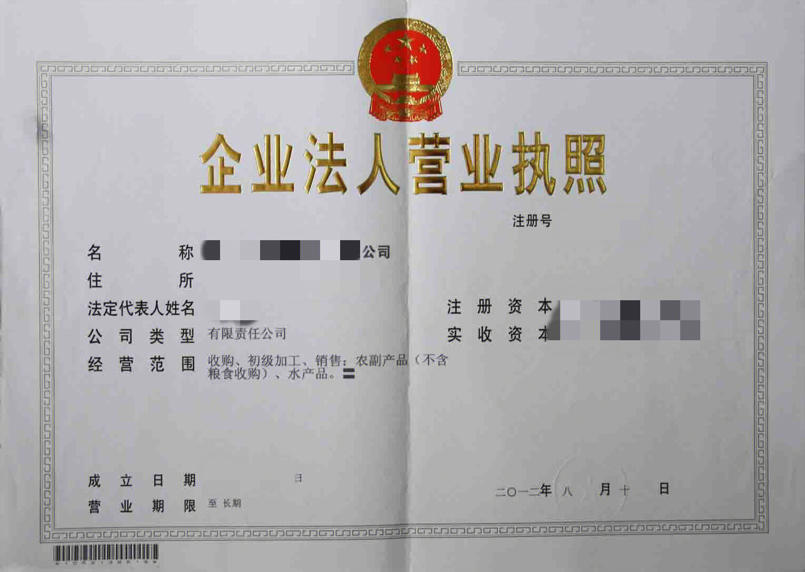
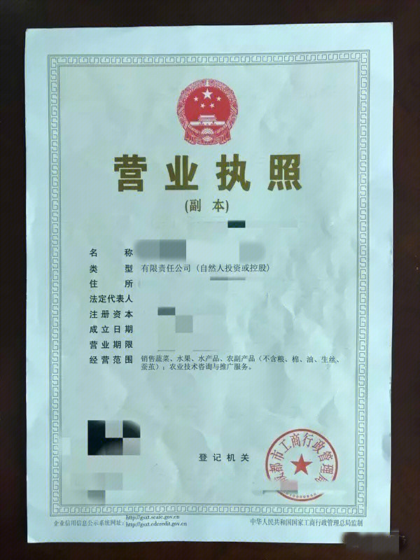

### 酒类

#### 政策法规依据

1、《食品经营许可管理办法》第四条

食品经营许可实行一地一证原则，即食品经营者在一个经营场所从事食品经营活动，应当取得一个食品经营许可证。

2、《中华人民共和国食品安全法》第三十五条

国家对食品生产经营实行许可制度。从事食品生产、食品销售、餐饮服务，应当依法取得许可。但是，销售食用农产品和仅销售预包装食品的，不需要取得许可。仅销售预包装食品的，应当报所在地县级以上地方人民政府食品安全监督管理部门备案。

3、《国境口岸食品卫生监督管理规定》第七条

食品生产经营单位从事口岸食品生产经营活动前，应当向其所在地海关申请办理《中华人民共和国国境口岸卫生许可证》。

#### 资质示例

《食品经营许可证》：

《食品生产许可证》：

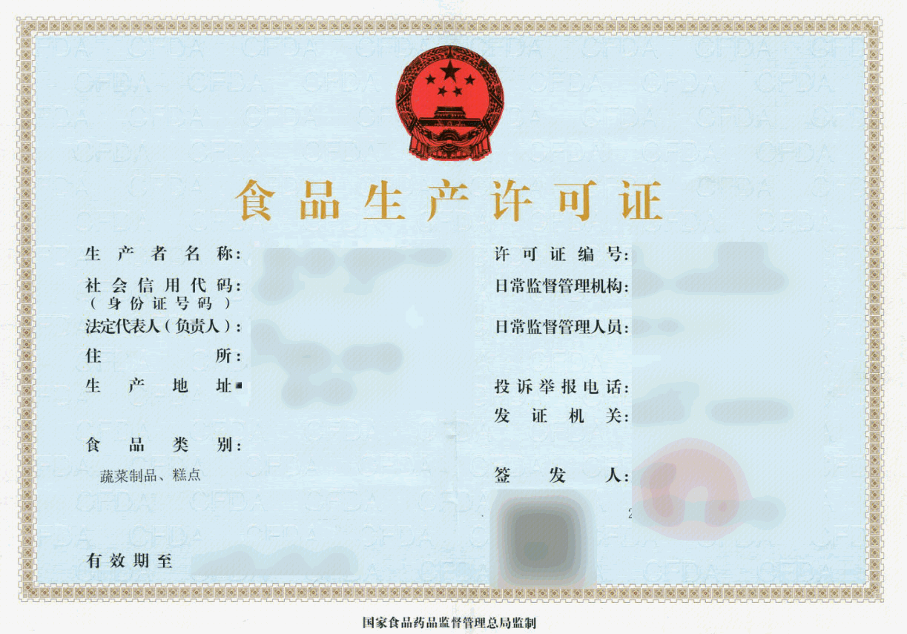

《国境口岸卫生许可证》：

《预包装食品销售备案凭证》：

### 保健品

#### 政策法规依据

《食品经营许可管理办法》 第二条 在中华人民共和国境内，从事食品销售和餐饮服务活动，应当依法取得食品经营许可。

第十条 申请食品经营许可，应当按照食品经营主体业态和经营项目分类提出。食品经营主体业态分为食品销售经营者、餐饮服务经营者、单位食堂。食品经营者申请通过网络经营、建立中央厨房或者从事集体用餐配送的，应当在主体业态后以括号标注。食品经营项目分为预包装食品销售（含冷藏冷冻食品、不含冷藏冷冻食品）、散装食品销售（含冷藏冷冻食品、不含冷藏冷冻食品）、特殊食品销售（保健食品、特殊医学用途配方食品、婴幼儿配方乳粉、其他婴幼儿配方食品）、其他类食品销售；热食类食品制售、冷食类食品制售、生食类食品制售、糕点类食品制售、自制饮品制售、其他类食品制售等。

#### 资质示例

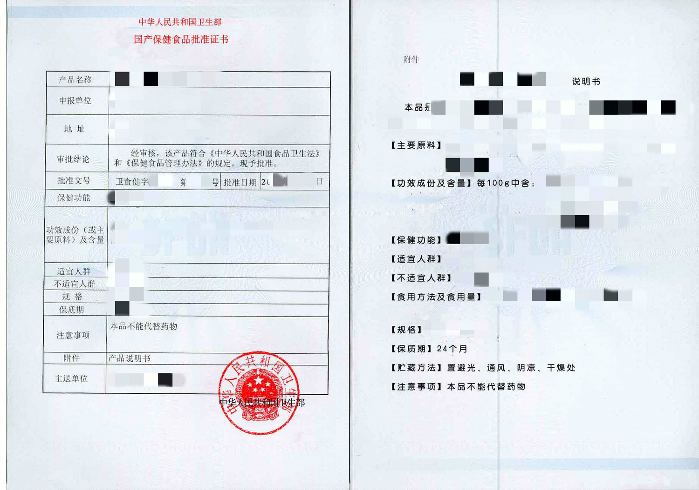
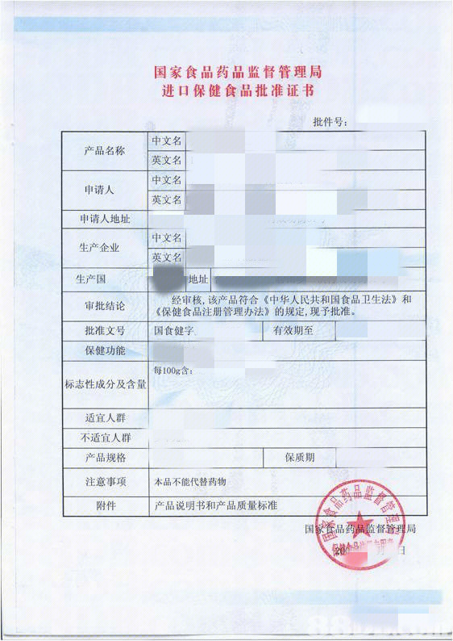

### 成人用品（医疗器械类）

#### 政策法规依据

《医疗器械网络销售监督管理办法》第三十八条

未取得第二类医疗器械经营备案凭证从事网络第二类医疗器械销售的，依照《医疗器械监督管理条例》第六十五条的规定予以处罚。

#### 资质示例

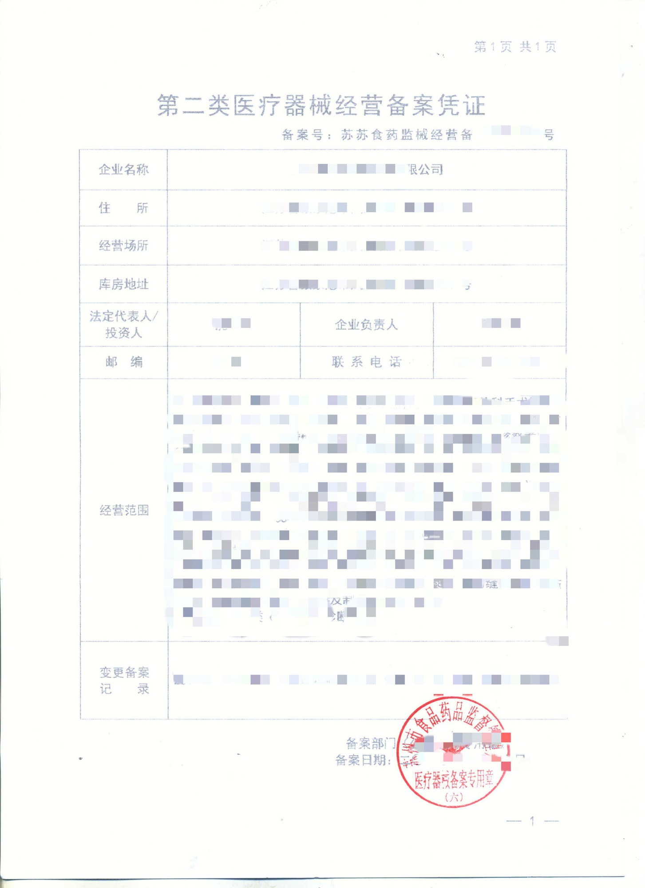

### 成人情趣用品

#### 资质示例

《营业执照》（经营范围需含成人情趣用品销售）：

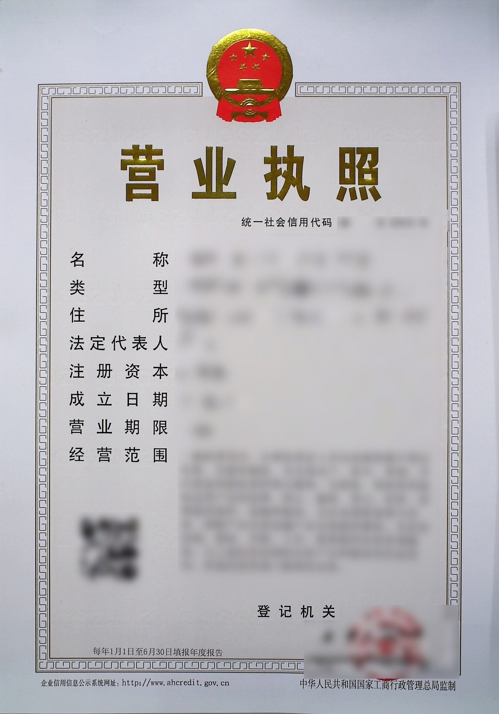

### 图书报刊/音像/影视/游戏/动漫

#### 政策法规依据

《出版管理条例》第三十五条

单位从事出版物批发业务的，须经省、自治区、直辖市人民政府出版行政主管部门审核许可，取得《出版物经营许可证》。单位和个体工商户从事出版物零售业务的，须经县级人民政府出版行政主管部门审核许可，取得《出版物经营许可证》。

#### 资质示例

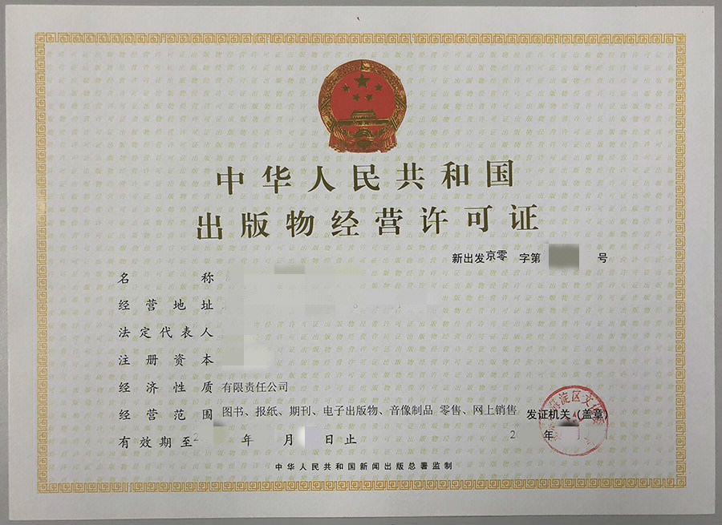

### 成品油

#### 政策法规依据

一、《成品油市场管理办法》第六条

申请从事成品油零售经营资格的企业，应当向所在地市级（设区的市,下同）人民政府商务主管部门提出申请。地市级人民政府商务主管部门审查后，将初步审查意见及申请材料报省级人民政府商务主管部门。由省级人民政府商务主管部门决定是否给予成品油零售经营许可。

二、《危险化学品安全管理条例》（2013修订）第三十五条

从事剧毒化学品、易制爆危险化学品经营的企业，应当向所在地设区的市级人民政府安全生产监督管理部门提出申请，从事其他危险化学品经营的企业，应当向所在地县级人民政府安全生产监督管理部门提出申请（有储存设施的，应当向所在地设区的市级人民政府安全生产监督管理部门提出申请）。申请人应当提交其符合本条例第三十四条规定条件的证明材料。设区的市级人民政府安全生产监督管理部门或者县级人民政府安全生产监督管理部门应当依法进行审查，并对申请人的经营场所、储存设施进行现场核查，自收到证明材料之日起30日内作出批准或者不予批准的决定。予以批准的，颁发危险化学品经营许可证；不予批准的，书面通知申请人并说明理由。

#### 资质示例

《成品油零售经营批准证书》：

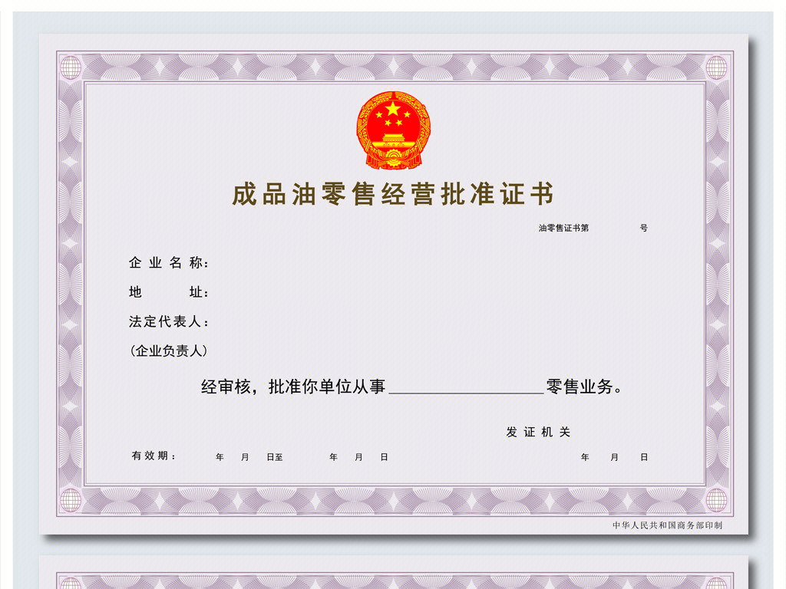

《危险化学品经营许可证》（包含“汽油 或 柴油”项目）：

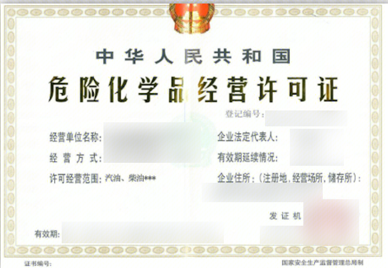

### 电话卡销售（中国联通）

#### 资质示例

中国联通统一配发《授权防伪二维码标识》：

### 电话卡销售（中国电信）

#### 资质示例

中国电信统一配发《授权防伪二维码标识》：

### 电话卡销售（中国移动）

#### 资质示例

中国移动统一配发《授权防伪二维码标识》：

### 电话卡销售（中国广电） / 电话卡销售

#### 资质示例

中国广电统一配发《授权防伪二维码标识》：

### 预付卡

#### 政策法规依据

《出版管理条例》第三十五条

单用途商业预付卡管理办法（试行）

第七条 发卡企业应在开展单用途卡业务之日起30日内按照下列规定办理备案：

（一） 集团发卡企业和品牌发卡企业向其工商登记注册地省、自治区、直辖市人民政府商务主管部门备案；

（二） 规模发卡企业向其工商登记注册地设区的市人民政府商务主管部门备案；

（三） 其他发卡企业向其工商登记注册地县（市、区）人民政府商务主管部门备案。

非金融机构支付服务管理办法

第二条 本办法所称非金融机构支付服务，是指非金融机构在收付款人之间作为中介机构提供下列部分或全部货币资金转移服务：

（一）网络支付；

（二）预付卡的发行与受理；

（三）银行卡收单；

（四）中国人民银行确定的其他支付服务。

本办法所称预付卡，是指以营利为目的发行的、在发行机构之外购买商品或服务的预付价值，包括采取磁条、芯片等技术以卡片、密码等形式发行的预付卡。

第三条 非金融机构提供支付服务，应当依据本办法规定取得《支付业务许可证》，成为支付机构。

支付机构预付卡业务管理办法

第二条 支付机构在中华人民共和国境内从事预付卡业务，适用本办法。

本办法所称支付机构，是指取得《支付业务许可证》，获准办理"预付卡发行与受理"业务的发卡机构和获准办理"预付卡受理"业务的受理机构。

本办法所称预付卡，是指发卡机构以特定载体和形式发行的、可在发卡机构之外购买商品或服务的预付价值。

#### 资质示例

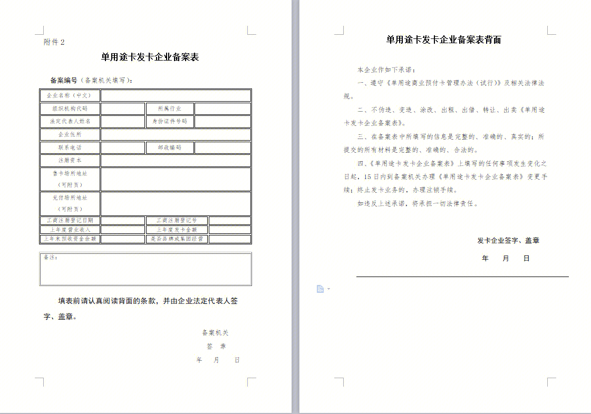
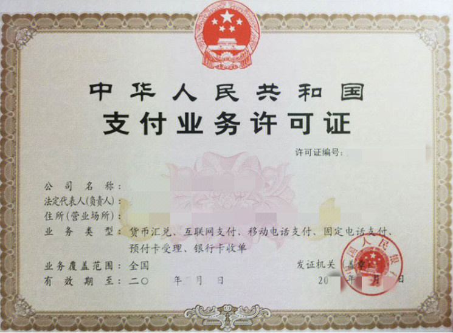

## 商业服务

### 律所服务

#### 政策法规依据

《律师和律师事务所执业证书管理办法》 第二条

律师事务所执业证书是律师事务所依法获准设立并执业的有效证件。

#### 资质示例

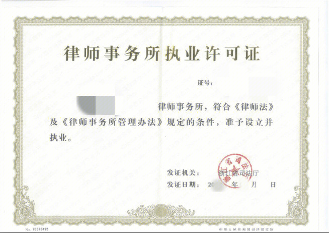

### 公证

#### 政策法规依据

《中华人民共和国公证法》第九条

设立公证机构，由所在地的司法行政部门报省、自治区、直辖市人民政府司法行政部门按照规定程序批准后，颁发公证机构执业证书。

#### 资质示例

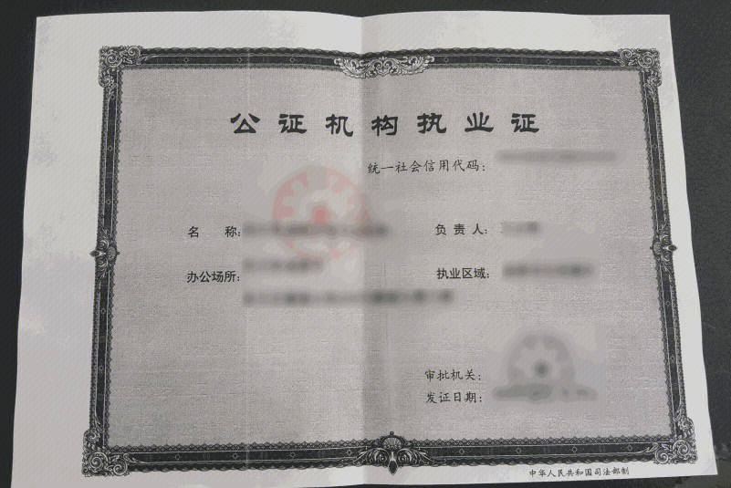

### 电子认证

#### 政策法规依据

《电子认证服务管理办法》第三条

在中华人民共和国境内设立电子认证服务机构和为电子签名提供电子认证服务，适用本办法。

《电子认证服务管理办法》第六条

申请电子认证服务许可的，应当向工业和信息化部提交下列材料：

（一）书面申请。

（二）人员证明。

（三）企业法人营业执照副本及复印件。

（四）经营场所证明。

（五）国家有关认证检测机构出具的技术、设备、物理环境符合国家有关安全标准的凭证。

（六）国家密码管理机构同意使用密码的证明文件。

#### 资质示例

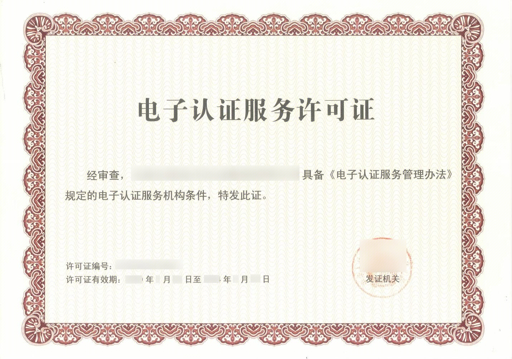

### 认证服务

#### 政策法规依据

《认证机构管理办法》第七条

设立认证机构，应当依法取得法人资格，并经国家认监委批准后，方可从事批准范围内的认证活动。未经批准，任何单位和个人不得从事认证活动。

#### 资质示例

《认证机构批准书》

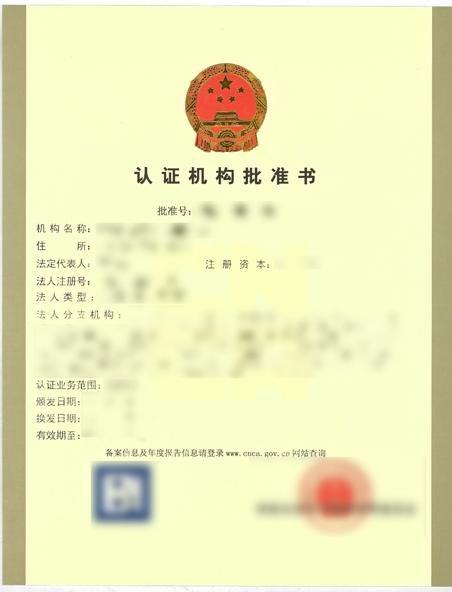

### 司法拍卖

#### 资质示例

### 拍卖公司（非文物）

#### 政策法规依据

《拍卖管理办法》第十二条

企业及分公司申请取得从事拍卖业务的许可，应当先经企业或分公司所在地市级商务主管部门审查后，报省级商务主管部门核准并颁发拍卖经营批准证书。

《互联网信息服务管理办法》 第三条 互联网信息服务分为经营性和非经营性两类。非经营性互联网信息服务，是指通过互联网向上网用户无偿提供具有公开性、共享性信息的服务活动。

第八条从事非经营性互联网信息服务，应当向省、自治区、直辖市电信管理机构或者国务院信息产业主管部门办理备案手续。

#### 资质示例

《拍卖经营批准证书》：

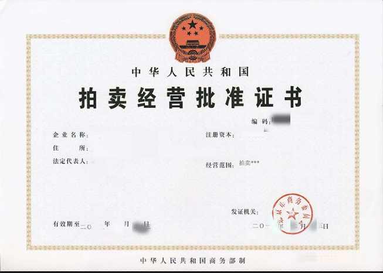

《非经营性互联网信息服务备案核准》：

《营业执照》：

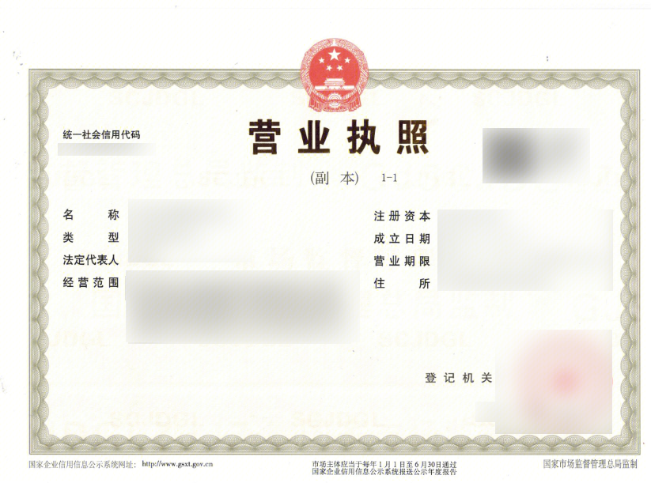

### 文物拍卖公司

#### 政策法规依据

《文物拍卖管理办法》第四条

依法设立的拍卖企业经营文物拍卖的，应当取得省、自治区、直辖市人民政府文物行政部门颁发的文物拍卖许可证。

《拍卖管理办法》第十二条

企业及分公司申请取得从事拍卖业务的许可，应当先经企业或分公司所在地市级商务主管部门审查后，报省级商务主管部门核准并颁发拍卖经营批准证书。

1、《互联网信息服务管理办法》 第三条 互联网信息服务分为经营性和非经营性两类。非经营性互联网信息服务，是指通过互联网向上网用户无偿提供具有公开性、共享性信息的服务活动。

2、《非经营性互联网信息服务备案管理办法》第七条 拟从事非经营性互联网信息服务的，应当通过信息产业部备案管理系统如实填报《非经营性互联网信息服务备案登记表》（以下简称“《备案登记表》”，格式见本办法附录），履行备案手续。

#### 资质示例

《拍卖经营批准证书》：

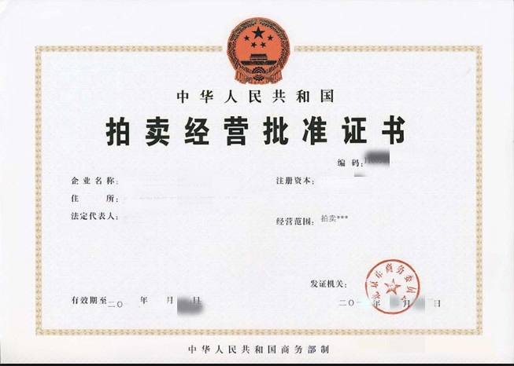

《文物拍卖许可证》：

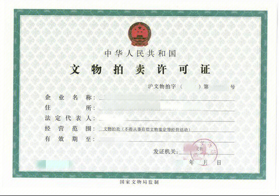

《非经营性互联网信息服务备案核准》：

《营业执照》：

### 专利/商标代理

#### 政策法规依据

《专利代理管理办法》第九条设立专利代理机构的审批程序如下：

（一）申请设立专利代理机构的，应当向其所在地的省、自治区、直辖市知识产权局提出申请。经审查，省、自治区、直辖市知识产权局认为符合本办法规定条件的，应当自收到申请之日起30日内上报国家知识产权局批准；认为不符合本办法规定条件的，应当自收到申请之日起30日内书面通知申请人。

（二）国家知识产权局对符合本办法规定条件的申请，应当自收到上报材料之日起30日内作出批准决定，通知上报的省、自治区、直辖市知识产权局，并向新设立的机构颁发专利代理机构注册证和机构代码；对不符合本办法规定条件的申请，应当自收到上报材料之日起30日内通知上报的省、自治区、直辖市知识产权局重新进行审查。

#### 资质示例

《专利代理机构注册证》：

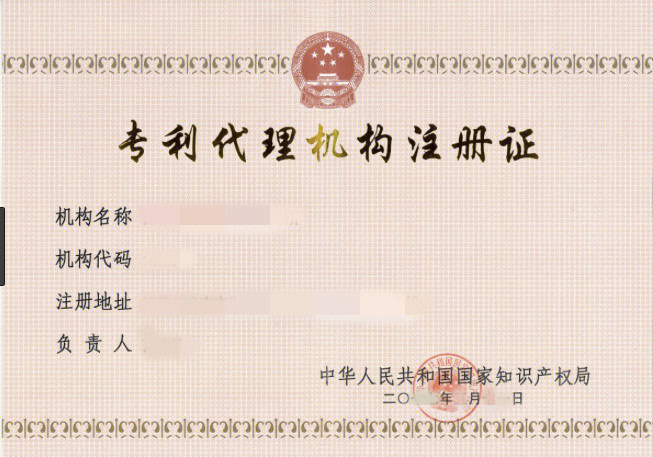

《专利代理机构执业许可证》》：

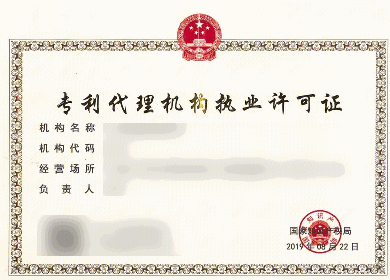

《商标代理机构备案凭证》：

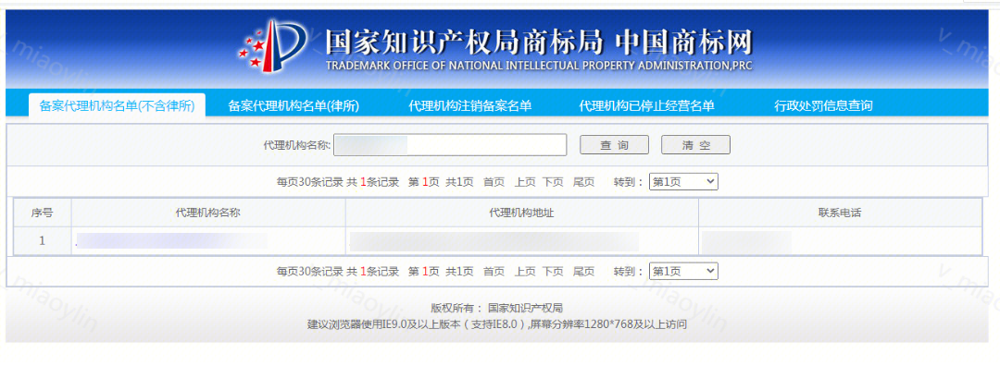

### 亲子/司法鉴定

#### 资质示例

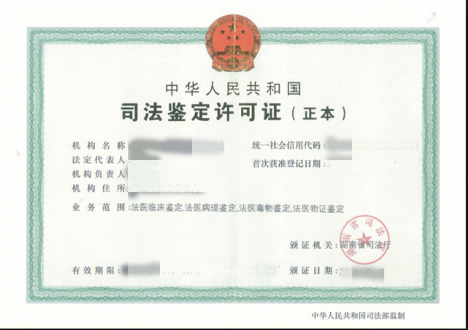

### 典当

#### 政策法规依据

《典当管理办法》第十五条

收到设立典当行或者典当行申请设立分支机构的申请后，设区的市（地）级商务主管部门应当报省级商务主管部门审核，省级商务主管部门将审核意见和申请材料报送商务部，由商务部批准并颁发《典当经营许可证》。

《互联网信息服务管理办法》 第三条 互联网信息服务分为经营性和非经营性两类。非经营性互联网信息服务，是指通过互联网向上网用户无偿提供具有公开性、共享性信息的服务活动。

第八条从事非经营性互联网信息服务，应当向省、自治区、直辖市电信管理机构或者国务院信息产业主管部门办理备案手续。

#### 资质示例

《典当经营许可证》：

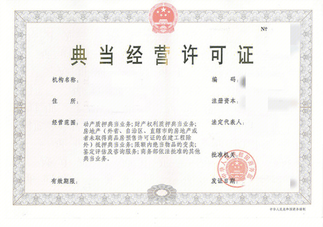

《非经营性互联网信息服务备案核准》：

### 会计师事务所

#### 政策法规依据

《会计师事务所执业许可和监督管理办法》第七条

会计师事务所应当自领取营业执照之日起60日内，向所在地的省级财政部门申请执业许可。未取得会计师事务所执业许可的，不得以会计师事务所的名义开展业务活动，不得从事《注册会计师法》第十四条规定的业务（以下简称注册会计师法定业务）。

#### 资质示例

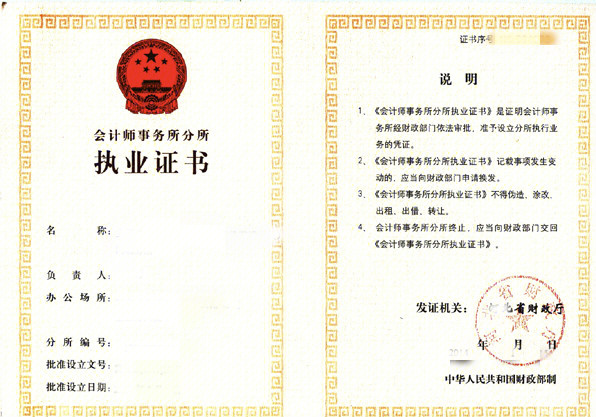

### 税务师事务所

#### 政策法规依据

《国家税务总局关于发布《税务师事务所行政登记规程（试行）》的公告》第三条

税务机关按照本规程规定，遵循公开、便捷原则，对符合条件的行政相对人予以行政登记，颁发《税务师事务所行政登记证书》（以下简称《登记证书》，见附件1）。《登记证书》式样由国家税务总局确定。

#### 资质示例

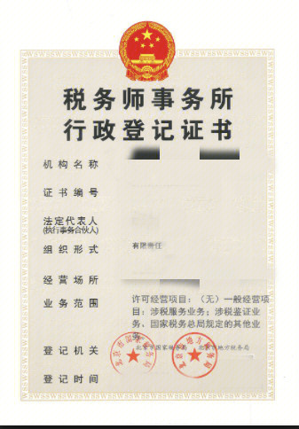
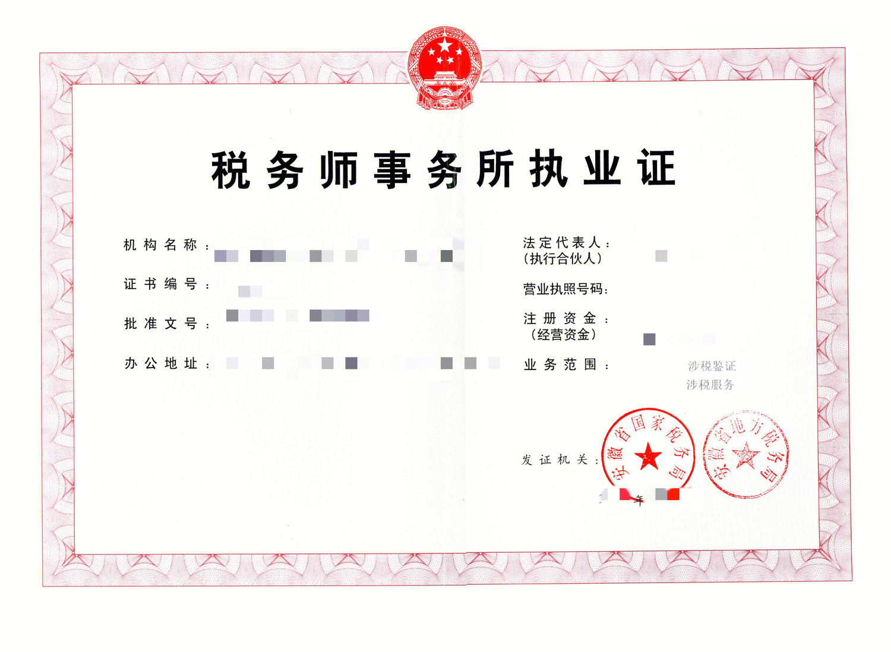

### 第三方人力资源服务

#### 政策法规依据

《人力资源市场暂行条例》第十八条

经营性人力资源服务机构从事职业中介活动的，应当依法向人力资源社会保障行政部门申请行政许可，取得人力资源服务许可证。

#### 资质示例

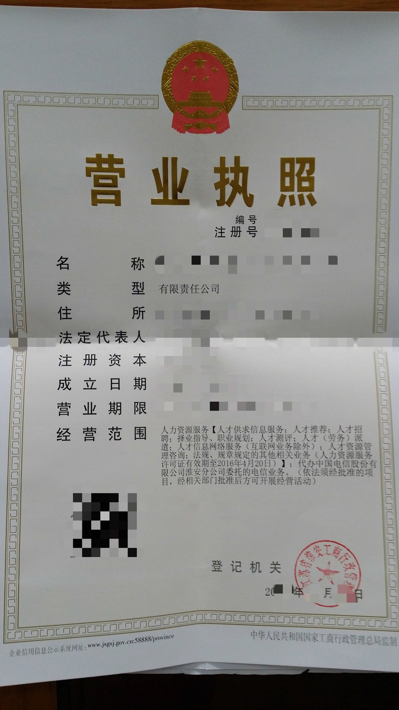

### 公共印章刻制

#### 政策法规依据

《印铸刻字业暂行管理规则》第三条凡经营印铸刻字业者，须先向该管市（县）人民政府公安局或分局申请登记，办理以下手续：

一、详细填写特种营业登记表两份，附申请人最近二寸半身免冠像片三张，并觅具可靠非同业铺保两家。

二、造具该业股东、职工名册，建筑设备及四邻平面略图（露天刻字摊免缴平面略图）。

三、将填妥之申请登记表，连同像片、略图、名册等送公安局或分局，经核准发给许可证后，须另向该管工商机关申请，领得营业执照后始准营业。

#### 资质示例

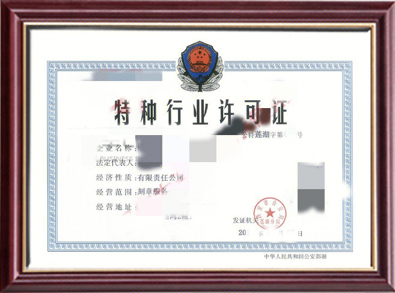

### 农林牧渔

#### 政策法规依据

《中华人民共和国食品安全法》第三十五条

国家对食品生产经营实行许可制度。从事食品生产、食品销售、餐饮服务，应当依法取得许可。但是，销售食用农产品，不需要取得许可。县级以上地方人民政府食品安全监督管理部门应当依照《中华人民共和国行政许可法》的规定，审核申请人提交的本法第三十三条第一款第一项至第四项规定要求的相关资料，必要时对申请人的生产经营场所进行现场核查；对符合规定条件的，准予许可；对不符合规定条件的，不予许可并书面说明理由。

《中华人民共和国陆生野生动物保护实施条例》第二十一条

驯养繁殖国家重点保护野生动物的，应当持有驯养繁殖许可证。国务院林业行政主管部门和省、自治区、直辖市人民政府林业行政主管部门可以根据实际情况和工作需要，委托同级有关部门审批或者核发国家重点保护野生动物驯养繁殖许可证。动物园驯养繁殖国家重点保护野生动物的，林业行政主管部门可以委托同级建设行政主管部门核发驯养繁殖许可证。驯养繁殖许可证由国务院林业行政主管部门印制。

《中华人民共和国畜牧法》第二十二条

从事种畜禽生产经营或者生产商品代仔畜、雏禽的单位、个人，应当取得种畜禽生产经营许可证。

《中华人民共和国野生动物保护法》第二十七条

禁止出售、购买、利用国家重点保护野生动物及其制品。因科学研究、人工繁育、公众展示展演、文物保护或者其他特殊情况，需要出售、购买、利用国家重点保护野生动物及其制品的，应当经省、自治区、直辖市人民政府野生动物保护主管部门批准，并按照规定取得和使用专用标识，保证可追溯，但国务院对批准机关另有规定的除外。

#### 资质示例

《全国工业产品生产许可证》：

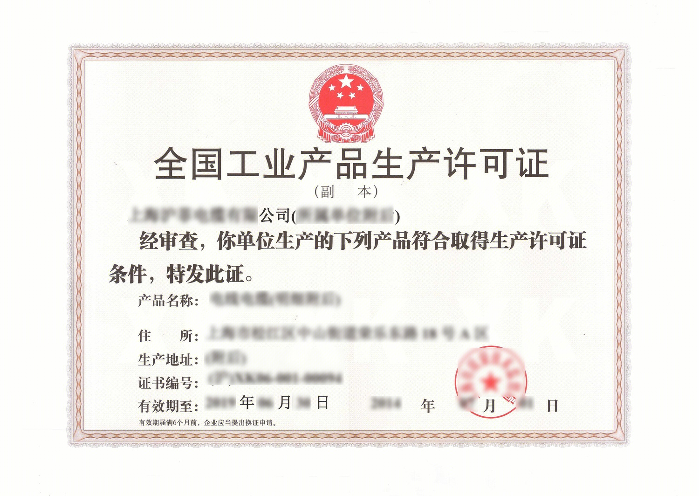

《食品经营许可证》：

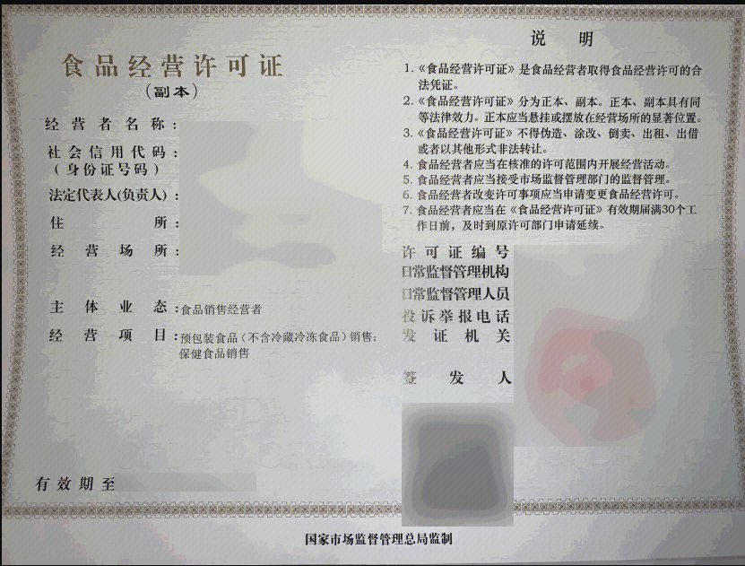

《野生动物驯养繁殖许可证》：

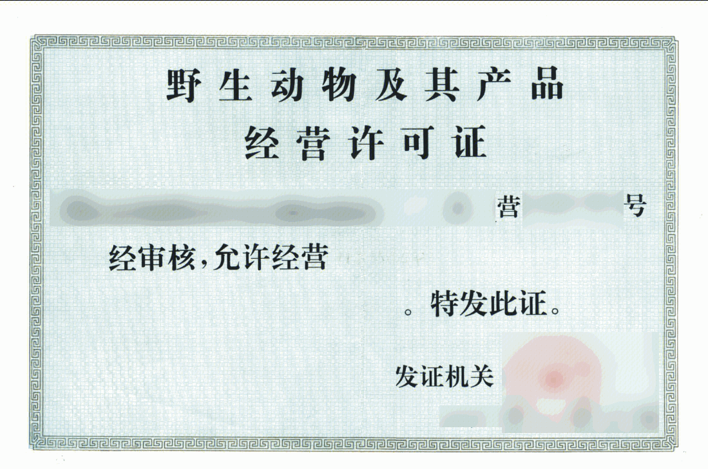

《野生动物及其产品经营许可证》：

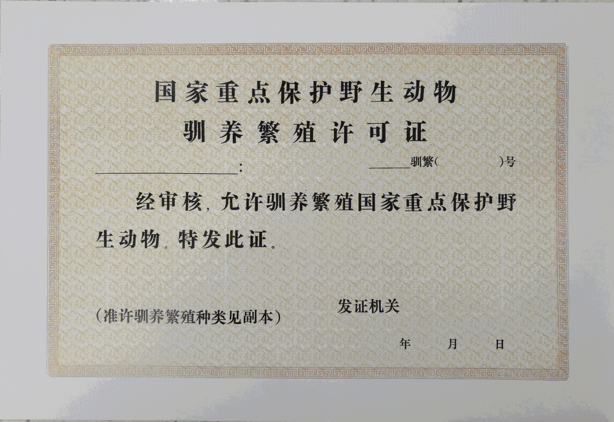

《种畜禽生产经营许可证》：

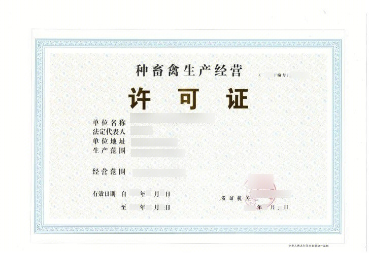

### 公司转让信息服务

#### 政策法规依据

《互联网信息服务管理办法》第四条

国家对经营性互联网信息服务实行许可制度；对非经营性互联网信息服务实行备案制度。未取得许可或者未履行备案手续的，不得从事互联网信息服务。

#### 资质示例

《非经营性互联网信息服务备案核准》：

### 出国移民

#### 资质示例

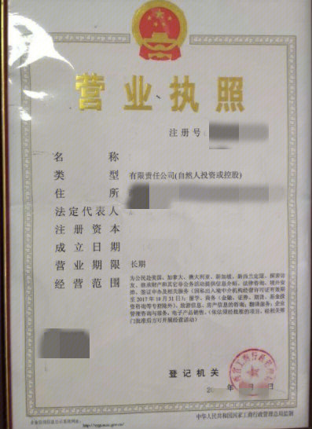

## 公益

### 募捐服务

#### 政策法规依据

《基金会管理条例》第十一条

登记管理机关应当自收到本条例第九条所列全部有效文件之日起60日内，作出准予或者不予登记的决定。准予登记的，发给《基金会法人登记证书》；不予登记的，应当书面说明理由。

《慈善组织互联网公开募捐信息平台基本管理规范》 平台应验证慈善组织的登记证书、公开募捐资格证书。平台不应为不具有公开募捐资格的组织、个人提供公开募捐信息发布服务。

#### 资质示例

《基金会法人登记证书》：

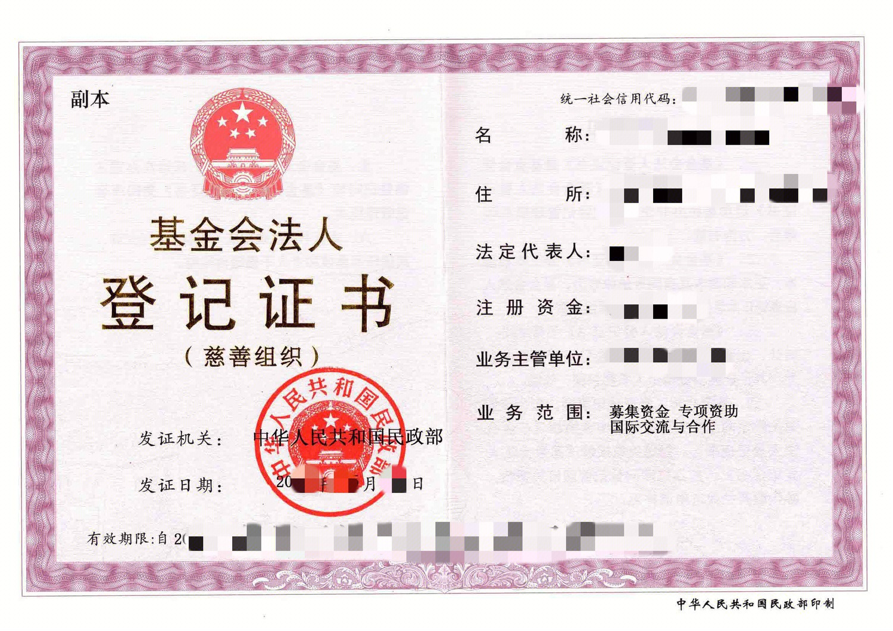

《慈善组织公开募捐资质证书》：

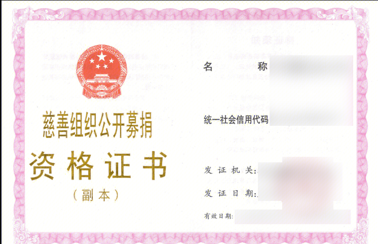

### 慈善信息服务

#### 政策法规依据

《基金会管理条例》第十一条

登记管理机关应当自收到本条例第九条所列全部有效文件之日起60日内，作出准予或者不予登记的决定。准予登记的，发给《基金会法人登记证书》；不予登记的，应当书面说明理由。

#### 资质示例

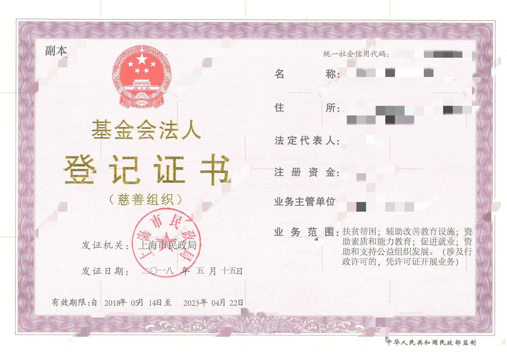

## 社交

### 陌生人交友 / 熟人交友

#### 资质示例

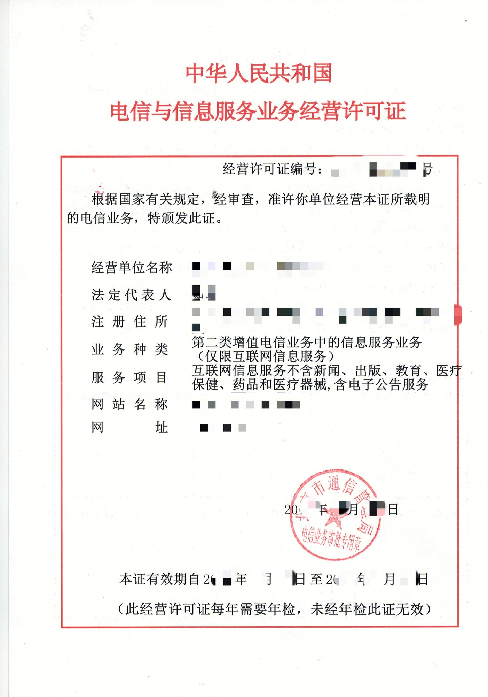

### 社区/论坛

#### 政策法规依据

《互联网信息服务管理办法》 第三条 互联网信息服务分为经营性和非经营性两类。非经营性互联网信息服务，是指通过互联网向上网用户无偿提供具有公开性、共享性信息的服务活动。

第八条从事非经营性互联网信息服务，应当向省、自治区、直辖市电信管理机构或者国务院信息产业主管部门办理备案手续。

#### 资质示例

《非经营性互联网信息服务备案核准》：

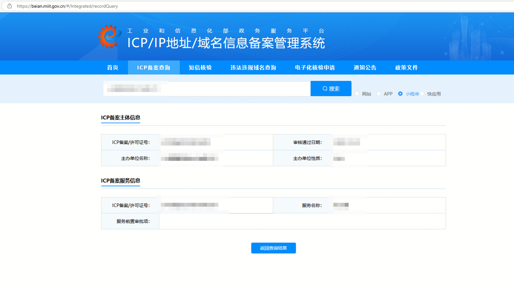

《统一社会信用代码证》（机构性质需为机关）：

《组织机构代码证》（机构类型需为机关）：

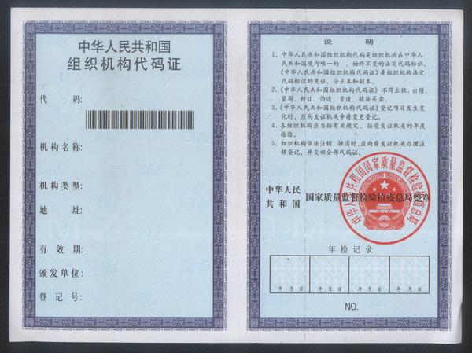

### 直播

#### 政策法规依据

《国家新闻出版广电总局关于加强网络视听节目直播服务管理有关问题的通知》

一、持有新闻出版广电行政部门颁发的《信息网络传播视听节目许可证》（以下简称《许可证》）、且许可项目为第一类互联网视听节目服务第五项的互联网视听节目服务机构，方可通过互联网对重大政治、军事、经济、社会、文化、体育等活动、事件的实况进行视音频直播。持有《许可证》且许可项目为第二类互联网视听节目服务第七项的互联网视听节目服务机构，方可通过互联网对一般社会团体文化活动、体育赛事等组织活动的实况进行视音频直播。不符合上述条件的机构及个人，包括开设互联网直播间以个人网络演艺形式开展直播业务但不持有《许可证》的机构，均不得通过互联网开展上述所列活动、事件的视音频直播服务，也不得利用网络直播平台（直播间）开办新闻、综艺、体育、访谈、评论等各类视听节目，不得开办视听节目直播频道。

#### 资质示例

《信息网络传播视听节目许可证》：

《统一社会信用代码证》（机构性质需为机关）：

### 笔记

#### 政策法规依据

《互联网信息服务管理办法》 第三条

互联网信息服务分为经营性和非经营性两类。非经营性互联网信息服务，是指通过互联网向上网用户无偿提供具有公开性、共享性信息的服务活动。

第八条从事非经营性互联网信息服务，应当向省、自治区、直辖市电信管理机构或者国务院信息产业主管部门办理备案手续。

#### 资质示例

《非经营性互联网信息服务备案核准》：

《统一社会信用代码证》（机构性质需为机关）：

《组织机构代码证》（机构类型需为机关）：

### 婚恋

#### 资质示例

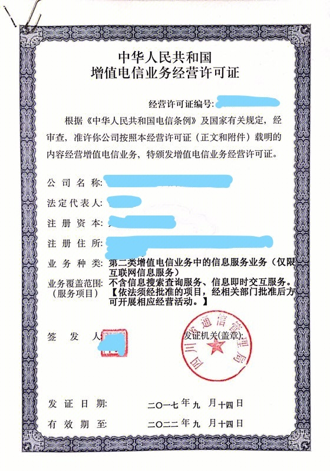

### 问答

#### 政策法规依据

《互联网信息服务管理办法》 第三条 互联网信息服务分为经营性和非经营性两类。非经营性互联网信息服务，是指通过互联网向上网用户无偿提供具有公开性、共享性信息的服务活动。

第八条从事非经营性互联网信息服务，应当向省、自治区、直辖市电信管理机构或者国务院信息产业主管部门办理备案手续。

#### 资质示例

《非经营性互联网信息服务备案核准》：

《统一社会信用代码证》（机构性质需为机关）：

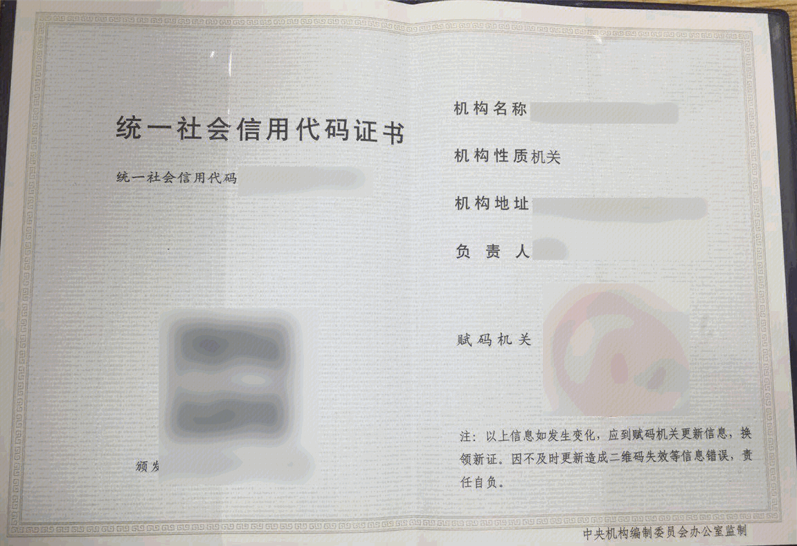

《组织机构代码证》（机构类型需为机关）：

### 直播答题

#### 政策法规依据

《国家新闻出版广电总局关于加强网络视听节目直播服务管理有关问题的通知》

一、持有新闻出版广电行政部门颁发的《信息网络传播视听节目许可证》（以下简称《许可证》）、且许可项目为第一类互联网视听节目服务第五项的互联网视听节目服务机构，方可通过互联网对重大政治、军事、经济、社会、文化、体育等活动、事件的实况进行视音频直播。持有《许可证》且许可项目为第二类互联网视听节目服务第七项的互联网视听节目服务机构，方可通过互联网对一般社会团体文化活动、体育赛事等组织活动的实况进行视音频直播。不符合上述条件的机构及个人，包括开设互联网直播间以个人网络演艺形式开展直播业务但不持有《许可证》的机构，均不得通过互联网开展上述所列活动、事件的视音频直播服务，也不得利用网络直播平台（直播间）开办新闻、综艺、体育、访谈、评论等各类视听节目，不得开办视听节目直播频道。

#### 资质示例

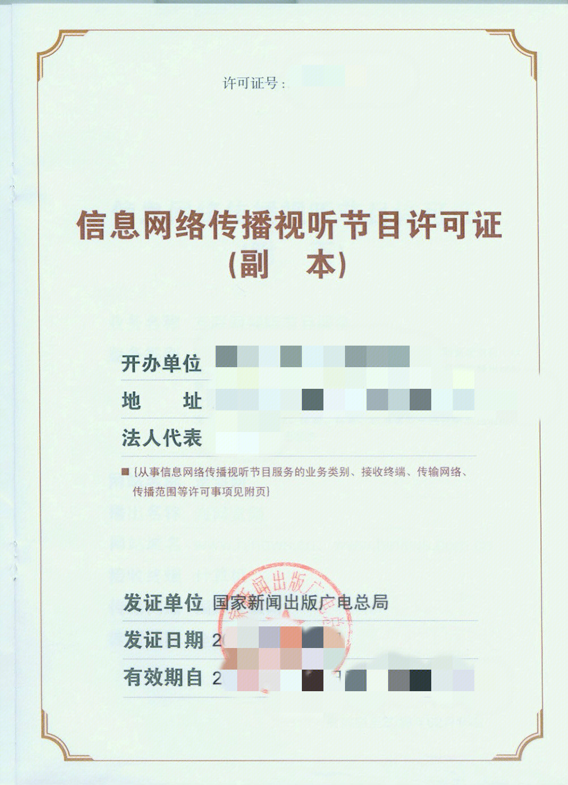

## 汽车服务

### 汽车预售

#### 政策法规依据

《道路机动车辆生产企业及产品准入管理办法》第十六条

道路机动车辆生产企业取得相关准入后方可生产、销售相应的道路机动车辆产品。道路机动车辆生产企业应当持续保持准入条件。

《汽车销售管理办法》 第十二条

经销商出售未经供应商授权销售的汽车，或者未经境外汽车生产企业授权销售的进口汽车，应当以书面形式向消费者作出提醒和说明，并书面告知向消费者承担相关责任的主体。未经供应商授权或者授权终止的，经销商不得以供应商授权销售汽车的名义从事经营活动。

#### 资质示例

《营业执照》：

《工信部道路机动车辆生产企业准入许可》：

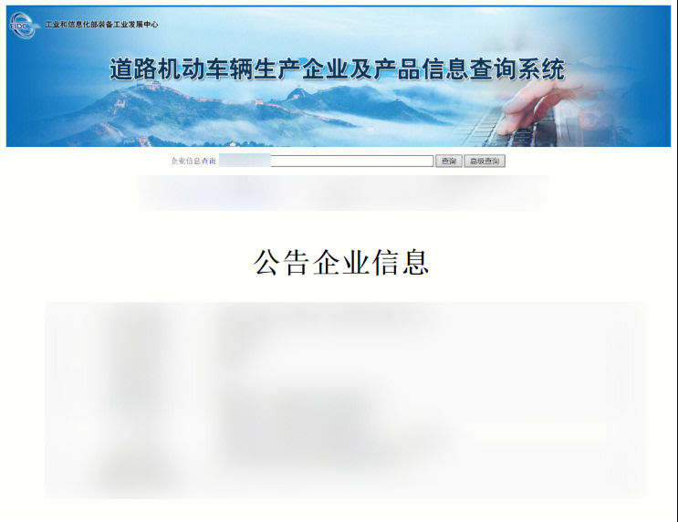
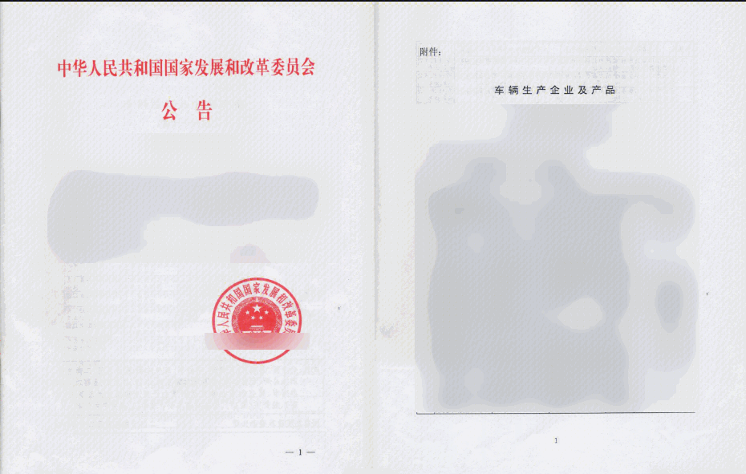
