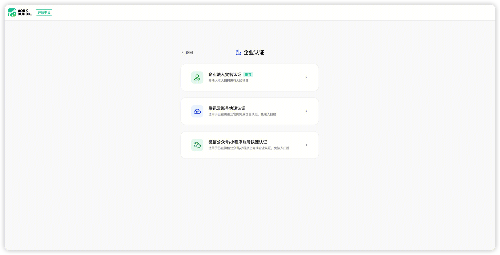
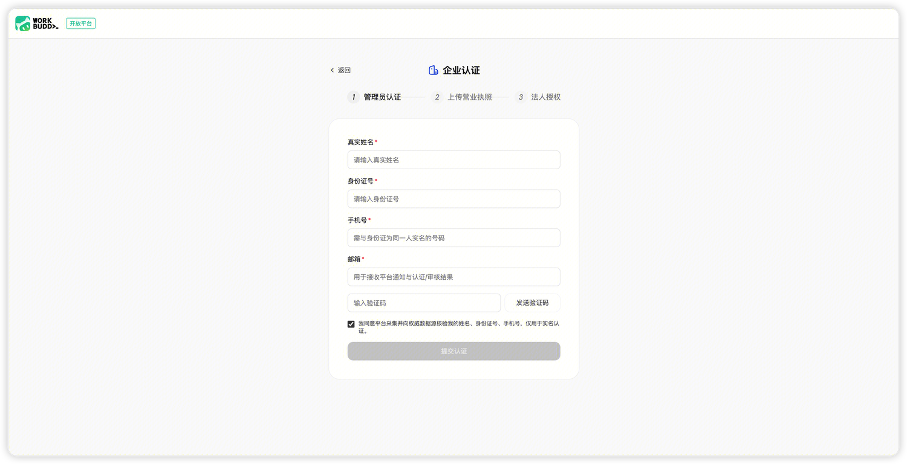
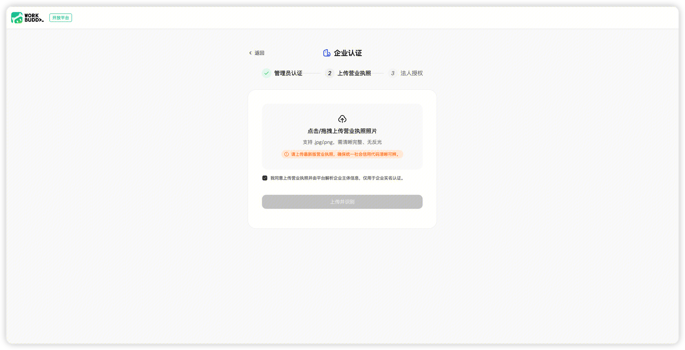
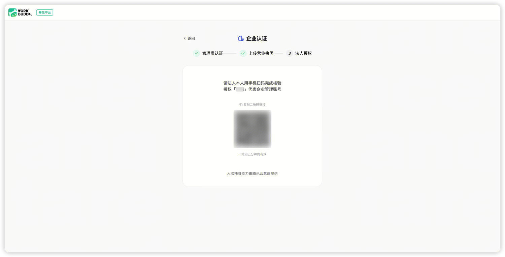
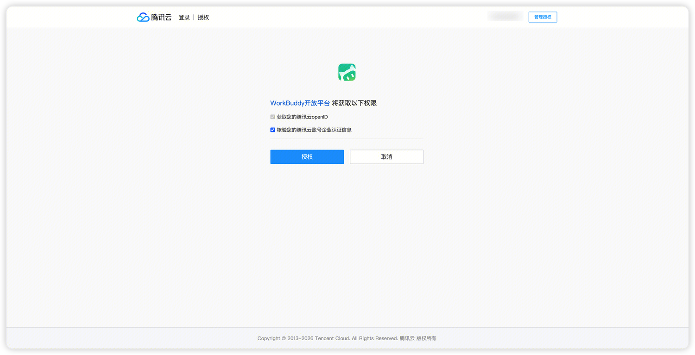
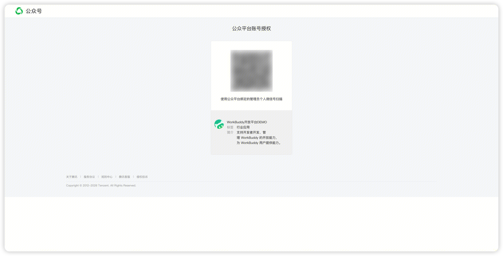
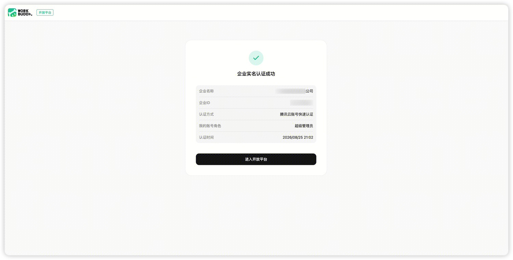
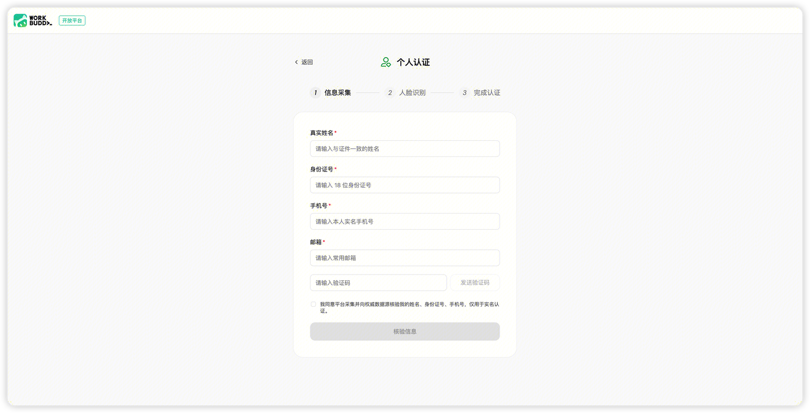

> 官方文档镜像 · [原文](https://open.workbuddy.cn/docs/onboarding) · [文档目录](../wiki/index.md) · [开发路线](../wiki/development-map.md)

# 入驻开放平台

## 企业认证

### 认证方式

企业实名认证适合以企业或组织身份发布资产的开发者。

目前提供三种认证方式：

| 认证方式 | 适用场景 | 第三步验证方式 |
| --- | --- | --- |
| 企业法人实名认证 | 企业未在支持的第三方平台完成认证，且法人可以配合验证 | 法人扫码完成人脸核身 |
| 腾讯云账号快速认证 | 企业已在腾讯云完成企业实名认证 | 扫码跳转腾讯云完成授权 |
| 微信公众号/小程序账号快速认证 | 企业已在微信公众号/小程序完成企业实名认证 | 扫码跳转微信公众号/小程序平台完成授权 |

## 管理员实名认证

请准备

- 本人中国大陆二代居民身份证号码；
- 已完成实名登记的本人手机号；
- 可以正常接收验证码的邮箱；
- 可以正常完成人脸识别的手机。

## 上传企业信息

1. 上传营业执照；
2. 系统通过 OCR 识别企业名称、统一社会信用代码和法定代表人姓名；
3. 核对系统识别结果；
4. 填写对外展示的开发者昵称；
5. 完成开发者昵称命名规范校验。

如果修改企业名称、统一社会信用代码等关键识别字段，系统可能要求进行二次确认。

选择“企业法人实名认证”时，还需要填写法人身份证号码，并完成企业名称、统一社会信用代码、法人姓名、法人身份证号四要素核验。

## 完成企业验证

- **企业法人实名认证**：由法定代表人本人扫码完成人脸核身；

- **腾讯云账号快速认证**：点击跳转腾讯云完成授权，校验营业执照主体与腾讯云已实名主体是否一致；

- **微信公众号/小程序账号快速认证**：点击跳转微信公众号/小程序平台完成授权，校验营业执照主体与第三方已实名主体是否一致。

如果第三方主体与营业执照主体不一致，可核对并修改信息后重新发起认证。

## 认证结果与规则

认证成功后，系统生成企业主体，完成认证的账号成为该企业主体的超级管理员。

- 每个账号最多认证 10 个企业主体；
- 同一家企业最多可以被 50 个账号分别认证；
- 不同账号认证产生的主体、开放资产和其他资产相互独立；
- 完成认证的管理员默认成为企业主体超级管理员。

### 认证失败处理

| 场景 | 常见提示 | 处理方法 |
| --- | --- | --- |
| 三要素不一致 | 实名信息核验不通过 | 检查姓名、身份证号和手机号是否属于同一人；达到页面尝试限制后按提示稍后重试 |
| 手机号未实名 | 手机号未完成实名或与身份证不匹配 | 使用本人已实名且与身份证信息一致的手机号 |
| 人脸比对不通过 | 人脸与实名信息不匹配 | 确认由本人操作并保持光线充足；达到页面尝试限制后按提示重试 |
| 身份证已被占用 | 该身份证已在其他账号完成个人实名 | 使用原认证账号登录；一个身份证只能认证一个个人主体 |
| 营业执照识别失败 | 未能识别营业执照信息 | 上传清晰、完整、无反光的照片，或按页面要求手动补填 |
| 企业四要素不一致 | 企业信息核验不通过 | 检查企业名称、信用代码、法人姓名和身份证号；达到页面尝试限制后按提示稍后重试 |
| 第三方主体不一致 | 营业执照与第三方已实名企业不一致 | 确认使用同一企业的腾讯云或微信开放平台账号后重新授权 |
| 证件类型不支持 | 当前证件类型暂不支持 | 当前仅支持中国大陆二代居民身份证，港澳台及外籍证件暂不支持 |

## 个人认证

### 认证准备

请准备：

- 本人中国大陆二代居民身份证；
- 已完成实名登记的本人手机号；
- 可以正常接收验证码的邮箱；
- 可以正常完成人脸识别的手机。

### 必填信息

- 开发者真实姓名；
- 真实姓名；
- 身份证号码；
- 手机号码；
- 邮箱地址。

### 重要规则

- 当前仅支持中国大陆二代居民身份证；
- 姓名需要使用证件上的中文姓名；
- 一个身份证在全平台只能认证一个个人主体；
- 如果该身份证已通过其他 WorkBuddy 账号完成个人实名认证，不能在当前账号重复认证；
- 每个账号最多创建一个个人主体。
