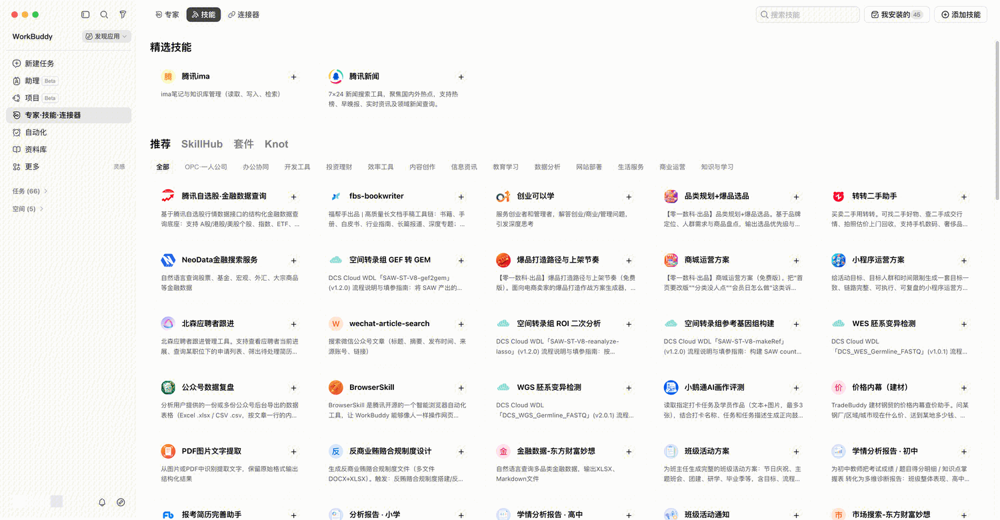
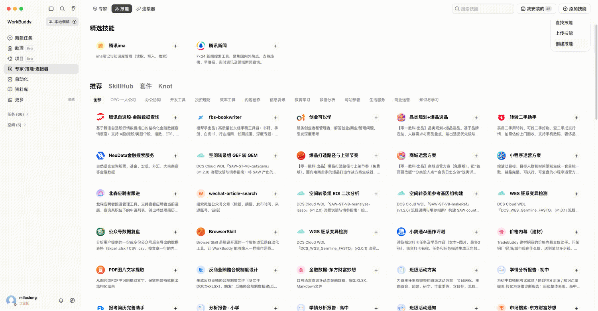

> 官方文档镜像 · [原文](https://open.workbuddy.cn/docs/skill) · [文档目录](../wiki/index.md) · [开发路线](../wiki/development-map.md)

<a id="技能"></a>


# 技能


<a id="技能市场"></a>


## 技能市场

展示位置

技能展示在WorkBuddy市场上，用户点击左侧菜单【专家·技能·连接器】出现二级菜单，选择【技能】，进入【技能市场】



用户点击对应技能右上角加号，安装对应技能，并支持在对话中调用已安装的技能


**技能创建工具**

点击市场右上角【添加技能】-【创建技能】



跳转进入对话，补全创建技能的提示词，开启创建。


**开放平台解析失败原因**

在开放平台上如创建技能过程中，提交zip包后解析失败，可参考后续【技能基础结构】【子资源目录说明】定位问题，如定位问题失败，请发送邮件联系运营同学[openworkbuddy@tencent.com](mailto:openworkbuddy@tencent.com)，或扫描开放平台首页下方的二维码，加入社群沟通。


<a id="技能基础结构"></a>


## 技能基础结构


```
skills/
└── {skill-name}/
    ├── SKILL.md              # ★ 技能定义（必须）
    ├── references/           # 参考资料（可选）
    │   ├── api-spec.md       #   API 规范、字段类型等
    │   └── examples.md       #   示例数据
    ├── scripts/              # 可执行脚本（可选）
    │   ├── fetch-data.js     #   数据获取脚本
    │   └── transform.py      #   数据处理脚本
    └── templates/            # 模板文件（可选）
        ├── report.sh         #   报告生成模板
        └── workflow.sh       #   工作流模板格式
```


[SKILL.md](http://SKILL.md) 使用 YAML frontmatter + Markdown 正文：


```
---
name: your-skill-name
display_name: 展示名称
display_name_en:
description: 一句话描述技能能力
description_zh: 简短中文介绍
description_en: A Brief English Introduction
category: writing            # 分类之一
version: 1.0.0
author: 合作方名称
---
 
# 技能指令正文
 
当用户需要做 XX 时，按以下步骤执行：
1. ...
2. ...
3. ...
```


**Frontmatter 字段**：

| **字段** | **必填** | **说明** |
| --- | --- | --- |
| name | 否 | 技能标识 |
| description | 是 | 写清用途和触发词 |
| description_zh | 是 | 简短中文介绍 |
| description_en | 是 | 简短英文介绍 |
| allowed-tools | 否 | 工具白名单（逗号分隔） |
| version | 是 | 版本号 |
| disable-model-invocation | 否 | true 则 AI 不会自动触发，只能用户手动调用 |
| user-invocable | 否 | false 则隐藏菜单，仅供 AI 内部使用 |
| author | 是 | 合作方名称 |


<a id="子资源目录说明"></a>


## 子资源目录说明


<a id="references-参考资料"></a>


### references — 参考资料

存放 [SKILL.md](http://SKILL.md) 引用的补充知识文档，AI 执行技能时会读取这些文件作为上下文。

适用场景：API 字段类型定义、协议规范、领域知识参考、示例数据等。

使用方式：在 [SKILL.md](http://SKILL.md) 中通过 @references/xxx.md 引用。

示例：


```
references/
├── field-types.md           # 字段类型枚举和用法
├── api-endpoints.md         # API 接口文档
└── best-practices.md        # 最佳实践指南
```


<a id="scripts-可执行脚本"></a>


### scripts — 可执行脚本

存放技能执行中需要调用的脚本，AI 通过 Bash 工具执行。

适用场景：调用外部 API、数据处理、批量操作、需要特定运行时的逻辑。

使用方式：在 [SKILL.md](http://SKILL.md) 中声明调用命令和参数。

示例：


```
scripts/
├── data-index.js            # 数据查询入口
└── tool-index.js            # 工具集入口
```


<a id="templates-模板文件"></a>


### templates — 模板文件

存放可复用的模板脚本或配置文件。

适用场景：标准化操作流程的模板、报告生成模板。

示例：


```
templates/
├── authenticated-session.sh  # 认证会话模板
└── capture-workflow.sh       # 数据采集工作流模板
```
