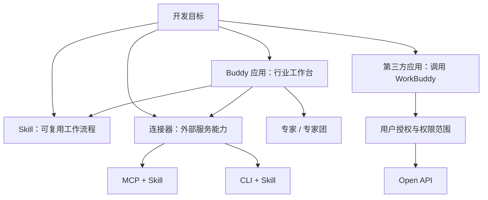

# 开发对象与能力关系

本文是整理者提供的阅读路径；箭头表示推荐阅读顺序或能力组合，不是新增的平台约束。

| 想实现什么 | 优先阅读 | 后续依赖 |
| --- | --- | --- |
| 封装一项可重复调用的工作流程 | [技能](../docs/skill.md) | 脚本、参考资料、模板 |
| 让 WorkBuddy 调用已有业务 API | [连接器](../docs/connector.md) | MCP 工具描述、认证、Skill 使用说明 |
| 接入已有成熟 CLI | [连接器](../docs/connector.md) | CLI 安装与运行时、登录状态、Skill 命令说明 |
| 封装领域角色或协作角色 | [专家](../docs/expert.md)、[专家团](../docs/expert-team.md) | 配置、技能和市场展示资源 |
| 提供行业专属工作台 | [Buddy 应用](../docs/buddy-app.md) | 工作模式、场景、技能、专家、连接器 |
| 从自己的产品调用 WorkBuddy | [第三方应用](../docs/third-party-app.md) | 用户授权、权限范围、[Open API](../docs/openapi.md) |

## 从能力到产品

建议先完成一个边界明确的 [Skill](../guides/skill-development.md)。如果需要外部系统，再根据 [连接器指南](../guides/connector-development.md) 接入；若目标是完整行业工作台，继续使用 [应用指南](../guides/app-development.md) 组合已验证的能力。这是项目实施建议，不表示平台要求必须依此顺序开发。

Buddy 应用与第三方应用是不同路线。前者在 WorkBuddy 提供的框架中组织行业体验；后者让自己的系统通过授权和接口使用 WorkBuddy。MCP Apps 是官方 Buddy 应用文档提及的一种集成能力，当前本站文档不能替代完整的外部 MCP Apps 协议资料。

## 共同准备

- [入驻开放平台](../docs/onboarding.md)：主体和认证要求。
- [开发者 profile](../docs/developer-profile.md)：展示信息与维护。
- [非个人主体服务类目](../docs/service-categories-enterprise.md)、[个人主体服务类目](../docs/service-categories-individual.md)：选择适用范围。
- [法规依据及示例](../docs/legal-basis-and-examples.md)：原文参考与配图。
- [联系渠道](../docs/contact.md)：平台问题的官方沟通入口。

返回 [完整目录](index.md) · 查看 [原文待核对事项](source-notes.md) 。
